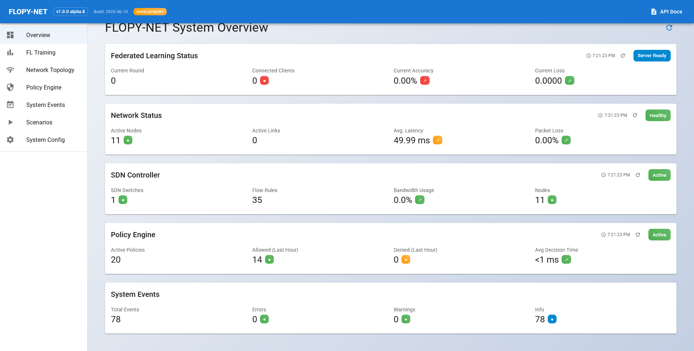
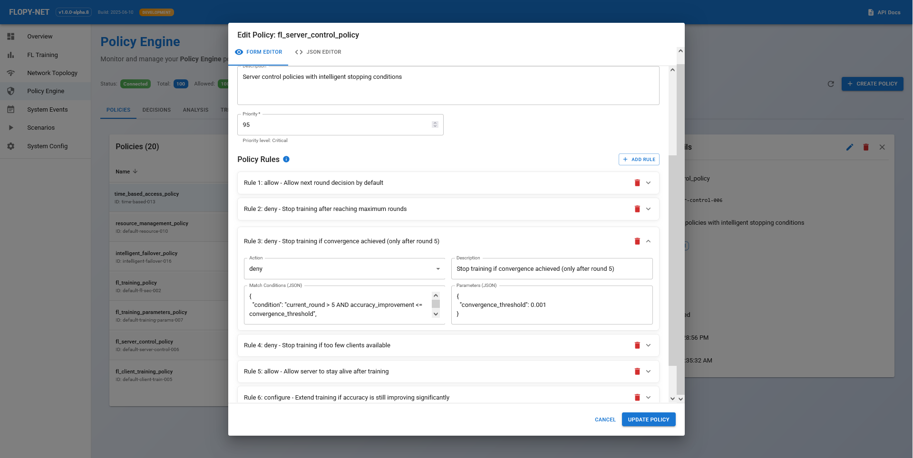
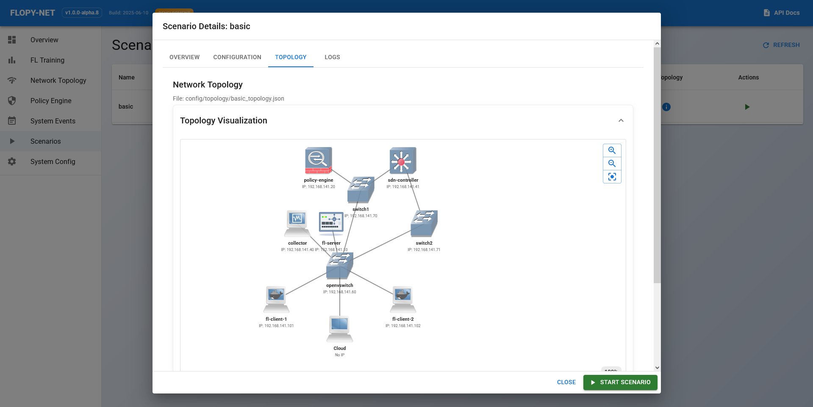
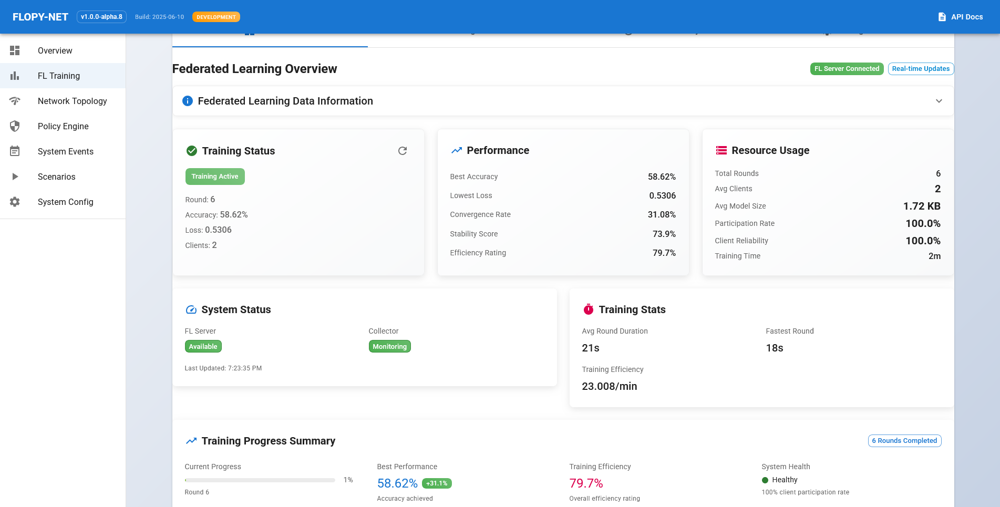
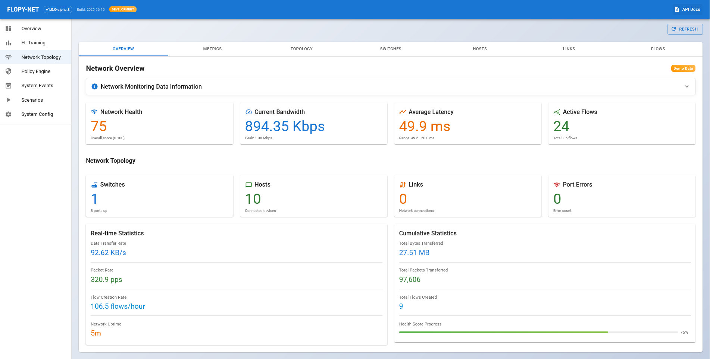
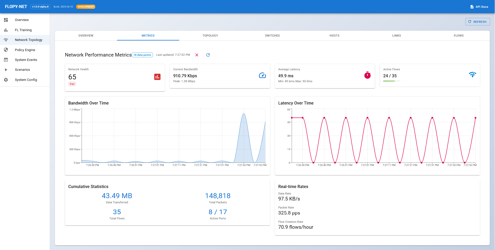
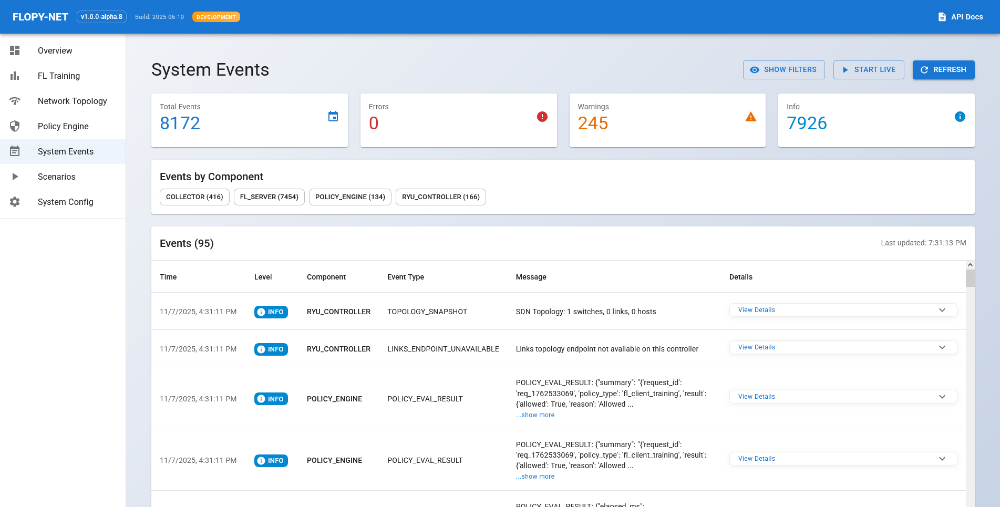
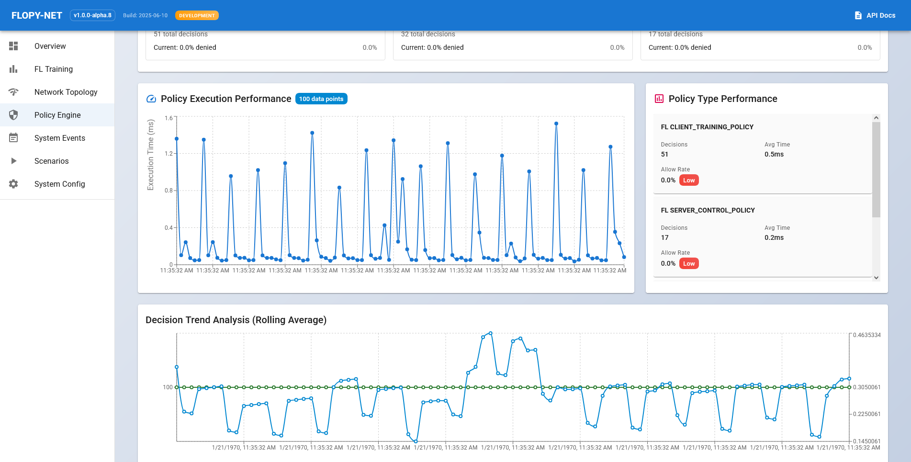

# FLOPY-NET: Federated Learning Platform - Network Emulation & Testing

[](https://flopynetdocs-a960.eu.onamber.cloud/)
[](https://flopynet.abdulme.link/)
[](https://github.com/abdulmelink/flopy-net)
[](https://github.com/abdulmelink/flopy-net/releases)
[](https://github.com/abdulmelink/flopy-net)

## Overview

**FLOPY-NET** is a comprehensive research platform for evaluating federated learning (FL) systems under realistic network conditions. It integrates [Flower](https://flower.ai/) federated learning framework with [GNS3](https://github.com/GNS3/gns3-server) network emulation to enable researchers to study how network dynamics—latency, packet loss, bandwidth constraints—affect FL training performance.

### What is FLOPY-NET? (30-Second Summary)

FLOPY-NET lets you **test federated learning algorithms in realistic network environments**:

- **Simulate FL Training**: Deploy FL servers and clients in emulated networks
- **Realistic Networks**: Use GNS3 to simulate real-world network conditions (latency, packet loss, bandwidth)
- **Real-Time Monitoring**: Web dashboard shows live training progress, metrics, and network topology
- **Policy Enforcement**: Centralized policy engine controls and governs FL behavior (client selection, model size limits, security rules)
- **Scenario-Based**: Define experiments via JSON configs—reproducible and shareable

**Use Cases**: Research network effects on FL, test aggregation algorithms under network constraints, study policy-driven FL systems, validate FL designs before real-world deployment.

### What Makes FLOPY-NET Unique

Unlike pure FL frameworks, FLOPY-NET bridges the gap between theoretical federated learning research and real-world network dynamics by providing:

- **Realistic Network Emulation**: Full GNS3 integration with customizable network topologies, SDN controllers, and OpenFlow switches
- **Policy-Driven FL Governance**: Centralized policy engine enforces security rules, compliance policies, client selection criteria, and resource constraints across all FL components
- **End-to-End Observability**: Real-time monitoring dashboard, comprehensive metrics collection, and SQLite-based analytics
- **Scenario-Based Experiments**: Reproducible experiments defined via JSON configuration files
- **Extensible Architecture**: Modular design allows researchers to plug in custom ML models, aggregation algorithms, and network policies


*Real-time dashboard showing system overview and FL training status*

### Current Implementation Status

**v1.0.0-alpha.8** demonstrates the platform architecture with simulated FL training using random data.

**Production ML Research**: Extend FL client/server components with real models, datasets, and training algorithms. See [Extending FLOPY-NET](#extending-flopy-net).

> **ALPHA VERSION WARNING**  
> This is an alpha release. Many features are not fully tested. The Policy Engine has untrusted policy types under development. Use for research and development only—NOT for production environments.

---

## Table of Contents

- [Overview](#overview)
- [Quick Demo](#quick-demo)
- [System Architecture](#system-architecture)
- [Key Features](#key-features)
- [Prerequisites](#prerequisites)
- [Quick Start](#quick-start)
- [Installation Guide](#installation-guide)
- [Running Scenarios](#running-scenarios)
- [Dashboard Usage](#dashboard-usage)
- [Project Structure](#project-structure)
- [Configuration](#configuration)
- [Extending FLOPY-NET](#extending-flopy-net)
- [Troubleshooting](#troubleshooting)
- [Contributing](#contributing)
- [License](#license)

---

## Quick Demo

Want to see FLOPY-NET in action? Check out the live demo:

**[Live Demo Dashboard](https://flopynet.abdulme.link/)** - Explore the dashboard interface  
**[Full Documentation](https://flopynetdocs-a960.eu.onamber.cloud/)** - Comprehensive guides and API docs  
**[📄 Comprehensive Report PDF](docs/latex-report/FLOPY-NET_Comprehensive_Report.pdf)** - Complete technical documentation and research guide

### What You'll See in 3 Steps

1. **Setup** (15 min): Configure GNS3 VM, replace IP addresses, pull Docker images
2. **Deploy** (5 min): Run one command to deploy FL server, clients, and network infrastructure
3. **Monitor** (Real-time): Watch federated learning training in your browser with live metrics


*Live federated learning training rounds with accuracy/loss metrics*

---

## System Architecture

### Component Overview

FLOPY-NET uses a microservices architecture with containerized components deployed across a simulated network.

| Layer | Components | Purpose |
|-------|-----------|---------|
| **User Interface** | Dashboard (React), CLI (Python) | Monitoring, control, scenario deployment |
| **Core Services** | Policy Engine, Collector, FL Server | Policy enforcement, metrics storage, FL coordination |
| **FL Layer** | FL Clients (Flower + PyTorch) | Local training, model updates |
| **Network** | GNS3, SDN Controller, OpenVSwitch | Network emulation, traffic control |

### Architecture Diagram

```
┌─────────────────────────────────────────────────────────────┐
│                    User Interface Layer                      │
│  Dashboard (React :8085)  │  CLI (Python)  │  API (:8001)   │
└────────────────────┬────────────────────────────────────────┘
                     │
┌────────────────────┴────────────────────────────────────────┐
│                   Core Services Layer                        │
│  ┌─────────────┐  ┌──────────────┐  ┌───────────────────┐  │
│  │ Policy      │  │ Collector    │  │ FL Server         │  │
│  │ Engine      │  │ Service      │  │ (Flower)          │  │
│  │ :5000       │  │ :8000        │  │ :8080             │  │
│  └─────────────┘  └──────────────┘  └───────────────────┘  │
└──────────────────────────────────────────────────────────────┘
                     │
┌────────────────────┴────────────────────────────────────────┐
│              Federated Learning Layer (GNS3)                 │
│  ┌─────────────┐         ┌────────────────────────────────┐ │
│  │ FL Server   │◄────────┤ FL Clients (1-N)               │ │
│  │ .10         │─────────► Local training & model updates │ │
│  └─────────────┘         └────────────────────────────────┘ │
└──────────────────────────────────────────────────────────────┘
                     │
┌────────────────────┴────────────────────────────────────────┐
│            Network Simulation Layer (GNS3)                   │
│  SDN Controller (.41)  │  OpenVSwitch (.60+)  │  Cloud Node │
└──────────────────────────────────────────────────────────────┘
```

### Component Details

#### User Interface Layer

| Component | Port | Description |
|-----------|------|-------------|
| **Dashboard Frontend** | 8085 | React + TypeScript UI with real-time updates |
| **Dashboard API** | 8001 | FastAPI backend for data aggregation |
| **CLI Tools** | - | Python scripts for scenario deployment |

#### Core Services Layer

| Service | IP | Port | Function |
|---------|-----|------|----------|
| **Policy Engine** | 192.168.100.20 | 5000 | Enforce client selection, model limits, security rules |
| **Collector** | 192.168.100.40 | 8000 | Aggregate and store metrics (SQLite) |
| **FL Server** | 192.168.100.10 | 8080 | Coordinate FL rounds, aggregate models (Flower) |

**Policy Engine Details**:
- Controls FL system behavior through customizable policies
- Client selection rules, model size limits, security policies
- All FL components consult policy engine before actions
- Comprehensive audit trail of policy decisions

#### FL Layer (Deployed in GNS3)

| Component | IP Range | Technology |
|-----------|----------|------------|
| **FL Clients** | 192.168.100.101-255 | Flower + PyTorch |

- Execute local training on data partitions
- Send model updates to FL server
- Report metrics to collector

#### Network Layer (GNS3)
| Component | IP | Port | Function |
|-----------|-----|------|----------|
| **SDN Controller** | 192.168.100.41 | 6633, 8181 | Ryu-based OpenFlow controller |
| **OpenVSwitch** | 192.168.100.60+ | - | Software-defined switches |
| **Cloud Node** | - | - | Bridge between GNS3 and host |

### Network Addressing Scheme

| Component Type | IP Range | Example |
|----------------|----------|---------|
| FL Server | 192.168.100.10-19 | 192.168.100.10 |
| Policy Engine | 192.168.100.20-29 | 192.168.100.20 |
| SDN Controller | 192.168.100.30-49 | 192.168.100.41 |
| Collector | 192.168.100.40+ | 192.168.100.40 |
| OpenVSwitch | 192.168.100.60-99 | 192.168.100.60 |
| FL Clients | 192.168.100.100-255 | 192.168.100.101-102 |

> **Note**: Subnet `192.168.100.0/24` is configurable. Replace with your GNS3 VM subnet.

---

## Key Features

### Federated Learning

| Feature | Description |
|---------|-------------|
| **Framework** | Flower 1.5.0 for FL server/client implementation |
| **ML Library** | PyTorch 2.0.1 for model training |
| **Models** | CNN, MLP (extensible to custom architectures) |
| **Aggregation** | FedAvg (supports custom strategies) |
| **Configuration** | Rounds, epochs, batch size, learning rate via JSON |

### Network Emulation

| Feature | Description |
|---------|-------------|
| **Platform** | GNS3 2.2.54 for network topology simulation |
| **SDN** | Ryu-based OpenFlow controller |
| **Conditions** | Configurable latency, packet loss, bandwidth, jitter |
| **Topologies** | Custom network designs via JSON configuration |
| **Control** | Programmatic GNS3 API integration |

### Policy Engine

| Feature | Description |
|---------|-------------|
| **Enforcement** | Client selection, model size limits, security rules |
| **Evaluation** | Real-time policy checks before FL actions |
| **Extensibility** | Custom policy functions in Python |
| **Auditing** | Complete event log of policy decisions |

### Monitoring & Analytics

| Feature | Description |
|---------|-------------|
| **Dashboard** | Real-time React UI with WebSocket updates |
| **Metrics** | FL training progress, network stats, system health |
| **Storage** | SQLite-based metrics database |
| **Visualization** | Training curves, topology graphs, time-series data |
| **Export** | CSV/JSON data export for analysis |

### Deployment

| Feature | Description |
|---------|-------------|
| **Containerization** | Docker-based components with Docker Compose |
| **Orchestration** | Automated GNS3 project creation and topology deployment |
| **Scenarios** | JSON-defined experiments for reproducibility |
| **CLI Tools** | Python scripts for system management |

---

## Prerequisites

### Required Software

| Software | Version | Purpose |
|----------|---------|---------|
| **VMware Workstation Player** | 16+ | Run GNS3 VM |
| **GNS3 VM** | 2.2.54 | Network emulation platform |
| **GNS3 GUI** | 2.2.54 | GNS3 management interface |
| **Docker Engine** | 20.10+ | Container runtime |
| **Docker Compose** | v2.0+ | Multi-container orchestration |
| **Python** | 3.8-3.11 | Scenario deployment scripts |

**Download Links**:
- GNS3 VM & GUI: [v2.2.54 Release](https://github.com/GNS3/gns3-gui/releases/tag/v2.2.54)
- Python dependencies: `pip install -r requirements.txt`

### System Requirements

**Host Machine**:

| Resource | Minimum | Recommended |
|----------|---------|-------------|
| CPU | 4 cores | 8+ cores |
| RAM | 16 GB | 32 GB |
| Storage | 50 GB free | 100 GB free |
| OS | Windows 10/11, Linux, macOS | Windows 11 or Linux |

**GNS3 VM Configuration**:

| Resource | Minimum | Recommended |
|----------|---------|-------------|
| CPU | 4 cores | 8 cores |
| RAM | 8 GB | 16 GB |
| Disk | 40 GB | 60 GB |
| Network | Host-Only, NAT, or Bridged | Host-Only |

### Network Configuration

**GNS3 VM Network Adapter Options**:

| Mode | Use Case | Pros | Cons |
|------|----------|------|------|
| **Host-Only** | Most scenarios (Recommended) | Isolated, secure | No internet in VM |
| **Bridged** | VM needs local network access | Full network access | Exposes VM to network |
| **NAT** | VM needs internet | Internet access | More complex routing |

**Important**: Note your GNS3 VM's IP address (displayed on VM console) for configuration.

> **Subnet Replacement Tip**  
> Default configs use `192.168.141.x` as example. Replace ALL occurrences of `192.168.141.128` (VM IP) and `192.168.141` (subnet prefix) with YOUR actual values using VS Code's find-and-replace (`Ctrl+Shift+H`).

---

## Quick Start

**Total Setup Time**: ~35 minutes for first-time setup

### Setup Workflow

```
1. Clone Repository (2 min)
           ↓
2. Install Dependencies (3 min)
           ↓
3. Configure GNS3 VM & Replace IPs (10 min) ← CRITICAL STEP
           ↓
4. Pull Docker Images to GNS3 (5 min)
           ↓
5. Start Dashboard (5 min)
           ↓
6. Deploy Scenario (10 min)
           ↓
7. Monitor Training (Real-time)
```

### Step 1: Clone Repository

```powershell
git clone https://github.com/abdulmelink/flopy-net.git
cd flopy-net
```

### Step 2: Install Python Dependencies

```powershell
pip install -r requirements.txt
```

### Step 3: Configure GNS3 VM & Replace IP Addresses

**This is the MOST CRITICAL step!**

#### 3.1 Start GNS3 VM and Get IP

1. Power on the GNS3 VM in VMware
2. Wait for boot (shows GNS3 ASCII logo)
3. **Note the IP address** on console (e.g., `Shell access: ssh gns3@192.168.50.10`)
4. Verify connectivity:
   ```powershell
   ping 192.168.50.10  # Your VM IP
   ```

#### 3.2 Replace IPs Project-Wide

Use VS Code to replace all example IPs with your actual values:

| Step | Action | Find | Replace With |
|------|--------|------|--------------|
| 1 | Open VS Code | Open project folder | - |
| 2 | Find & Replace | `Ctrl+Shift+H` | - |
| 3 | Replace VM IP | `192.168.141.128` | Your VM IP (e.g., `192.168.50.10`) |
| 4 | Click "Replace All" | - | - |
| 5 | Replace Subnet | `192.168.141` | Your subnet (e.g., `192.168.50`) |
| 6 | Click "Replace All" | - | - |

**Files Automatically Updated**:
- `config/gns3_connection.json`
- `config/scenarios/basic_main.json`
- `config/topology/basic_topology.json`
- `dashboard/docker-compose.yml`

### Step 4: Pull Docker Images to GNS3 VM

FLOPY-NET uses pre-built Docker images hosted on Docker Hub. Pull them to your GNS3 VM:

```powershell
# This will pull the latest images from abdulmelink/ registry to your GNS3 VM
python scripts/deploy_gns3_images.py
```

This script will:
- Connect to your GNS3 VM via SSH (using credentials from config)
- Pull all required Docker images:
  - `abdulmelink/flopynet-server:latest`
  - `abdulmelink/flopynet-client:latest`
  - `abdulmelink/flopynet-policy-engine:latest`
  - `abdulmelink/flopynet-collector:latest`
  - `abdulmelink/flopynet-controller:latest`
  - `abdulmelink/openvswitch:latest`

> **Note for Maintainers**: If you need to build and push new images to the registry, use `python scripts/build_gns3_images.py --push` (requires Docker Hub credentials).

### Step 5: Start the Dashboard

```powershell
cd dashboard
docker compose up -d --build
```

The dashboard will be available at:
- **Frontend**: http://localhost:8085
- **Backend API**: http://localhost:8001

> ✅ **If you completed Step 3 correctly**, the `dashboard/docker-compose.yml` file already has the correct IPs for your GNS3 VM and subnet. The environment variables should now point to your actual GNS3 VM IP and subnet (e.g., `http://192.168.50.10:80` instead of `http://192.168.141.128:80`).

### Step 6: Deploy a Scenario

From the repository root:

```powershell
python src/scenarios/basic/scenario.py `
  --config config/scenarios/basic_main.json `
  --topology config/topology/basic_topology.json
```

This will:
1. Create a GNS3 project (`basic_federated_learning`)
2. Deploy FL server, clients, policy engine, and network infrastructure
3. Start federated learning training
4. Collect metrics and events

### Step 7: Monitor & Control via Dashboard

Open http://localhost:8085 in your browser to:
- View FL training progress in real-time
- Explore network topology
- Monitor metrics and events
- Analyze performance data
- Edit policies


*Editing round stop rule*

---

## Installation Guide

### Detailed Setup Steps

#### 1. GNS3 VM Setup

1. **Download GNS3 VM 2.2.54**:
   - Visit [GNS3 Releases - v2.2.54](https://github.com/GNS3/gns3-gui/releases/tag/v2.2.54)
   - Download: **GNS3.VM.VMware.Workstation.2.2.54.zip**
   - Extract the zip file

2. **Import into VMware Workstation Player**:
   - Open VMware Workstation Player
   - File → Open → Select the extracted `GNS3 VM.ova` file
   - Accept the import settings
   - After import, edit VM settings (recommend before first boot):
     - **CPU**: 4-8 cores (adjust based on your system; 4 minimum, 8 recommended)
     - **RAM**: 8192-16384 MB (8GB minimum, 16GB recommended for complex topologies)
     - **Disk**: Leave as default (40GB dynamically allocated)
     - **Network Adapter**: Host-Only (or Bridged/NAT depending on your setup)
       - Host-Only: Recommended for most scenarios, VM isolated to host
       - Bridged: If you need VM on your local network
       - NAT: If you need VM internet access

3. **Start GNS3 VM and Get IP Address**:
   - Power on the VM
   - Wait for it to fully boot (shows GNS3 ASCII art logo)
   - **Note the IP address** displayed on the console screen (e.g., `Shell access: ssh gns3@192.168.141.128`)
   - Write down this IP—you'll use it throughout the configuration
   - From your host machine, verify connectivity:
     ```powershell
     ping 192.168.141.128  # Replace with your actual VM IP
     ```

4. **Install and Configure GNS3 GUI 2.2.54**:
   - Download and install [GNS3 GUI 2.2.54](https://github.com/GNS3/gns3-gui/releases/tag/v2.2.54) on your host machine
   - On first launch, the **Setup Wizard** will appear:
     - Choose "Run appliances on a remote server"
     - Enter your GNS3 VM IP address and port 80
     - Test the connection
   - Verify: GNS3 GUI → Edit → Preferences → Server
     - Should show your GNS3 VM server as connected (green indicator)

#### 2. Docker Images Setup

**Pull Pre-built Images from Docker Hub** (Recommended)

FLOPY-NET provides pre-built Docker images on Docker Hub. Pull them to your GNS3 VM:

```powershell
# This connects to your GNS3 VM and pulls all required images
python scripts/deploy_gns3_images.py
```

This will pull the following images to your GNS3 VM:
- `abdulmelink/flopynet-server:latest`
- `abdulmelink/flopynet-client:latest`
- `abdulmelink/flopynet-policy-engine:latest`
- `abdulmelink/flopynet-collector:latest`
- `abdulmelink/flopynet-sdn-controller:latest`
- `abdulmelink/openvswitch:latest`

The script uses SSH to connect to your GNS3 VM (credentials from `config/gns3_connection.json` or command-line args).

**Verify Images on GNS3 VM**:

```powershell
# SSH into your GNS3 VM
ssh gns3@192.168.141.128  # Replace with your VM IP
# Password: gns3

# List pulled images
docker images | grep abdulmelink
```

> **Note for Maintainers/Contributors**: To build and push new images to Docker Hub, use:
> ```powershell
> python scripts/build_gns3_images.py --push
> ```
> This requires Docker Hub credentials for the `abdulmelink` registry.

#### 3. GNS3 Template Configuration

Deploy FLOPY-NET templates to GNS3:

```powershell
python scripts/gns3_templates.py --deploy
```

This creates GNS3 templates for:
- `flopynet-PolicyEngine`
- `flopynet-FLServer`
- `flopynet-FLClient`
- `flopynet-Collector`
- `flopynet-SDNController`
- `flopynet-OpenVSwitch`

#### 4. Configuration Files

**If you followed the Quick Start guide**, you've already replaced all IP addresses and subnet prefixes using VS Code's find-and-replace feature in Step 3. The following files should now have your actual GNS3 VM IP and subnet:

**`config/gns3_connection.json`**: ✅ Should now have your VM IP
```json
{
  "host": "192.168.50.10",  # Your actual GNS3 VM IP
  "port": 80,
  "protocol": "http"
}
```

**`config/scenarios/basic_main.json`**: ✅ Should now have your VM IP and subnet
```json
{
  "gns3": {
    "server_url": "http://192.168.50.10:80",  # Your VM IP
    "project_name": "basic_federated_learning"
  },
  "network": {
    "gns3": {
      "host": "192.168.50.10",  # Your VM IP
      "port": 80
    },
    "subnet": "192.168.50.0/24"  # Your subnet
  }
}
```

**`dashboard/docker-compose.yml`**: ✅ Should now have your VM IP and subnet
```yaml
environment:
  - GNS3_URL=http://192.168.50.10:80        # Your VM IP
  - COLLECTOR_URL=http://192.168.50.40:8000   # Your subnet
  - POLICY_ENGINE_URL=http://192.168.50.20:5000  # Your subnet
```

> ⚠️ **Important**: If you skipped the global find-and-replace in Quick Start Step 3, go back and do it now! Otherwise, FLOPY-NET will try to connect to the wrong IP addresses.

---

## Running Scenarios

Scenarios are JSON-defined FL experiments that specify network topology, training parameters, and deployment configuration.

### Basic Scenario Deployment

**Command**:
```powershell
python src/scenarios/basic/scenario.py `
  --config config/scenarios/basic_main.json `
  --topology config/topology/basic_topology.json
```

**Deployment Process**:

| Phase | Duration | Actions |
|-------|----------|---------|
| 1. GNS3 Project | 1 min | Create/reset `basic_federated_learning` project |
| 2. Topology Deploy | 3 min | Deploy FL server, clients, policy engine, collector, SDN components |
| 3. Network Config | 2 min | Assign static IPs, configure OpenFlow rules |
| 4. Container Start | 2 min | Start all Docker containers in GNS3 |
| 5. FL Training | 5-10 min | Execute 5 federated learning rounds |
| 6. Metrics Collection | Ongoing | Continuous metrics gathering |


*Basic scenario network topology with FL components and network infrastructure*

### Dashboard-Based Deployment

Alternative to CLI deployment:

1. Open dashboard: http://localhost:8085
2. Navigate to **Scenarios** section
3. Select **Basic Scenario**
4. Click **Deploy Scenario**
5. Monitor deployment progress
6. View training in **FL Monitoring** section

### Scenario Configuration Structure

Scenarios are defined in `config/scenarios/*.json`. Key configuration sections:

#### GNS3 Settings

```json
{
  "gns3": {
    "server_url": "http://192.168.141.128:80",
    "project_name": "basic_federated_learning",
    "reset_project": true,
    "cleanup_action": "stop"
  }
}
```

- **server_url**: GNS3 server endpoint
- **project_name**: GNS3 project name (auto-created)
- **reset_project**: Clear existing project before deployment
- **cleanup_action**: `stop` or `delete` after completion

#### Network Configuration

```json
{
  "network": {
    "topology_file": "config/topology/basic_topology.json",
    "use_static_ip": true,
    "subnet": "192.168.141.0/24",
    "ip_map": {
      "policy-engine": "192.168.141.20",
      "fl-server": "192.168.141.10",
      "collector": "192.168.141.40",
      "fl-client-1": "192.168.141.101",
      "fl-client-2": "192.168.141.102"
    }
  }
}
```

#### FL Training Parameters

```json
{
  "federation": {
    "rounds": 5,
    "local_epochs": 2,
    "batch_size": 32,
    "learning_rate": 0.01,
    "optimizer": "adam"
  }
}
```

#### Model Configuration

```json
{
  "model": {
    "type": "cnn",
    "input_shape": [28, 28, 1],
    "layers": [
      {"type": "conv2d", "filters": 32, "kernel_size": 3, "activation": "relu"},
      {"type": "max_pooling2d", "pool_size": 2},
      {"type": "flatten"},
      {"type": "dense", "units": 128, "activation": "relu"},
      {"type": "dense", "units": 10, "activation": "softmax"}
    ]
  }
}
```

### Advanced Scenario Usage

**Custom Topology**:

```powershell
python src/scenarios/basic/scenario.py `
  --config config/scenarios/basic_main.json `
  --topology config/topology/my_custom_topology.json
```

**Modify Training Parameters**:

Edit `config/scenarios/basic_main.json`:
- Increase `federation.rounds` for longer training
- Adjust `learning_rate` for different convergence behavior
- Change `model.type` to `mlp` for simpler model

**Multiple Clients**:

Add more clients to `config/topology/basic_topology.json` and update the `ip_map` in scenario config.

---

## Dashboard Usage

Access at **http://localhost:8085** after starting: `cd dashboard && docker compose up -d`

### Dashboard Features

| Section | Features | Use For |
|---------|----------|---------|
| **Overview** | System health, connectivity status, quick stats | System status at a glance |
| **FL Monitoring** | Training progress, client status, accuracy/loss curves | Track training performance |
| **Network Topology** | Interactive GNS3 view, node details, link stats | Visualize network state |
| **Policy Engine** | Active policies, violations, compliance metrics | Monitor policy enforcement |
| **Metrics Explorer** | Time-series plots, multi-metric comparison, data export | Analyze collected data |
| **Events Log** | Component events, filtering, debugging context | Troubleshoot issues |
| **Scenario Management** | Deploy/stop scenarios, configuration preview | Control experiments |


*FL monitoring dashboard showing training progress and client statistics*


*Interactive network topology visualization with node details*

### Quick Actions

| Task | Location | How |
|------|----------|-----|
| Check system health | Overview page | View connectivity indicators |
| Monitor training | FL Monitoring → Progress | Watch accuracy/loss curves |
| View topology | Network Topology | Click nodes for details |
| Check policy events | Policy Engine → Events | Filter by time/type |
| Export metrics | Metrics Explorer → Export | Download JSON/CSV |
| Deploy scenario | Scenario Management | Click "Deploy" button |


*Network performance metrics and traffic analysis*


*Real-time system events and activity monitoring*

### Dashboard API

**Base URL**: `http://localhost:8001/api`

| Endpoint | Method | Description | Example Response |
|----------|--------|-------------|------------------|
| `/health` | GET | System health check | `{"status": "healthy"}` |
| `/overview` | GET | System overview | Status of all components |
| `/fl/rounds` | GET | FL training rounds | Round data with metrics |
| `/fl/clients` | GET | FL client status | Per-client statistics |
| `/metrics/{category}` | GET | Category metrics | Time-series data |
| `/network/topology` | GET | GNS3 topology | Nodes, links, positions |
| `/policy/active` | GET | Active policies | Enforced policy list |
| `/events` | GET | System events | Paginated event log |
| `/scenarios/{id}/deploy` | POST | Deploy scenario | Deployment status |

**API Usage Examples**:

```powershell
# Get FL training rounds
curl http://localhost:8001/api/fl/rounds

# Get active policies
curl http://localhost:8001/api/policy/active

# Deploy a scenario
curl -X POST http://localhost:8001/api/scenarios/basic/deploy
```

---

## Project Structure

Understanding the codebase organization:

```
flopy-net/
├── config/                      # Configuration files
│   ├── scenarios/               # Scenario definitions
│   │   └── basic_main.json      # Basic scenario config
│   ├── topology/                # Network topology definitions
│   │   └── basic_topology.json  # Basic topology
│   ├── policies/                # Policy definitions
│   │   └── policies.json        # Active policies
│   ├── gns3_connection.json     # GNS3 server connection
│   └── *.json                   # Component-specific configs
│
├── src/                         # Source code
│   ├── scenarios/               # Scenario implementations
│   │   ├── basic/               # Basic scenario
│   │   │   ├── scenario.py      # Main scenario script
│   │   │   ├── deployment_manager.py
│   │   │   └── gns3_manager.py
│   │   ├── base_scenario.py     # Base scenario class
│   │   └── common.py            # Shared scenario utilities
│   │
│   ├── fl/                      # Federated learning components
│   │   ├── server/              # FL server implementation
│   │   │   └── fl_server.py     # Flower server
│   │   ├── client/              # FL client implementation
│   │   │   └── fl_client.py     # Flower client
│   │   └── common/              # Shared FL utilities
│   │       └── model_handler.py # ML model management
│   │
│   ├── policy_engine/           # Policy engine
│   │   ├── policy_engine.py     # Main policy engine
│   │   └── policy_functions/    # Custom policy functions
│   │
│   ├── collector/               # Metrics collector
│   │   ├── collector.py         # Main collector service
│   │   ├── storage.py           # SQLite storage
│   │   └── monitors/            # Component monitors
│   │
│   ├── networking/              # Network utilities
│   │   ├── gns3/                # GNS3 integration
│   │   ├── sdn/                 # SDN controller
│   │   └── protocols/           # Network protocols
│   │
│   ├── core/                    # Core utilities
│   │   ├── config.py            # Configuration management
│   │   └── interfaces/          # Component interfaces
│   │
│   ├── utils/                   # General utilities
│   │   ├── topology_manager.py  # Topology management
│   │   └── config_loader.py     # Config file loader
│   │
│   └── main.py                  # CLI entry point
│
├── dashboard/                   # Web dashboard
│   ├── frontend/                # React TypeScript UI
│   │   ├── src/
│   │   │   ├── components/      # React components
│   │   │   ├── pages/           # Dashboard pages
│   │   │   └── services/        # API clients
│   │   └── package.json
│   │
│   └── backend/                 # FastAPI backend
│       ├── app/
│       │   ├── main.py          # FastAPI app
│       │   ├── api/endpoints/   # API routes
│       │   └── services/        # Business logic
│       └── requirements.txt
│
├── docker/                      # Dockerfiles
│   ├── flopynet_fl_server.Dockerfile
│   ├── flopynet_fl_client.Dockerfile
│   ├── flopynet_policy_engine.Dockerfile
│   ├── flopynet_collector.Dockerfile
│   ├── flopynet_controller.Dockerfile
│   └── entrypoints/             # Container entry scripts
│
├── scripts/                     # Utility scripts
│   ├── build_gns3_images.py     # Build Docker images
│   ├── deploy_gns3_images.py    # Deploy to GNS3
│   ├── reset_gns3_environment.py # Clean GNS3
│   ├── gns3_templates.py        # Template management
│   └── README.md                # Scripts documentation
│
├── docs/                        # Documentation
│   └── ...                      # Docusaurus documentation site
│
├── docker-compose.yml           # Main compose file (all components)
├── requirements.txt             # Python dependencies
├── README.md                    # This file
└── FUTURE.md                    # Roadmap and future plans
```

### Key Files and Their Purposes

| File | Purpose |
|------|---------|
| `src/scenarios/basic/scenario.py` | Entry point for basic scenario deployment |
| `src/fl/server/fl_server.py` | Flower-based FL server implementation |
| `src/fl/client/fl_client.py` | Flower-based FL client implementation |
| `src/policy_engine/policy_engine.py` | Policy enforcement engine |
| `src/collector/collector.py` | Metrics collection service |
| `src/main.py` | CLI tool for system management |
| `config/scenarios/basic_main.json` | Basic scenario configuration |
| `config/topology/basic_topology.json` | Network topology definition |
| `dashboard/docker-compose.yml` | Dashboard deployment config |
| `docker-compose.yml` | Full system deployment (alternative to GNS3) |

---

## Configuration

### Configuration Hierarchy

| Priority | Source | Example | Use For |
|----------|--------|---------|---------|
| 1 (Highest) | Command-line args | `--rounds 10` | Quick overrides |
| 2 | Environment variables | Docker Compose env | Container config |
| 3 | JSON config files | `config/*.json` | Main configuration |
| 4 (Lowest) | Hardcoded defaults | Source code | Fallback values |

### Key Configuration Files

| File | Purpose | Key Settings |
|------|---------|--------------|
| `config/gns3_connection.json` | GNS3 server connection | Host IP, port, timeout |
| `config/scenarios/basic_main.json` | FL experiment parameters | Rounds, epochs, batch size |
| `config/topology/basic_topology.json` | Network topology definition | Nodes, links, IP addresses |
| `config/policies/policies.json` | Active policy definitions | Policy rules and thresholds |
| `dashboard/docker-compose.yml` | Dashboard deployment | Service URLs and ports |

### Common Configuration Tasks

#### Change FL Training Parameters

**File**: `config/scenarios/basic_main.json`

```json
{
  "federation": {
    "rounds": 10,           // Training rounds
    "local_epochs": 3,      // Epochs per round
    "batch_size": 64,       // Training batch size
    "learning_rate": 0.001  // Learning rate
  }
}
```

#### Modify Network Topology

**File**: `config/topology/basic_topology.json`

| Task | Action | Example |
|------|--------|---------|
| Add node | Add entry to `"nodes"` array | Copy existing node, change name/IP |
| Change IPs | Update `"ip_address"` fields | Match your subnet |
| Reposition nodes | Modify `"x"`, `"y"` coordinates | GNS3 canvas position |
| Add link | Add entry to `"links"` array | Connect source/target nodes |

#### Update Policies

**File**: `config/policies/policies.json`

```json
{
  "policies": {
    "model_size_limit": {
      "enabled": true,
      "max_size_mb": 100  // Max model size
    },
    "client_selection": {
      "enabled": true,
      "min_clients": 2    // Minimum clients
    }
  }
}
```

#### Configure Docker Compose Services

**File**: `dashboard/docker-compose.yml`

| Variable | Purpose | Example |
|----------|---------|---------|
| `GNS3_URL` | GNS3 API endpoint | `http://192.168.50.10:80` |
| `COLLECTOR_URL` | Collector service | `http://192.168.50.40:8000` |
| `POLICY_ENGINE_URL` | Policy Engine API | `http://192.168.50.20:5000` |
| `SUBNET_PREFIX` | Network subnet | `192.168.50` |

---

## Extending FLOPY-NET

FLOPY-NET is designed for extensibility. Here's how to customize and extend the platform.

### Adding Custom FL Models

The FL client uses PyTorch models defined in `src/fl/common/model_handler.py`.

**1. Define Your Model**:

Create a new model class in `src/fl/common/models/`:

```python
# src/fl/common/models/my_model.py
import torch.nn as nn

class MyCustomModel(nn.Module):
    def __init__(self, input_dim, output_dim):
        super().__init__()
        self.fc1 = nn.Linear(input_dim, 128)
        self.fc2 = nn.Linear(128, output_dim)
        self.relu = nn.ReLU()
    
    def forward(self, x):
        x = self.relu(self.fc1(x))
        return self.fc2(x)
```

**2. Register Model in ModelHandler**:

Edit `src/fl/common/model_handler.py`:

```python
from src.fl.common.models.my_model import MyCustomModel

class ModelHandler:
    def create_model(self, config):
        model_type = config.get("model", {}).get("type", "cnn")
        
        if model_type == "my_custom":
            return MyCustomModel(
                input_dim=config["model"]["input_dim"],
                output_dim=config["model"]["output_dim"]
            )
        # ... existing model types
```

**3. Update Scenario Config**:

```json
{
  "model": {
    "type": "my_custom",
    "input_dim": 784,
    "output_dim": 10
  }
}
```

### Implementing Custom Aggregation Strategies

FLOPY-NET uses Flower's strategy system. To implement custom aggregation:

**1. Create Custom Strategy**:

```python
# src/fl/server/strategies/my_strategy.py
from flwr.server.strategy import FedAvg
from flwr.common import Parameters, FitRes, Metrics
from typing import List, Tuple, Optional

class MyCustomStrategy(FedAvg):
    def aggregate_fit(
        self,
        rnd: int,
        results: List[Tuple[ClientProxy, FitRes]],
        failures: List[BaseException],
    ) -> Optional[Parameters]:
        # Custom aggregation logic
        # Example: Weighted aggregation based on client data size
        
        weights = [fit_res.num_examples for _, fit_res in results]
        # ... implement custom aggregation
        
        return aggregated_parameters
```

**2. Use in FL Server**:

Edit `src/fl/server/fl_server.py` to use your custom strategy:

```python
from src.fl.server.strategies.my_strategy import MyCustomStrategy

strategy = MyCustomStrategy(
    min_available_clients=config["min_available_clients"],
    # ... other parameters
)
```

### Adding Custom Policies

Policies are Python functions evaluated by the Policy Engine.

**1. Create Policy Function**:

```python
# config/policy_functions/my_custom_policy.py
def evaluate_my_policy(context: dict) -> dict:
    """
    Custom policy evaluation function.
    
    Args:
        context: Policy context with keys like:
            - client_id: Client identifier
            - model_size: Model size in bytes
            - round_number: Current FL round
    
    Returns:
        dict with keys:
            - allowed: bool (True if action is allowed)
            - reason: str (explanation)
    """
    model_size_mb = context.get("model_size", 0) / (1024 * 1024)
    
    if model_size_mb > 50:
        return {
            "allowed": False,
            "reason": f"Model size {model_size_mb:.2f} MB exceeds 50 MB limit"
        }
    
    return {
        "allowed": True,
        "reason": "Policy check passed"
    }
```

**2. Register Policy**:

Edit `config/policies/policies.json`:

```json
{
  "policies": {
    "my_custom_policy": {
      "enabled": true,
      "function": "my_custom_policy.evaluate_my_policy",
      "parameters": {
        "max_size_mb": 50
      }
    }
  }
}
```

**3. Invoke in Code**:

```python
# In FL client or server
import requests

response = requests.post(
    "http://policy-engine:5000/evaluate",
    json={
        "policy_name": "my_custom_policy",
        "context": {
            "client_id": "client-1",
            "model_size": model_size_bytes,
            "round_number": current_round
        }
    }
)

result = response.json()
if not result["allowed"]:
    # Handle policy violation
    logger.warning(f"Policy violation: {result['reason']}")
```

### Creating Custom Scenarios

**1. Create Scenario Directory**:

```
src/scenarios/my_scenario/
├── scenario.py
├── deployment_manager.py
└── __init__.py
```

**2. Implement Scenario Class**:

```python
# src/scenarios/my_scenario/scenario.py
from src.scenarios.base_scenario import BaseScenario

class MyCustomScenario(BaseScenario):
    def __init__(self, config_file: str, topology_file: str = None):
        super().__init__(config_file, topology_file)
    
    def run(self) -> bool:
        """Execute the custom scenario."""
        # 1. Setup GNS3 topology
        self.setup_gns3()
        
        # 2. Deploy components
        self.deploy_components()
        
        # 3. Run custom FL logic
        self.run_federated_learning()
        
        # 4. Collect results
        self.collect_results()
        
        return True
    
    def run_federated_learning(self):
        # Custom FL training logic
        pass
```

**3. Create Configuration**:

```json
// config/scenarios/my_scenario.json
{
  "scenario_type": "my_scenario",
  "scenario_name": "My Custom Scenario",
  // ... scenario-specific config
}
```

**4. Run Scenario**:

```powershell
python src/scenarios/my_scenario/scenario.py `
  --config config/scenarios/my_scenario.json `
  --topology config/topology/my_topology.json
```

### Extending Network Topologies

**1. Define Custom Topology**:

```json
// config/topology/my_topology.json
{
  "topology_name": "my_custom_topology",
  "description": "Custom topology with additional network nodes",
  "nodes": [
    {
      "name": "fl-server",
      "service_type": "fl-server",
      "ip_address": "192.168.141.10",
      "template_name": "flopynet-FLServer",
      "x": 0,
      "y": 200
    },
    {
      "name": "my-custom-node",
      "service_type": "custom",
      "ip_address": "192.168.141.50",
      "template_name": "my-custom-template",
      "x": 400,
      "y": 200,
      "environment": {
        "CUSTOM_VAR": "value"
      }
    }
  ],
  "links": [
    {
      "source": "fl-server",
      "target": "my-custom-node",
      "type": "ethernet",
      "bandwidth": 100,
      "latency_ms": 10
    }
  ]
}
```

**2. Create GNS3 Template** (if using custom nodes):

Use `scripts/gns3_templates.py` as a reference to create custom node templates.

---

## Troubleshooting

### Quick Reference

| Issue | Likely Cause | Quick Fix |
|-------|--------------|-----------|
| Services disconnected | Wrong IP addresses in configs | Replace `192.168.141.x` with your subnet ([see solution](#ip-configuration-issue)) |
| Can't connect to GNS3 | VM not running or wrong IP | Verify VM running, check IP, update config |
| Dashboard shows errors | Services not started in GNS3 | Deploy scenario first, check GNS3 containers |
| FL clients timeout | Network connectivity issue | Check GNS3 links, verify static IPs |
| Docker build fails | Insufficient disk space | Run `docker system prune -a` |

### IP Configuration Issue

**Symptoms**:
- Dashboard shows "disconnected"
- Scenario deployment fails
- Services cannot reach each other

**Solution**:

```powershell
# 1. Get your GNS3 VM IP (shown on VM console)
#    Example: 192.168.50.10

# 2. Open VS Code and replace project-wide
#    Ctrl+Shift+H → Find and Replace in Files
#    Replace: 192.168.141.128 → Your VM IP
#    Replace: 192.168.141 → Your subnet prefix

# 3. Restart dashboard
cd dashboard
docker compose down
docker compose up -d

# 4. Verify connectivity
ping 192.168.50.10  # Your VM IP
curl http://192.168.50.10:80/v2/version
```

### GNS3 Connection Issues

| Symptom | Check | Fix |
|---------|-------|-----|
| Connection refused | VM running? | Start GNS3 VM |
| Timeout | Network reachable? | `ping VM_IP`, check firewall |
| Wrong endpoint | Correct IP in config? | Update `config/gns3_connection.json` |
| Port blocked | Port 80 accessible? | Check firewall rules |

**Verify GNS3 Server**:
```powershell
# Test GNS3 API
curl http://YOUR_VM_IP:80/v2/version

# Should return GNS3 version info
```

### Dashboard Issues

| Problem | Cause | Solution |
|---------|-------|----------|
| "Disconnected" status | Wrong URLs in docker-compose | Update `GNS3_URL`, `COLLECTOR_URL`, `POLICY_ENGINE_URL` |
| No metrics | Scenario not deployed | Deploy scenario first |
| Topology empty | GNS3 project not active | Check GNS3 GUI for active project |
| Can't reach services | Network configuration | Verify GNS3 cloud node, check subnet |

### FL Training Issues

| Problem | Cause | Solution |
|---------|-------|----------|
| Clients timeout | Network unreachable | Check GNS3 links, verify IPs in topology |
| Server not responding | Container not started | Check GNS3 console, verify container running |
| Training stalled | Policy denied | Check Policy Engine logs for violations |
| No metrics collected | Collector unreachable | Verify Collector service running (.40:8000) |

**Check FL Server Status**:
```powershell
# Via GNS3 GUI console, or:
python scripts/gns3_docker_shell.py [project_id] [fl-server-node-id]
# Inside container:
curl http://localhost:8081/health
```

### Docker Issues

| Problem | Solution |
|---------|----------|
| Build fails | Clean: `docker system prune -a`, check disk space |
| Image pull fails | Check internet, verify registry access |
| Container won't start | Check logs: `docker logs [container_name]` |
| Out of disk space | Remove unused: `docker system prune -a --volumes` |

### Debug Mode

Enable detailed logging:

```python
# In scenario scripts or src/main.py
import logging
logging.basicConfig(level=logging.DEBUG)
```

### Log Locations

| Component | Log Location |
|-----------|-------------|
| Dashboard Backend | `docker logs dashboard-backend` |
| GNS3 Containers | GNS3 GUI console or `scripts/get_gns3_container_logs.py` |
| Scenario Deployment | Console output during deployment |
| Collector | Check dashboard backend logs |

### Useful Commands

```powershell
# Check GNS3 connectivity
python scripts/check_gns3_connectivity.py --host YOUR_VM_IP

# Reset GNS3 environment
python scripts/reset_gns3_environment.py

# Access container shell
python scripts/gns3_docker_shell.py [project_id] [node_id]

# Get container logs
python scripts/get_gns3_container_logs.py [project_id] [node_id]

# Clean Docker
docker system prune -a

# Restart dashboard
cd dashboard
docker compose restart
```

**Problem**: FL clients fail to connect to FL server

```
ERROR: Cannot connect to server at fl-server:8080
```

**Solutions**:
1. Verify FL server is running in GNS3:
   ```powershell
   python scripts/gns3_docker_shell.py [project_id] [server_node_id]
   # Inside container:
   curl http://localhost:8080/health
   ```
2. Check network connectivity between client and server nodes
3. Verify static IP configuration in topology file
4. Check GNS3 links are properly configured
5. Review FL server logs in dashboard or GNS3 console

### Docker Image Build Failures

**Problem**: Docker image build fails with errors

**Solutions**:
1. Ensure Docker daemon is running
2. Check disk space: `docker system df`
3. Clean up old images: `docker system prune -a`
4. Verify `requirements.txt` dependencies are resolvable
5. Check Dockerfile paths are correct

### Policy Engine Errors

**Problem**: Policy evaluation fails or returns errors

**Solutions**:
1. Check policy syntax in `config/policies/policies.json`
2. Verify custom policy functions exist in `config/policy_functions/`
3. Review Policy Engine logs:
   ```powershell
   # If running in GNS3
   python scripts/gns3_docker_shell.py [project_id] [policy_engine_node_id]
   tail -f /app/logs/policy_engine.log
   ```
4. Ensure policy function signatures match expected format

### GNS3 Node Deployment Fails

**Problem**: Scenario deployment fails with GNS3 errors

```
Error: Failed to deploy node fl-client-1: Template not found
```

**Solutions**:
1. Verify templates are deployed:
   ```powershell
   python scripts/gns3_templates.py --list
   ```
2. Deploy templates if missing:
   ```powershell
   python scripts/gns3_templates.py --deploy
   ```
3. Check Docker images exist in GNS3 VM:
   ```bash
   # SSH into GNS3 VM
   ssh gns3@192.168.141.128
   docker images | grep flopynet
   ```
4. Rebuild and push images if needed:
   ```powershell
   python scripts/build_gns3_images.py --push
   ```

### Metrics Not Appearing in Dashboard

**Problem**: Dashboard shows no metrics or incomplete data

**Solutions**:
1. Verify Collector service is running and accessible
2. Check Collector logs for errors:
   ```powershell
   # Dashboard backend logs
   cd dashboard
   docker compose logs dashboard-backend
   ```
3. Ensure FL components are reporting metrics:
   - Check FL server metrics endpoint: `http://192.168.141.10:9091/metrics`
4. Verify SQLite database exists: `src/collector/metrics.db`
5. Check dashboard backend can reach Collector URL

### Windows-Specific Issues

**Problem**: PowerShell script execution errors

**Solutions**:
1. Enable script execution:
   ```powershell
   Set-ExecutionPolicy -ExecutionPolicy RemoteSigned -Scope CurrentUser
   ```
2. Use backtick (`` ` ``) for line continuation in PowerShell (not `\`)
3. Check Python is in PATH: `python --version`
4. Use `python` command (not `python3` on Windows)

### Debugging Tips

**Enable Debug Logging**:

Edit `src/main.py` or scenario scripts:
```python
setup_logging(level=logging.DEBUG)
```

**View Container Logs**:

```powershell
# Dashboard components
cd dashboard
docker compose logs -f dashboard-backend

# GNS3-deployed containers
python scripts/get_gns3_container_logs.py [project_id] [node_id]
```

**Check GNS3 Connectivity**:

```powershell
python scripts/check_gns3_connectivity.py --host 192.168.141.128
```

**Reset GNS3 Environment**:

```powershell
python scripts/reset_gns3_environment.py --project basic_federated_learning
```

**Inspect Network Configuration**:

```powershell
# From GNS3 VM
ssh gns3@192.168.141.128
ip addr show
docker network ls
```

---

## Contributing

FLOPY-NET welcomes contributions! Please read our [Contributing Guidelines](CONTRIBUTING.md) before submitting pull requests.

### Quick Links

- **[Contributing Guide](CONTRIBUTING.md)**: Coding standards, commit conventions, and PR process
- **[Issue Templates](.github/ISSUE_TEMPLATE/)**: Bug reports, feature requests, and documentation issues
- **[Pull Request Template](.github/PULL_REQUEST_TEMPLATE.md)**: PR submission checklist

FLOPY-NET has several areas where community involvement can make a significant impact.

### Priority Contribution Areas

#### 1. **Architecture & Stability**
- Simplify microservices dependencies
- Improve error handling and logging
- Add comprehensive test suites (unit, integration, E2E)
- Standardize configuration management

#### 2. **FL Framework Extensibility**
- Create generic base classes for custom FL algorithms
- Develop plug-and-play model integration system
- Implement additional aggregation strategies (FedProx, FedYogi, etc.)
- Add support for differential privacy mechanisms

#### 3. **Documentation**
- Expand tutorials and examples
- Create video walkthroughs
- Document internal APIs
- Write troubleshooting guides

#### 4. **Network Simulation**
- Enhance SDN controller capabilities
- Add more network condition presets (5G, satellite, edge networks)
- Improve GNS3 integration robustness
- Create topology templates library

#### 5. **Policy Engine**
- Implement secure policy execution sandbox
- Add policy validation and testing framework
- Create policy template library
- Improve policy debugging tools

### How to Contribute

**1. Fork the Repository**

```powershell
git clone https://github.com/abdulmelink/flopy-net.git
cd flopy-net
git checkout -b feature/my-new-feature
```

**2. Make Your Changes**

- Follow existing code style and conventions
- Add comments and documentation
- Update relevant README sections
- Test your changes thoroughly

**3. Run Tests** (when test suite is available)

```powershell
pytest tests/
```

**4. Submit Pull Request**

- Provide clear description of changes
- Reference related issues
- Include screenshots/logs if relevant
- Ensure all CI checks pass

### Development Guidelines

**Code Style**:
- Python: Follow PEP 8
- TypeScript: Follow Airbnb style guide
- Add type hints where possible
- Write docstrings for public functions/classes

**Commit Messages**:
```
feat: Add custom aggregation strategy support
fix: Resolve GNS3 connection timeout issue
docs: Update installation guide for Windows
refactor: Simplify configuration loading
```

**Testing**:
- Write unit tests for new functionality
- Test with different configurations
- Verify compatibility with GNS3 2.2.54
- Test on multiple platforms if possible

### Reporting Issues

**Before submitting an issue**:
1. Check existing issues for duplicates
2. Try troubleshooting steps in this README
3. Gather relevant logs and configuration

**Issue Template**:
```
**Environment**:
- FLOPY-NET version: v1.0.0-alpha.8
- OS: Windows 11
- GNS3 version: 2.2.54
- Docker version: 20.10.23

**Description**:
Clear description of the issue

**Steps to Reproduce**:
1. Step 1
2. Step 2
3. ...

**Expected Behavior**:
What should happen

**Actual Behavior**:
What actually happens

**Logs**:
```
Relevant log excerpts
```

**Screenshots** (if applicable):
```

### Development Roadmap

See [FUTURE.md](FUTURE.md) for detailed roadmap and planned features.

**Immediate Priorities** (v1.0.0-beta):
- [ ] Comprehensive test suite
- [ ] Improved error handling
- [ ] Enhanced documentation
- [ ] Policy Engine security improvements
- [ ] Additional ML model support

**Medium-term Goals** (v1.1.0):
- [ ] Real-world dataset integration
- [ ] Advanced aggregation algorithms
- [ ] Network scenario library
- [ ] Dashboard enhancements
- [ ] Performance optimizations

**Long-term Vision** (v2.0.0):
- [ ] Production-ready deployments
- [ ] Cloud integration (AWS, Azure, GCP)
- [ ] Kubernetes orchestration
- [ ] Advanced analytics and ML-driven optimizations

---

## Developer's Note

FLOPY-NET was developed as a research platform to bridge federated learning and network simulation. As with many academic and research projects, it evolved rapidly, leading to some architectural inconsistencies and areas for improvement.

### Known Limitations

- **Configuration Complexity**: Multiple configuration layers can be confusing
- **Code Standardization**: Variations in code style across components
- **Testing Coverage**: Limited automated tests
- **Policy Engine Security**: Untrusted policy execution needs sandboxing
- **Documentation Gaps**: Some advanced features lack detailed documentation

### Philosophy

FLOPY-NET prioritizes:
1. **Modularity**: Components should be easily replaceable and extensible
2. **Simplicity**: Architecture should be understandable and debugable
3. **Flexibility**: Support diverse FL research scenarios
4. **Observability**: Comprehensive monitoring and logging

### Using AI Tools

**Author's Recommendation**: Use AI coding assistants (GitHub Copilot, ChatGPT, Claude) to:
- Understand component interactions
- Navigate the codebase
- Implement custom extensions
- Debug issues
- Generate boilerplate code

The codebase is well-structured for AI-assisted development with clear component boundaries and extensive comments.

---

## License

FLOPY-NET is released under the [Apache License 2.0](LICENSE).

### Third-Party Components

FLOPY-NET integrates several open-source projects:
- **Flower**: [Apache 2.0 License](https://github.com/adap/flower)
- **GNS3**: [GNU GPL v3](https://github.com/GNS3/gns3-server)
- **PyTorch**: [BSD License](https://github.com/pytorch/pytorch)
- **FastAPI**: [MIT License](https://github.com/tiangolo/fastapi)
- **React**: [MIT License](https://github.com/facebook/react)

See individual component licenses for details.

---

## Acknowledgments

- **Flower Team**: For the excellent federated learning framework
- **GNS3 Community**: For powerful network emulation tools
- **Contributors**: All who have contributed code, documentation, and feedback

---

## Support and Community

- **Documentation**: [https://flopynetdocs-a960.eu.onamber.cloud/](https://flopynetdocs-a960.eu.onamber.cloud/)
- **Demo**: [https://flopynet.abdulme.link/](https://flopynet.abdulme.link/)
- **Issues**: [GitHub Issues](https://github.com/abdulmelink/flopy-net/issues)
- **Discussions**: [GitHub Discussions](https://github.com/abdulmelink/flopy-net/discussions)

---

## Citation

If you use FLOPY-NET in your research, please cite:

```bibtex
@software{flopynet2025,
  title = {FLOPY-NET: Federated Learning Platform with Network Emulation},
  author = {[Author Names]},
  year = {2025},
  url = {https://github.com/abdulmelink/flopy-net},
  version = {v1.0.0-alpha.8}
}
```

---

## 💬 Frequently Asked Questions

This section provides concise answers to common questions about FLOPY-NET.

---

### 🚀 Getting Started & Installation

| Question | Answer |
| :--- | :--- |
| **Why can't the dashboard connect to services?** | **Cause:** Example IP addresses in config files don't match your GNS3 VM IP. **Solution:** Get your GNS3 VM IP (e.g., `192.168.50.10`). Use Find & Replace in your editor to substitute the default IP (`192.168.141.128`) with your actual VM IP and the subnet prefix (`192.168.141`) with your actual subnet. **See:** [IP Configuration Issue](#ip-configuration-issue) |
| **Can I run FLOPY-NET without GNS3?** | **Yes.** Use the root `docker-compose up -d`. You will get the FL Server, Clients, Policy Engine, Collector, and Dashboard. **You will lose** network emulation (latency, loss, bandwidth), SDN integration, and network failure injection. Use this for quick testing and development. |
| **Is FLOPY-NET cross-platform?** | **Yes,** it works on **Windows, Linux, and macOS**. All platforms are fully tested, though Windows users should use PowerShell and Linux/macOS users should use Bash. |

---

### 🌐 Network & SDN

| Question | Answer |
| :--- | :--- |
| **Why use SDN in federated learning?** | **SDN (Software-Defined Networking)** enables programmable control over the network. This allows for **Dynamic QoS** (prioritizing FL traffic), **Policy Enforcement** (bandwidth/latency limits per client), **Traffic Monitoring**, and **Failure Injection** to research network-aware FL protocols. |
| **What does the SDN Controller do?** | The **Ryu-based Controller** programs OpenFlow switches for network control (OpenFlow 1.3 protocol). Its functions include **Flow Rule Installation, Topology Discovery, QoS Policy Enforcement, and Dynamic Reconfiguration**. Note: The SDN implementation is experimental. |
| **Can I run FL without SDN?** | **Yes.** SDN is optional. If you skip the SDN controller in your GNS3 topology, you can still run FL training, test aggregation algorithms, and experiment with client selection. You will lose the programmable network control features. |
| **What network conditions can I simulate?** | You can configure **Latency** (fixed or variable), **Bandwidth** (from Kbps to Gbps), **Packet Loss** (0-100%), **Jitter**, and **Link Failures** (intermittent disconnections) via the topology JSON file. |
| **GNS3 vs. Docker Compose deployment?** | **Docker Compose** is **Simple, fast, and low-resource** but has no network emulation or SDN. **GNS3** is **Advanced** with **full network emulation, configurable conditions, and SDN**, but requires high resources and complex setup. |

---

### 🤖 Federated Learning & Training

| Question | Answer |
| :--- | :--- |
| **What datasets and models are supported?** | **Currently: Synthetic data only** (using `np.random.randn()`) to focus on architecture and network effects. However, the infrastructure for real data is **80% ready**, with **MNIST** and **CIFAR-10** loaders implemented in **src/fl/client/data_loader.py**. Needs integration work to wire them into the training loop. |
| **Why does training use random data?** | It is a **design decision to prioritize platform architecture over ML research**. This allows for faster experiments (10-20s), no large dataset downloads, predictable resource usage, and easier debugging of the distributed system. |
| **How do FL clients communicate?** | Clients and the Server use **gRPC (HTTP/2)** on port 8080, leveraging **Protocol Buffers** serialization over **TCP/IP** through the GNS3 network. All traffic is subject to configured network conditions (latency, loss, bandwidth). |
| **What is the FL protocol workflow?** | It follows the standard Flower protocol: **Registration** $\to$ **Instructions** $\to$ **Local Training** $\to$ **Updates** $\to$ **Aggregation** (FedAvg is calculated using the weighted sum of client updates) $\to$ **Distribution**. The Policy Engine validates actions at each step. |
| **Does FLOPY-NET support other FL frameworks?** | **No, Flower only** (v1.5.0). The modular design would allow for framework adapters, but none are currently implemented. This is a high-priority contribution opportunity. |
| **How do I add more FL clients?** | You must: 1. Edit `config/topology/basic_topology.json` to define the new client node and IP. 2. Update `config/scenarios/basic_main.json` with the IP mapping. 3. **Ensure resources** (8GB minimum, 16GB+ recommended, as each client uses **approx. 1GB** of RAM). Then redeploy. |

---

### 🔐 Policy Engine & Governance

| Question | Answer |
| :--- | :--- |
| **How does Policy Engine affect FL training?** | It acts as the **centralized decision authority** by performing **Client Selection** (based on trust/resources), **Model Validation** (size, anomalies), **Security Rules** (detecting Byzantine attacks), and **Compliance Enforcement**. It is queried by the FL Server, FL Clients, and SDN Controller. |
| **How do I debug FL issues?** | Use a **systematic approach:** 1. **Check Services** (e.g., `curl http://localhost:8080/health`). 2. **Verify Network** (`ping`, `telnet`). 3. **Check Logs** (using `scripts/get_gns3_container_logs.py`). 4. **Test Policy Engine** (`curl -X POST .../evaluate`). 5. **Capture Traffic** in GNS3 for Wireshark analysis on port 8080. |

---

### 📊 Scalability & Performance

| Question | Answer |
| :--- | :--- |
| **How scalable is FLOPY-NET?** | The platform is designed for **2-10 FL clients** for network research, not production use. Resource requirements are high due to emulation overhead (**approx. 1GB** RAM per client). It is **not designed for 100+ clients**. |
| **Can I use FLOPY-NET in production?** | **No.** v1.0.0-alpha.8 is a research platform only and is missing critical features like **Authentication, TLS/SSL encryption, Input Validation, Secret Management, and a security audit** of the experimental Policy Engine. |
| **How do I export experiment results?** | You have three methods: 1. **Dashboard Export** (Metrics Explorer $\to$ CSV/JSON). 2. **Direct Database Query** (`sqlite3 src/collector/metrics.db`). 3. **API Access** (e.g., `curl http://localhost:8001/api/fl/rounds`). |
| **What data storage layers are used?** | **SQLite** for time-series performance data, **JSON** for hierarchical policy definitions, **JSONL** for event logs/audit trails, and **Docker Compose environment variables/JSON files** for configuration. |
## Core Components

### 1. Policy Engine (Port 5000)
**The Heart of FLOPY-NET's Governance System**

> ⚠️ **DEVELOPMENT WARNING**: The Policy Engine contains **untested and potentially unreliable policy types**. Many enforcement mechanisms are experimental and may not function as expected. Use with caution in research environments.

The Policy Engine serves as the centralized authority for all system decisions, enforcing security, performance, and compliance rules across all components.

**Key Features:**
- **Centralized Policy Management**: JSON-based policy definitions with CRUD operations
- **Real-time Enforcement**: Authorization for client connections, model updates, and network operations
- **Compliance Monitoring**: Continuous policy adherence checking and violation detection
- **Trust Management**: Client reputation scoring and behavioral analysis
- **Audit Trail**: Complete logging of policy decisions and enforcement actions

**Architecture:**
- Flask-based REST API service with SQLite/JSON storage
- Event-driven policy evaluation with real-time updates
- Integration with all system components for decision queries


*Policy Engine decision metrics and governance analytics dashboard*

### 2. Collector Service (Port 8000)
**Comprehensive Metrics and Analytics Engine**

The Collector aggregates, stores, and analyzes metrics from all system components, providing the data foundation for monitoring and research.

**Key Features:**
- **Multi-Source Data Collection**: FL training metrics, network performance, system health
- **Time-Series Storage**: Efficient SQLite-based storage with metric aggregation
- **Real-time Analytics**: Performance analysis and trend detection
- **Event Logging**: Structured system events with JSON formatting
- **Research Data Export**: API endpoints for data extraction and analysis

### 3. Federated Learning Simulation Framework
**FL Simulation with Network Integration**

A complete FL simulation framework designed to demonstrate federated learning behavior patterns while studying network effects and policy enforcement.

**FL Server (Port 8080):**
- **Simulation Coordination**: Round-based FL simulation orchestration with client management
- **Mock Model Aggregation**: Simulated FedAvg aggregation using random data for system validation
- **Policy Integration**: Policy Engine queries for all training decisions and compliance checking
- **Performance Monitoring**: Real-time simulation metrics and convergence pattern demonstration

**FL Clients (192.168.100.101-255):**
- **Training Simulation**: Local training simulation with configurable parameters and synthetic data generation
- **Network Integration**: Real network communication patterns demonstrating FL protocol behavior
- **Network Awareness**: Adaptive behavior based on network conditions
- **Policy Compliance**: Real-time policy checking and enforcement

### 4. Network Simulation & SDN
**Realistic Network Environment**

Advanced network simulation capabilities combining GNS3 with SDN controllers for realistic experimentation.

**GNS3 Integration (Port 80):**
- **Topology Management**: Dynamic network topology creation and modification
- **Container Deployment**: Automated FL component deployment in network nodes
- **Network Conditions**: Configurable packet loss, latency, and bandwidth constraints

**SDN Controller (Port 6633/8181):**
- **Programmable Networking**: Ryu-based OpenFlow controller with custom applications
- **Policy-Driven Routing**: Network policies enforced through flow rules
- **Traffic Management**: QoS, load balancing, and security controls
- **Network Monitoring**: Real-time topology discovery and performance tracking

### 5. Dashboard & Monitoring
**Comprehensive System Observatory**

Multi-tier web-based interface providing real-time visualization and system control capabilities.

**Frontend (Port 8085):**
- **React-based Interface**: Modern, responsive web application with TypeScript
- **Real-time Visualization**: Interactive charts, network topology, and system metrics
- **Component Management**: Service health monitoring and configuration

**Backend API (Port 8001):**
- **FastAPI Service**: High-performance data aggregation and API endpoints
- **Service Integration**: Unified interface to all system components
- **WebSocket Support**: Real-time data streaming for live updates

## Research Applications

FLOPY-NET is specifically designed for researchers studying:

- **Network-Aware Federated Learning**: Impact of real network conditions on FL performance, convergence, and accuracy
- **Security & Privacy Research**: Byzantine attack detection, differential privacy, secure aggregation mechanisms
- **Edge Computing Studies**: Resource-constrained device behavior, heterogeneous client capabilities
- **System Optimization**: Network topology effects, client selection strategies, adaptive algorithms
- **Policy & Governance**: Compliance monitoring, trust management, regulatory adherence in distributed ML

## Supported Experimental Scenarios

- **Basic FL Training**: Standard federated learning with configurable client counts and models
- **Network Variation Studies**: Different bandwidth, latency, packet loss, and jitter conditions
- **Client Heterogeneity**: Diverse device capabilities, data distributions, and participation patterns
- **Dynamic Network Conditions**: Changing topology, node failures, and network partitions
- **Security Testing**: Byzantine clients, model poisoning, privacy attacks and defenses
- **Policy Enforcement**: Dynamic rule changes, compliance violations, and remediation actions

## Creating Custom Scenarios

FLOPY-NET provides a comprehensive framework for creating custom federated learning scenarios:

### Configuration Files Required:
1. **Scenario Config** (`config/scenarios/your_scenario.json`): Defines FL parameters, network settings, GNS3 integration
2. **Topology Config** (`config/topology/your_topology.json`): Defines network nodes, IP addresses, service templates
3. **Policy Config** (`config/policies/`): Custom policies for your scenario
4. **Scenario Class** (`src/scenarios/your_scenario.py`): Python implementation extending BaseScenario

### Key Configuration Parameters:
- **Network Topology**: Node placement, IP assignments, service types, environmental variables
- **FL Parameters**: Client counts, training rounds, model types, aggregation methods
- **GNS3 Integration**: Server URLs, project settings, cleanup actions
- **Dynamic Events**: Network failures, client dropouts, policy changes during execution
- **Resource Constraints**: CPU, memory, bandwidth limitations per client type

### Quick Example:
```bash
# 1. Copy existing configs as templates
cp config/scenarios/basic_main.json config/scenarios/my_scenario.json
cp config/topology/basic_topology.json config/topology/my_topology.json

# 2. Modify configurations for your requirements
# 3. Run your custom scenario
python src/scenarios/basic/scenario.py --topology config/topology/my_topology.json --config config/scenarios/my_scenario.json
```

**📖 Complete Guide**: See `docs/docs/tutorials/custom-scenarios.md` for detailed instructions on creating scenarios with heterogeneous clients, dynamic network conditions, and custom policies.

## Project Structure

```
flopy-net/
├── src/                    # Core Python source code
│   ├── core/              # Base interfaces, models, policies, repositories
│   ├── fl/                # Federated learning framework (server/client)
│   ├── networking/        # GNS3 integration, SDN controllers, simulators
│   ├── policy_engine/     # Policy management and enforcement service
│   ├── metrics/           # Collector service and analytics
│   ├── scenarios/         # Experimental scenarios and configuration
│   └── utils/             # Shared utilities and helpers
├── dashboard/             # Web-based monitoring interface
│   ├── frontend/          # React TypeScript application
│   └── backend/           # FastAPI data aggregation service
├── config/                # System configuration files
│   ├── policies/          # Policy definitions and rules
│   ├── gns3/              # Network topology templates
│   └── scenarios/         # Experimental configurations
├── docker/                # Container definitions and entrypoints
├── scripts/               # Utility and maintenance scripts
├── docs/                  # Comprehensive documentation
└── docker-compose.yml     # Main deployment configuration
```

## Documentation Structure

### Component Documentation
- **`dashboard/README.md`**: Dashboard setup, development, and API documentation
- **`src/networking/README.md`**: Network simulation and GNS3 integration
- **`config/README.md`**: Configuration system and policy management
- **`scripts/README.md`**: Utility scripts and maintenance tools

### API Documentation
- **Policy Engine API**: http://localhost:5000 (Flask REST API, endpoints listed in source code)
- **Collector API**: http://localhost:8000/api (Custom endpoint documentation at /api)
- **Dashboard API**: http://localhost:8001 (FastAPI backend, docs availability depends on configuration)

### Research Documentation
- **`docs/`**: Comprehensive technical documentation and research guides
- **LaTeX Report**: Complete technical report in `docs/latex-report/`
- **Custom Scenarios Guide**: `docs/docs/tutorials/custom-scenarios.md` - Complete guide to creating custom FL scenarios
- **Scenario Components**: `docs/docs/components/scenarios.md` - Built-in scenarios and architecture
- **Configuration Templates**: `docs/latex-report/appendices/B-configuration-templates.tex` - JSON config examples

## Version Information

- **Current Version**: v1.0.0-alpha.8
- **Stability**: **Alpha - Active development, breaking changes expected**
- **Testing Status**: **Limited testing - many features are experimental**
- **Production Readiness**: **NOT suitable for production use**
- **Python Version**: 3.8+
- **Container Runtime**: Docker 20.10+
- **Supported Platforms**: Linux, Windows, macOS

## Quick Reference

- **System Status**: `docker-compose ps`
- **Configuration**: Edit environment variables in `docker-compose.yml` (no .env file needed)
- **Policy Management**: Edit `config/policies/policies.json` for active policies
- **GNS3 Management**: Use scripts in `scripts/` directory for maintenance
- **Log Monitoring**: `docker-compose logs -f [service-name]`

## Contributing

FLOPY-NET is an open-source research platform actively seeking contributors to address critical development priorities and enhance platform usability.

### Priority Contribution Areas

**Architecture & Complexity Reduction (High Impact)**
- **Microservices Simplification**: Reduce inter-service dependencies and communication overhead
- **Configuration Consolidation**: Merge redundant config files and standardize parameter management
- **Code Organization**: Implement consistent software patterns and improve module structure
- **File Structure Standardization**: Establish coherent directory layouts across all components

**FL Framework Extensibility (Research Impact)**
- **Generic Base Classes**: Develop truly reusable FL client/server foundations for any ML project
- **Model Integration System**: Create plug-and-play interfaces for PyTorch, TensorFlow, JAX models
- **Algorithm Interfaces**: Design standardized APIs for custom aggregation methods and FL algorithms
- **Dataset Abstraction**: Build flexible data loading and preprocessing pipelines

**Critical Stability & Usability (Adoption Impact)**
- **Testing Infrastructure**: Implement comprehensive unit, integration, and end-to-end testing
- **Policy Engine Hardening**: Fix reliability issues and security vulnerabilities
- **Setup Simplification**: Reduce installation complexity and improve error messages
- **GNS3 Integration Stability**: Resolve network simulation crashes and connectivity issues
- **Logging Standardization**: Implement consistent error handling and debugging capabilities

### Contribution Guidelines

1. **Review Priority Areas**: Check the high-priority areas listed above and in the top README section
2. **Fork and Branch**: Create a feature branch from the main repository
3. **Follow Standards**: Adhere to existing code patterns and documentation requirements
4. **Add Tests**: Include comprehensive tests for new functionality and bug fixes
5. **Update Documentation**: Ensure all changes are properly documented
6. **Submit PR**: Provide detailed description of changes and impact assessment

### Development Setup
- Review `docs/development/contributing.md` for detailed setup instructions
- Join discussions for architecture decisions and design reviews
- Test changes against multiple scenarios before submission

### Ideas & Discussions
- **GitHub Issues**: Report bugs, request features, or propose architectural improvements
- **Discussions**: Architecture decisions, design patterns, and research directions
- **Discord/Slack**: Real-time collaboration and quick questions (coming soon)

**Priority contributions addressing architecture simplification and FL framework extensibility will receive expedited review and integration.**

## License

This project is licensed under the MIT License - see the [LICENSE](LICENSE) file for details.

## Citation

If you use FLOPY-NET in your research, please cite:

```bibtex
@software{flopynet2025,
  title={{FLOPY-NET}: Federated Learning Platform - Network Emulation \& Testing},
  subtitle={A Modular Policy-Driven Architecture and Platform for Network-Aware Federated Learning Analysis},
  author={Saylan, Abdulmelik},
  year={2025},
  version={v1.0.0-alpha.8},
  url={https://github.com/abdulmelink/flopy-net},
  doi={10.5281/zenodo.XXXXXXX},
  license={Apache-2.0},
  publisher={GitHub},
  repository={https://github.com/abdulmelink/flopy-net},
  keywords={federated learning, network emulation, policy engine, GNS3, Flower, SDN},
  note={Research platform for evaluating federated learning systems under realistic network conditions}
}
```

### Alternative Citation Formats

**IEEE Style:**
> A. Saylan, "FLOPY-NET: Federated Learning Platform - Network Emulation & Testing," Version v1.0.0-alpha.8, 2025. [Online]. Available: https://github.com/abdulmelink/flopy-net

**APA Style:**
> Saylan, A. (2025). FLOPY-NET: Federated Learning Platform - Network Emulation & Testing (Version v1.0.0-alpha.8) [Computer software]. GitHub. https://github.com/abdulmelink/flopy-net

## Support & Community

- **Issues**: Report bugs and request features via GitHub Issues
- **Discussions**: Community discussions and Q&A
- **Documentation**: Comprehensive guides and API references in `docs/`
- **Examples**: Sample configurations and experiments in `config/scenarios/`

---

**FLOPY-NET** - Advancing Federated Learning Research Through Network-Aware Experimentation
