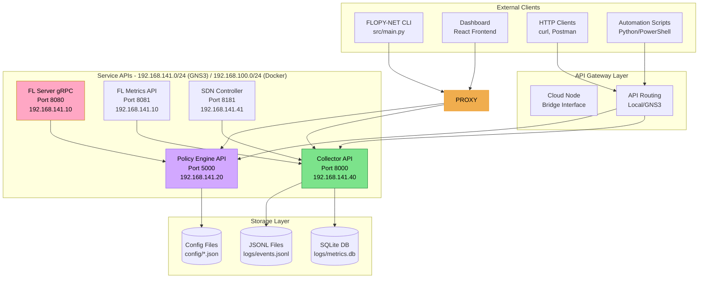

# API Reference Overview

FLOPY-NET provides REST APIs for its core components, enabling programmatic access to federated learning orchestration, network management, policy enforcement, and real-time monitoring.

## API Architecture

FLOPY-NET provides a comprehensive REST API architecture that supports both Docker Compose (development) and GNS3 (research) deployment environments. The API services maintain consistent interfaces while adapting to different network topologies and deployment scenarios.



## Service Endpoints

FLOPY-NET provides APIs across multiple deployment environments with consistent interfaces but different network configurations.

### Deployment Environment Overview

**Development Environment (Docker Compose):**
- All services accessible via localhost with port mapping
- Simplified networking with static container IPs
- Direct API access without tunneling

**Research Environment (GNS3 VM):**
- Services deployed within GNS3 network topology
- External access via cloud node bridge interface
- Realistic network conditions affecting API performance

### Core API Services

| Service | Development Port | GNS3 Access | Base URL | Description | Status |
|---------|-----------------|-------------|----------|-------------|--------|
| **Policy Engine** | 5000 | Via cloud node | `/api/v1` | Policy management and enforcement | ✅ Active |
| **Collector** | 8083 | Via cloud node | `/api/v1` | Metrics collection and monitoring | ✅ Active |
| **FL Server gRPC** | 8080 | Direct/tunnel | `/` | Federated learning coordination | ✅ Active |
| **FL Metrics** | 8081 | Via collector | `/metrics` | FL training metrics (internal) | ✅ Active |
| **Dashboard Backend** | 8001 | Via tunnel | `/api/v1` | Web dashboard backend | ✅ Active |
| **SDN Controller** | - | Network only | `/onos/v1` | Network management (optional) | 🔶 Optional |

### Network Configuration

#### Docker Compose Environment
```yaml
services:
  policy-engine:
    ports: ["5000:5000"]
    networks:
      flopynet: 
        ipv4_address: 192.168.100.20
  
  collector:
    ports: ["8083:8000"]
    networks:
      flopynet:
        ipv4_address: 192.168.100.40
```

#### GNS3 Environment
```json
{
  "gns3_topology": {
    "policy_engine": {
      "ip": "192.168.141.20",      "port": 5000,
      "external_access": "cloud node bridge"
    },
    "collector": {
      "ip": "192.168.141.40", 
      "port": 8000,
      "external_access": "cloud node bridge"
    }
  }
}
```

### Authentication

Currently, the APIs do not implement authentication. All endpoints are accessible without authorization headers.

**Note**: Authentication and authorization features are planned for future releases.

### Rate Limiting

Currently, the APIs do not implement rate limiting.

**Note**: Rate limiting features are planned for future releases to ensure fair usage and system stability.

### Error Handling

All APIs return consistent error responses:

```json
{
  "error": {
    "code": "VALIDATION_ERROR",
    "message": "Invalid request parameters",
    "details": {
      "field": "client_id",
      "issue": "Required field missing"
    },
    "timestamp": "2024-01-15T10:30:00Z",
    "request_id": "req_abc123"
  }
}
```

### Common HTTP Status Codes

| Code | Description | Usage |
|------|-------------|-------|
| 200 | OK | Successful GET, PUT, PATCH |
| 201 | Created | Successful POST |
| 204 | No Content | Successful DELETE |
| 400 | Bad Request | Invalid request parameters |
| 401 | Unauthorized | Missing or invalid authentication |
| 403 | Forbidden | Insufficient permissions |
| 404 | Not Found | Resource not found |
| 429 | Too Many Requests | Rate limit exceeded |
| 500 | Internal Server Error | Server-side error |

## WebSocket Connections

Real-time data streaming is available through WebSocket connections:

```javascript
// Connect to real-time metrics
const ws = new WebSocket('ws://localhost:8081/ws/metrics');

ws.onmessage = function(event) {
    const data = JSON.parse(event.data);
    console.log('Real-time metrics:', data);
};
```

### WebSocket Endpoints

| Endpoint | Description |
|----------|-------------|
| `/ws/metrics` | Real-time metrics streaming |
| `/ws/fl-status` | FL training status updates |
| `/ws/network-events` | Network topology changes |
| `/ws/policy-events` | Policy enforcement events |

## API Versioning

APIs follow semantic versioning with backwards compatibility:

- **v1**: Current stable version
- **v2**: Beta version with new features
- **v3**: Alpha version for experimental features

Version is specified in the URL path: `/api/v1/...`

## SDKs and Client Libraries

Official client libraries are available:

- **Python SDK**: `pip install flopy-net-client`
- **JavaScript SDK**: `npm install flopy-net-client`
- **Go SDK**: `go get github.com/flopy-net/go-client`

## Interactive API Explorer

Use the built-in API explorer to test endpoints:

```bash
# Start the API documentation server
cd docs
npm run api-docs

# Open http://localhost:3000/api-explorer
```

## Next Steps

- [Dashboard API Reference](./dashboard-api.md) - Web dashboard backend API
- [Collector API Reference](./collector.md) - Metrics collection API
- [Policy Engine API Reference](./policy-engine-api.md) - Policy management API
- [FL Framework API Reference](./fl-framework.md) - Federated learning API
- [SDN Controller API Reference](./networking-api.md) - Network management API
