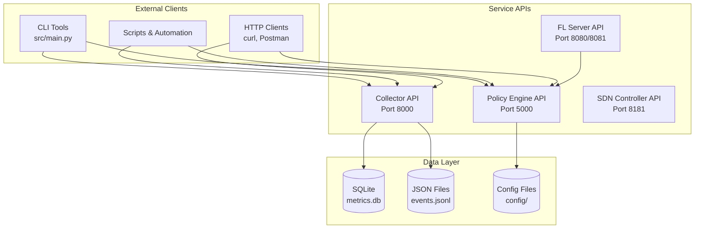

# API Reference Overview

FLOPY-NET provides REST APIs for its core components, enabling programmatic access to federated learning orchestration, network management, policy enforcement, and real-time monitoring.

## API Architecture



## Service Endpoints

### Core Services

| Service | Port | Base URL | Description | Status |
|---------|------|----------|-------------|--------|
| Policy Engine API | 5000 | `/` | Policy management and enforcement | ✅ Active |
| Collector API | 8000 | `/` | Metrics collection and aggregation | ✅ Active |
| FL Server API | 8080/8081 | `/` | Federated learning coordination | ✅ Active |
| SDN Controller API | 8181 | `/onos/v1` | Network management (if enabled) | 🔶 Optional |

### Network Configuration

All services run on the `192.168.100.0/24` network with static IPs:

| Service | Container IP | External Port | Internal Port |
|---------|-------------|---------------|---------------|
| Policy Engine | 192.168.100.20 | 5000 | 5000 |
| Collector | 192.168.100.40 | 8000 | 8000 |
| FL Server | 192.168.100.10 | - | 8080/8081 |
| SDN Controller | 192.168.100.41 | - | 6633/8181 |

### Authentication

All APIs use JWT-based authentication with the following header:

```http
Authorization: Bearer <jwt_token>
```

### Rate Limiting

APIs implement rate limiting to ensure fair usage:

- **Dashboard API**: 1000 requests/hour per IP
- **Collector API**: 5000 requests/hour per IP
- **Policy Engine API**: 500 requests/hour per IP
- **FL Server API**: 100 requests/hour per IP
- **SDN Controller API**: 200 requests/hour per IP

### Error Handling

All APIs return consistent error responses:

```json
{
  "error": {
    "code": "VALIDATION_ERROR",
    "message": "Invalid request parameters",
    "details": {
      "field": "client_id",
      "issue": "Required field missing"
    },
    "timestamp": "2024-01-15T10:30:00Z",
    "request_id": "req_abc123"
  }
}
```

### Common HTTP Status Codes

| Code | Description | Usage |
|------|-------------|-------|
| 200 | OK | Successful GET, PUT, PATCH |
| 201 | Created | Successful POST |
| 204 | No Content | Successful DELETE |
| 400 | Bad Request | Invalid request parameters |
| 401 | Unauthorized | Missing or invalid authentication |
| 403 | Forbidden | Insufficient permissions |
| 404 | Not Found | Resource not found |
| 429 | Too Many Requests | Rate limit exceeded |
| 500 | Internal Server Error | Server-side error |

## WebSocket Connections

Real-time data streaming is available through WebSocket connections:

```javascript
// Connect to real-time metrics
const ws = new WebSocket('ws://localhost:8081/ws/metrics');

ws.onmessage = function(event) {
    const data = JSON.parse(event.data);
    console.log('Real-time metrics:', data);
};
```

### WebSocket Endpoints

| Endpoint | Description |
|----------|-------------|
| `/ws/metrics` | Real-time metrics streaming |
| `/ws/fl-status` | FL training status updates |
| `/ws/network-events` | Network topology changes |
| `/ws/policy-events` | Policy enforcement events |

## API Versioning

APIs follow semantic versioning with backwards compatibility:

- **v1**: Current stable version
- **v2**: Beta version with new features
- **v3**: Alpha version for experimental features

Version is specified in the URL path: `/api/v1/...`

## SDKs and Client Libraries

Official client libraries are available:

- **Python SDK**: `pip install flopy-net-client`
- **JavaScript SDK**: `npm install flopy-net-client`
- **Go SDK**: `go get github.com/flopy-net/go-client`

## Interactive API Explorer

Use the built-in API explorer to test endpoints:

```bash
# Start the API documentation server
cd docs
npm run api-docs

# Open http://localhost:3000/api-explorer
```

## Next Steps

- [Dashboard API Reference](./dashboard-api.md) - Web dashboard backend API
- [Collector API Reference](./collector-api.md) - Metrics collection API
- [Policy Engine API Reference](./policy-engine-api.md) - Policy management API
- [FL Framework API Reference](./fl-framework.md) - Federated learning API
- [SDN Controller API Reference](./networking-api.md) - Network management API
