# System Architecture Overview

FLOPY-NET is architected as a modular, policy-driven platform that integrates the Flower federated learning framework with comprehensive network simulation and monitoring. The system follows a layered microservices architecture approach, enabling researchers to conduct realistic federated learning experiments while maintaining strict policy compliance and comprehensive observability.

## High-Level Architecture

FLOPY-NET consists of five primary layers deployed as Docker containers with static IP assignment (192.168.100.0/24 network), each serving distinct functional responsibilities while maintaining loose coupling through well-defined interfaces:

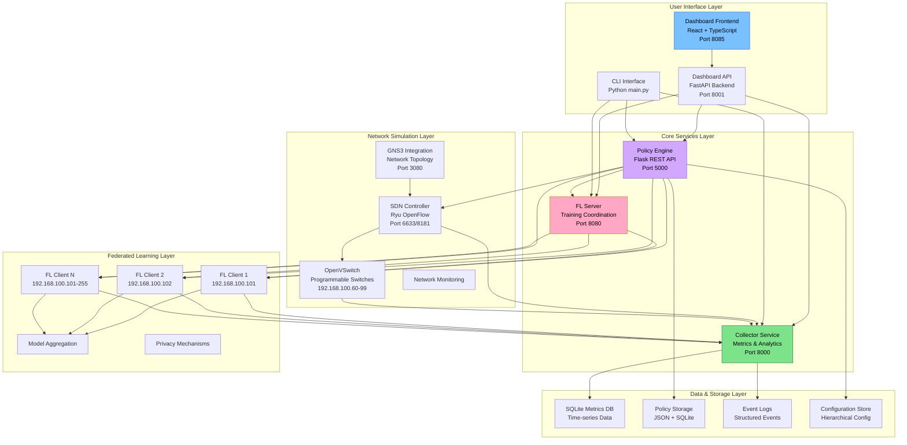

## Architectural Design Principles

### 1. Policy-Driven Architecture

The **Policy Engine** serves as the central nervous system of FLOPY-NET, ensuring that all components operate according to defined security, performance, and governance rules.

**Core Principles:**
- **Centralized Decision Making**: All system components query the Policy Engine before taking actions
- **Real-time Enforcement**: Policies are enforced in real-time across all system operations
- **Dynamic Updates**: Policy changes can be applied without system restart
- **Audit Trail**: Complete logging of policy decisions and enforcement actions
- **Event-Driven Compliance**: Continuous monitoring with event buffer system

**Implementation:**
- Flask-based REST API service on port 5000
- SQLite and JSON storage backends for policies and events
- Custom policy functions in `config/policy_functions/`
- Real-time event buffer with configurable retention

### 2. Microservices Architecture

Each major component is implemented as an independent service with well-defined interfaces, enabling independent development, deployment, and scaling.

**Service Independence:**
- Components can be developed and deployed independently
- Different technology stacks optimized for each service
- Fault isolation prevents cascading failures
- Horizontal scaling of individual components

**Interface Contracts:**
- RESTful APIs with comprehensive documentation
- Standardized error handling and status codes
- Event-driven communication patterns
- Consistent authentication and authorization

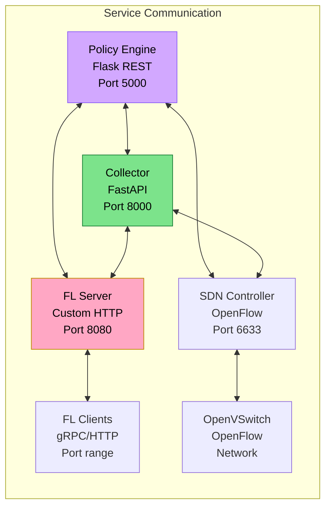

### 3. Observable Systems

Every component exposes comprehensive metrics, logs, and control interfaces to ensure complete system visibility.

**Metrics Collection:**
- Performance metrics from all components
- Business metrics for federated learning research
- Infrastructure metrics for system health
- Custom metrics for experimental analysis

**Structured Logging:**
- JSON-formatted structured logs
- Centralized log aggregation in Collector
- Configurable log levels and retention
- Event correlation across components

**Health Monitoring:**
- Component health endpoints
- Dependency health checking
- Resource utilization monitoring
- Automated alerting and remediation

### 3. Observable and Controllable Systems

Every component exposes metrics, logs, and control interfaces:

- **Metrics**: Performance, health, and business metrics
- **Events**: System events and state changes
- **Controls**: REST APIs for configuration and control
- **Health Checks**: Liveness and readiness probes

### 4. Research-First Design

The platform is optimized for research workflows:

- **Reproducible Experiments**: Deterministic seeding and configuration
- **Extensible Frameworks**: Plugin architecture for custom algorithms
- **Data Export**: Comprehensive data export for analysis
- **Scenario Management**: Pre-defined and custom scenarios

## Component Interactions

### Startup Sequence

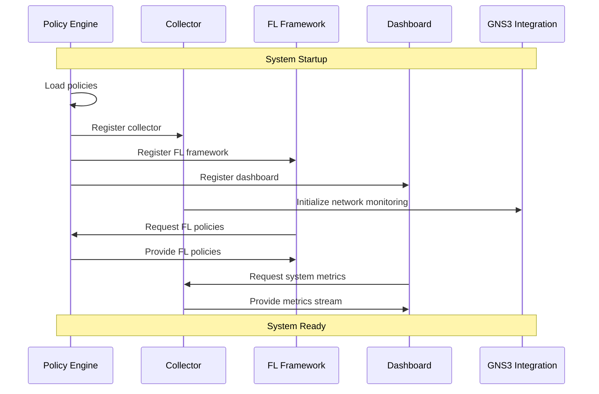

### Experiment Lifecycle

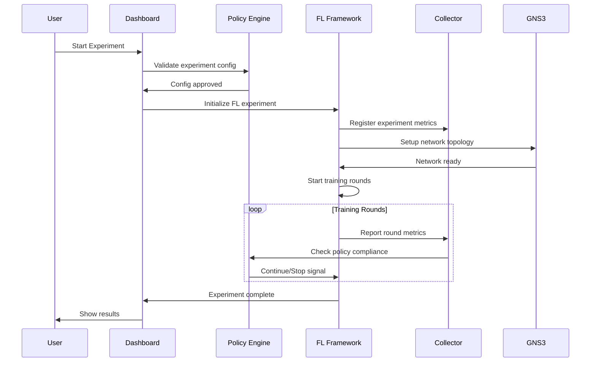

## Data Flow Architecture

### Metrics Collection Flow

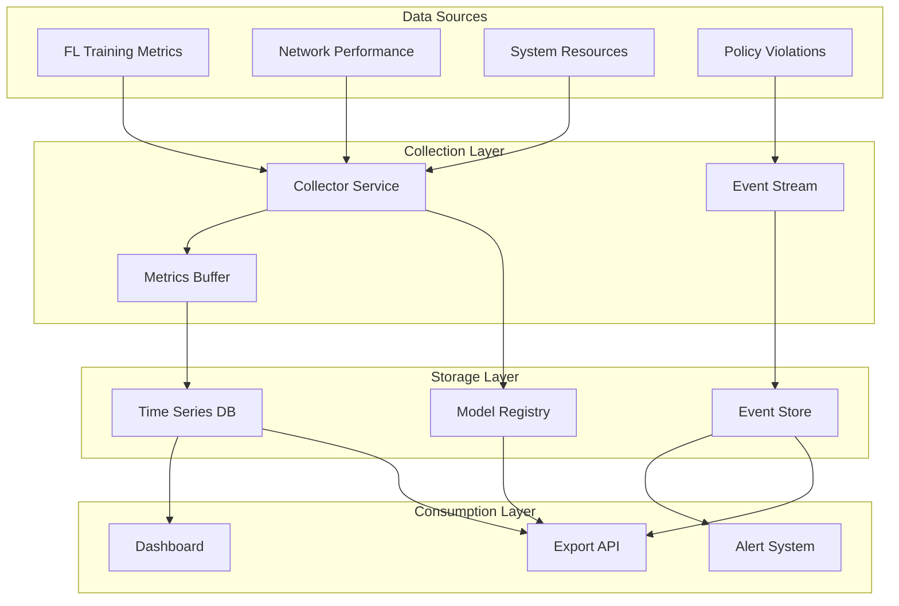

### Policy Enforcement Flow

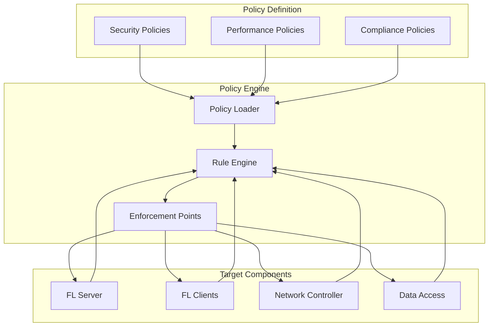

## Security Architecture

### Multi-Layer Security Model

FLOPY-NET implements security at multiple layers:

1. **Network Layer**: SDN-based network isolation and monitoring
2. **Application Layer**: Policy-based access control and validation
3. **Data Layer**: Encryption at rest and in transit
4. **Component Layer**: Service-to-service authentication

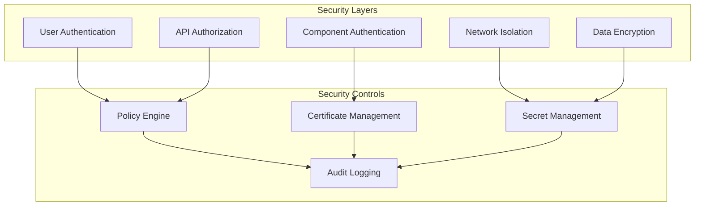

## Scalability Architecture

### Horizontal Scaling

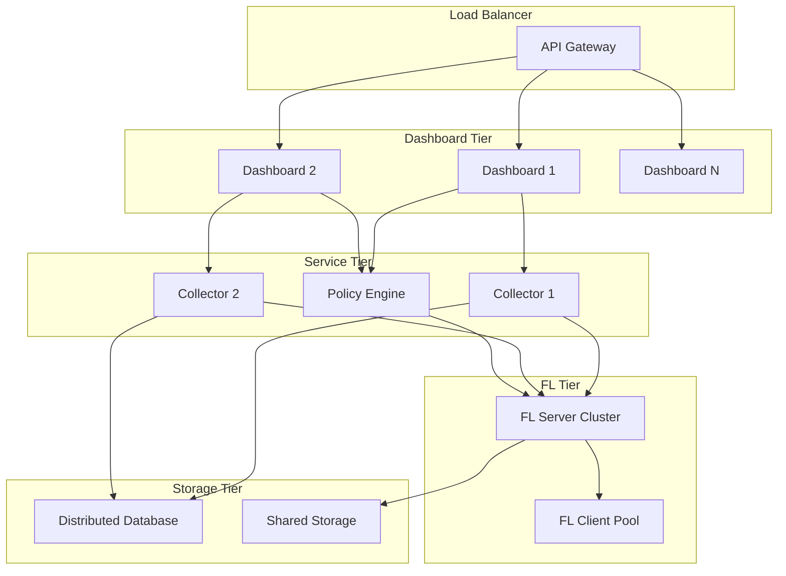

## Performance Characteristics

### Throughput Metrics

| Component | Metric | Target | Maximum |
|-----------|---------|---------|----------|
| Dashboard API | Requests/sec | 1,000 | 10,000 |
| Collector | Metrics/sec | 10,000 | 100,000 |
| Policy Engine | Evaluations/sec | 5,000 | 50,000 |
| FL Framework | Clients | 100 | 1,000 |

### Latency Targets

| Operation | P50 | P95 | P99 |
|-----------|-----|-----|-----|
| API Response | 50ms | 200ms | 500ms |
| Metric Collection | 10ms | 50ms | 100ms |
| Policy Evaluation | 5ms | 20ms | 50ms |
| FL Round Start | 1s | 5s | 10s |

## Deployment Architecture

### Development Environment

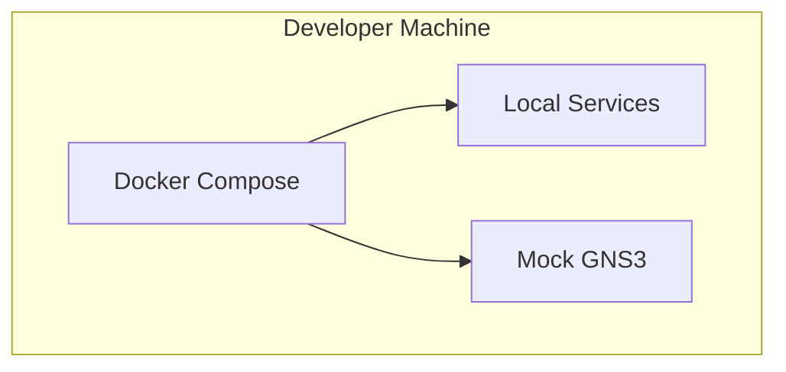

### Production Environment

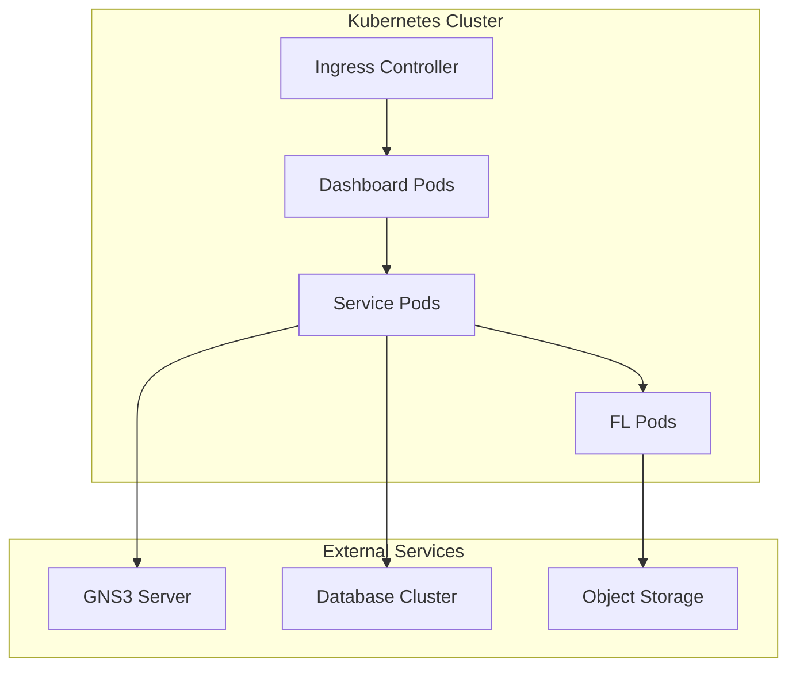

## Technology Stack

### Core Technologies

| Layer | Technology | Purpose |
|-------|------------|---------|
| **Frontend** | React 18 + TypeScript | Interactive dashboard |
| **Backend** | FastAPI + Python | REST API services |
| **Database** | PostgreSQL + InfluxDB | Metrics and metadata storage |
| **Message Queue** | Redis | Event streaming |
| **Container** | Docker + Compose | Service orchestration |
| **Network** | GNS3 + OpenFlow | Network simulation |

### ML/FL Technologies

| Component | Technology | Purpose |
|-----------|------------|---------|
| **FL Framework** | Custom + PyTorch | Federated learning implementation |
| **Model Training** | PyTorch | Deep learning models |
| **Data Handling** | Pandas + NumPy | Data preprocessing |
| **Visualization** | Plotly + D3.js | Interactive charts |

## Configuration Management

### Configuration Hierarchy

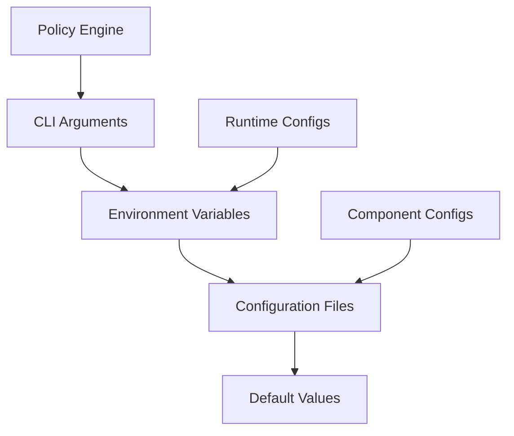

### Configuration Files Structure

```
config/
├── system/
│   ├── collector_config.json
│   ├── policy_config.json
│   └── server_config.json
├── scenarios/
│   ├── basic_fl.json
│   ├── non_iid.json
│   └── byzantine.json
├── policies/
│   ├── security_policies.json
│   ├── performance_policies.json
│   └── compliance_policies.json
└── network/
    ├── topology_configs/
    └── gns3_templates/
```

## Monitoring and Observability

### Metrics Collection

FLOPY-NET collects four types of metrics:

1. **Business Metrics**: FL accuracy, convergence, client participation
2. **Performance Metrics**: Latency, throughput, resource utilization
3. **Infrastructure Metrics**: CPU, memory, disk, network usage
4. **Security Metrics**: Policy violations, authentication failures

### Logging Strategy

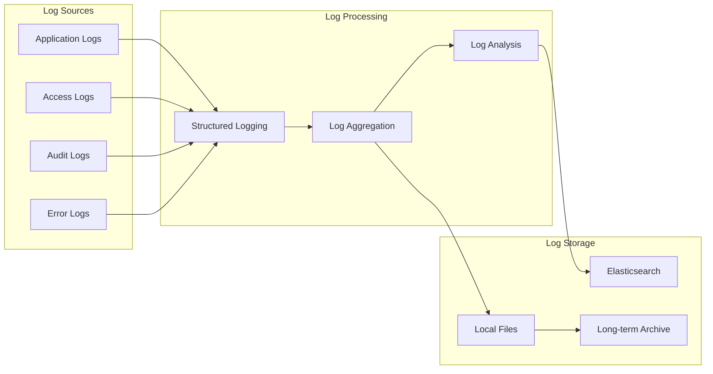

This architecture ensures that FLOPY-NET provides a robust, scalable, and research-friendly platform for studying federated learning in realistic network environments.
