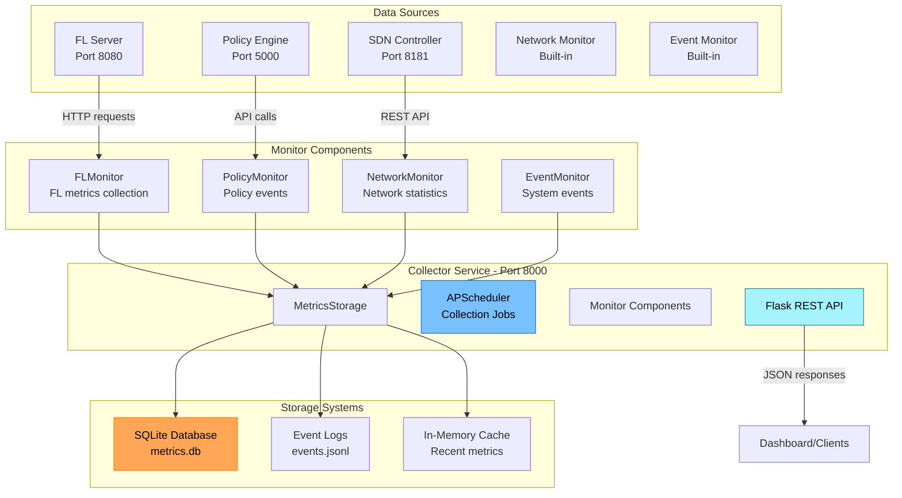

# Collector Service

The Collector service is the central metrics aggregation and monitoring system for FLOPY-NET. It gathers, stores, and provides real-time and historical data from all system components, enabling comprehensive observability and analysis of federated learning experiments and network operations.

## Architecture



## Implementation Details

### Source Code Structure
- **Main Service**: `src/collector/collector.py` - Flask app with APScheduler
- **Monitor Classes**: Individual monitor components for different data sources
- **Storage Layer**: `src/collector/storage.py` - SQLite and JSON-based storage
- **Configuration**: `config/collector_config.json` and `config/collector/`

## Core Functionality

### 1. Data Collection Components

The Collector service uses specialized monitor classes for different data sources:

#### FL Monitor (`src/collector/fl_monitor.py`)
- **Training Metrics**: Round progress, client participation, model performance
- **Server Status**: Health checks, resource utilization
- **Client Analytics**: Connection status, training contributions

#### Policy Monitor (`src/collector/policy_monitor.py`)  
- **Policy Events**: Rule executions, enforcement actions
- **Security Monitoring**: Anomaly detection, compliance violations
- **Audit Trail**: Decision logs, access control events

#### Network Monitor (`src/collector/network_monitor.py`)
- **Topology Discovery**: Device inventory, connection mapping
- **Performance Metrics**: Latency, bandwidth, packet loss
- **SDN Statistics**: Flow table entries, switch performance

#### Event Monitor (`src/collector/event_monitor.py`)
- **System Events**: Component startup/shutdown, configuration changes
- **Error Tracking**: Exception logs, failure analysis
- **Operational Metrics**: Service health, resource consumption

```python
async def collect_fl_metrics(self):
    """Collect FL training and performance metrics."""
    try:
        # Get current FL server status and metrics
        fl_metrics = await self.http_client.get(
            self.sources['fl_server'] + "/metrics"
        )
            metrics = response.json()
            
            # Process and normalize data
            processed = self.processors['fl'].process(metrics)
            
            # Store in time-series database
            await self.storage.store_metrics('fl_training', processed)
            
            # Update real-time cache
            await self.storage.cache_recent('fl_current', processed)
              except Exception as e:
            logger.error("FL metrics collection failed: " + str(e))
    
    async def collect_network_metrics(self):
        """Collect network performance metrics."""
        try:            # Get topology and statistics
            topology = await self.http_client.get(
                self.sources['sdn_controller'] + "/onos/v1/topology"
            )
            devices = await self.http_client.get(
                self.sources['sdn_controller'] + "/onos/v1/devices"
            )flows = await self.http_client.get(
                self.sources['sdn_controller'] + "/onos/v1/flows"
            )
            
            # Combine and process network data
            network_data = {
                "timestamp": time.time(),
                "topology": topology.json(),
                "devices": devices.json(),
                "flows": flows.json()
            }
            
            processed = self.processors['network'].process(network_data)
            await self.storage.store_metrics('network_performance', processed)
              except Exception as e:
            logger.error("Network metrics collection failed: " + str(e))
```

### 3. Data Storage Architecture

#### Time-Series Database (InfluxDB)

```python
class TSDBManager:
    """Time-series database management."""
    
    def __init__(self):
        self.client = InfluxDBClient(
            host='localhost',
            port=8086,
            database='flopynet_metrics'
        )
        self.measurements = {
            'fl_training': self._setup_fl_schema(),
            'network_performance': self._setup_network_schema(),
            'policy_events': self._setup_policy_schema()
        }
    
    def _setup_fl_schema(self):
        """Define FL metrics schema."""
        return {
            "measurement": "fl_training",
            "tags": ["round", "client_id", "experiment_id"],
            "fields": [
                "accuracy", "loss", "training_time", 
                "communication_bytes", "model_size"
            ]
        }
    
    async def store_fl_round(self, round_data: dict):
        """Store FL training round data."""
        points = []
        
        for client_id, metrics in round_data.get('clients', {}).items():
            point = {
                "measurement": "fl_training",
                "tags": {
                    "round": round_data['round_number'],
                    "client_id": client_id,
                    "experiment_id": round_data['experiment_id']
                },
                "time": round_data['timestamp'],
                "fields": {
                    "local_accuracy": metrics.get('accuracy', 0),
                    "local_loss": metrics.get('loss', 0),
                    "training_time": metrics.get('training_time', 0),
                    "data_samples": metrics.get('data_samples', 0),
                    "communication_bytes": metrics.get('comm_bytes', 0)
                }
            }
            points.append(point)
        
        # Global metrics point
        global_point = {
            "measurement": "fl_training_global",
            "tags": {
                "round": round_data['round_number'],
                "experiment_id": round_data['experiment_id']
            },
            "time": round_data['timestamp'],
            "fields": {
                "global_accuracy": round_data.get('global_accuracy', 0),
                "global_loss": round_data.get('global_loss', 0),
                "participants": round_data.get('participants', 0),
                "aggregation_time": round_data.get('aggregation_time', 0)
            }
        }
        points.append(global_point)
        
        self.client.write_points(points)
```

#### Redis Cache for Real-time Data

```python
class CacheManager:
    """Redis-based caching for real-time metrics."""
    
    def __init__(self):
        self.redis = redis.Redis(host='localhost', port=6379, db=0)
        self.ttl = 300  # 5 minutes TTL for real-time data
      async def cache_current_state(self, component: str, data: dict):
        """Cache current component state."""
        key = "current:" + component
        serialized = json.dumps(data, default=str)
        
        self.redis.setex(key, self.ttl, serialized)
      async def get_current_state(self, component: str) -> dict:
        """Get current component state."""
        key = "current:" + component
        cached = self.redis.get(key)
        
        if cached:
            return json.loads(cached.decode())
        return {}
      async def cache_aggregated_metrics(self, timeframe: str, metrics: dict):
        """Cache pre-aggregated metrics for common queries."""
        key = "aggregated:" + timeframe
        self.redis.setex(key, 60, json.dumps(metrics, default=str))
```

## REST API Endpoints

### Metrics Retrieval

#### Current System Status
```http
GET /api/v1/status
```

**Response:**
```json
{
  "timestamp": "2025-01-16T10:30:00Z",
  "system_health": "healthy",
  "components": {
    "fl_server": {
      "status": "training",
      "current_round": 15,
      "active_clients": 8,
      "last_update": "2025-01-16T10:29:55Z"
    },
    "policy_engine": {
      "status": "active",
      "active_policies": 12,
      "events_per_minute": 3.2,
      "last_update": "2025-01-16T10:29:58Z"
    },
    "sdn_controller": {
      "status": "connected",
      "managed_devices": 5,
      "active_flows": 127,
      "last_update": "2025-01-16T10:29:59Z"
    }
  }
}
```

#### FL Training Metrics
```http
GET /api/v1/fl/metrics?experiment_id={id}&from={timestamp}&to={timestamp}
```

**Response:**
```json
{
  "experiment_id": "exp_2025_001",
  "timerange": {
    "from": "2025-01-16T09:00:00Z",
    "to": "2025-01-16T10:30:00Z"
  },
  "global_metrics": {
    "rounds": [1, 2, 3, 4, 5, 6, 7, 8, 9, 10],
    "global_accuracy": [0.45, 0.52, 0.58, 0.63, 0.67, 0.71, 0.74, 0.76, 0.78, 0.80],
    "global_loss": [0.85, 0.78, 0.72, 0.67, 0.63, 0.58, 0.55, 0.52, 0.49, 0.46],
    "participants_per_round": [10, 9, 10, 8, 9, 10, 9, 8, 10, 9],
    "round_duration_seconds": [120, 115, 125, 130, 118, 122, 127, 124, 119, 121]
  },
  "client_metrics": {
    "client-1": {
      "participation_rate": 0.9,
      "avg_local_accuracy": 0.78,
      "avg_training_time": 45.2,
      "data_contribution": 1250
    },
    "client-2": {
      "participation_rate": 0.8,
      "avg_local_accuracy": 0.76,
      "avg_training_time": 52.1,
      "data_contribution": 980
    }
  }
}
```

#### Network Performance
```http
GET /api/v1/network/metrics?timeframe={duration}
```

**Response:**
```json
{
  "timeframe": "1h",
  "topology": {
    "devices": 5,
    "hosts": 12,
    "links": 8,
    "last_change": "2025-01-16T09:45:23Z"
  },
  "performance": {
    "average_latency_ms": 23.5,
    "peak_bandwidth_mbps": 850.2,
    "packet_loss_rate": 0.001,
    "flow_table_utilization": 0.65
  },
  "traffic_analysis": {
    "fl_traffic_percentage": 78.3,
    "control_traffic_percentage": 12.1,
    "background_traffic_percentage": 9.6
  },
  "qos_metrics": {
    "high_priority_flows": 45,
    "medium_priority_flows": 23,
    "low_priority_flows": 89,
    "priority_violations": 2
  }
}
```

### Real-time Streaming

#### WebSocket Connection
```javascript
// JavaScript client example
const ws = new WebSocket('ws://collector:8083/ws/metrics');

ws.onmessage = function(event) {
    const data = JSON.parse(event.data);
    
    switch(data.type) {
        case 'fl_round_update':
            updateFLCharts(data.metrics);
            break;
        case 'network_alert':
            showNetworkAlert(data.alert);
            break;
        case 'policy_event':
            logPolicyEvent(data.event);
            break;
    }
};

// Subscribe to specific metric streams
ws.send(JSON.stringify({
    action: 'subscribe',
    streams: ['fl_training', 'network_performance', 'policy_events']
}));
```

## Data Processing Pipeline

### 1. Metric Normalization

```python
class MetricProcessor:
    """Process and normalize metrics from different sources."""
    
    def __init__(self):
        self.normalizers = {
            'fl_training': FLMetricNormalizer(),
            'network_performance': NetworkMetricNormalizer(),
            'policy_events': PolicyEventNormalizer()
        }
    
    def process_fl_metrics(self, raw_metrics: dict) -> dict:
        """Normalize FL training metrics."""
        normalized = {
            "timestamp": time.time(),
            "experiment_id": raw_metrics.get("experiment_id"),
            "round_number": raw_metrics.get("round", 0),
            "global_metrics": {
                "accuracy": self._safe_float(raw_metrics.get("accuracy")),
                "loss": self._safe_float(raw_metrics.get("loss")),
                "convergence_rate": self._calculate_convergence(raw_metrics)
            },
            "client_metrics": {}
        }
        
        # Process per-client metrics
        for client_id, client_data in raw_metrics.get("clients", {}).items():
            normalized["client_metrics"][client_id] = {
                "local_accuracy": self._safe_float(client_data.get("accuracy")),
                "local_loss": self._safe_float(client_data.get("loss")),
                "training_time": self._safe_float(client_data.get("training_time")),
                "data_samples": self._safe_int(client_data.get("data_samples")),
                "model_updates": self._safe_int(client_data.get("model_updates"))
            }
        
        return normalized
    
    def _calculate_convergence(self, metrics: dict) -> float:
        """Calculate convergence rate based on recent accuracy trend."""
        recent_accuracy = metrics.get("recent_accuracy", [])
        if len(recent_accuracy) < 3:
            return 0.0
        
        # Simple linear regression slope
        x = list(range(len(recent_accuracy)))
        y = recent_accuracy
        
        n = len(x)
        sum_x = sum(x)
        sum_y = sum(y)
        sum_xy = sum(x[i] * y[i] for i in range(n))
        sum_x2 = sum(x[i] ** 2 for i in range(n))
        
        slope = (n * sum_xy - sum_x * sum_y) / (n * sum_x2 - sum_x ** 2)
        return slope
```

### 2. Anomaly Detection

```python
class AnomalyDetector:
    """Detect anomalous patterns in collected metrics."""
    
    def __init__(self):
        self.thresholds = {
            'fl_accuracy_drop': 0.1,  # 10% accuracy drop
            'network_latency_spike': 100,  # 100ms spike
            'client_disconnect_rate': 0.3  # 30% clients disconnect
        }
        self.history_window = 100  # Keep last 100 data points
        self.metric_history = defaultdict(list)
    
    def check_fl_anomalies(self, metrics: dict) -> List[dict]:
        """Check for FL training anomalies."""
        alerts = []
        
        # Accuracy drop detection
        current_accuracy = metrics.get("global_accuracy", 0)
        self.metric_history["accuracy"].append(current_accuracy)
        
        if len(self.metric_history["accuracy"]) > 5:
            recent_avg = np.mean(self.metric_history["accuracy"][-5:])
            prev_avg = np.mean(self.metric_history["accuracy"][-10:-5])
              if recent_avg < prev_avg - self.thresholds['fl_accuracy_drop']:
                alerts.append({
                    "type": "fl_accuracy_drop",
                    "severity": "high",
                    "message": "Accuracy dropped by " + str(round(prev_avg - recent_avg, 3)),
                    "current_value": current_accuracy,
                    "expected_range": (prev_avg - 0.05, prev_avg + 0.05),
                    "timestamp": time.time()
                })
        
        # Client participation anomaly
        active_clients = metrics.get("active_clients", 0)
        total_clients = metrics.get("total_clients", 1)
        participation_rate = active_clients / total_clients
          if participation_rate < (1 - self.thresholds['client_disconnect_rate']):
            alerts.append({
                "type": "client_disconnect_spike",
                "severity": "medium",
                "message": "Only " + str(active_clients) + "/" + str(total_clients) + " clients active",
                "current_value": participation_rate,
                "threshold": self.thresholds['client_disconnect_rate'],
                "timestamp": time.time()
            })
        
        return alerts
    
    def check_network_anomalies(self, metrics: dict) -> List[dict]:
        """Check for network performance anomalies."""
        alerts = []
        
        # Latency spike detection
        current_latency = metrics.get("average_latency_ms", 0)
        self.metric_history["latency"].append(current_latency)
        
        if len(self.metric_history["latency"]) > 10:
            baseline = np.mean(self.metric_history["latency"][-10:])
            
            if current_latency > baseline + self.thresholds['network_latency_spike']:                alerts.append({
                    "type": "network_latency_spike",
                    "severity": "high",
                    "message": "Latency spike: " + str(current_latency) + "ms (baseline: " + str(round(baseline, 1)) + "ms)",
                    "current_value": current_latency,
                    "baseline": baseline,
                    "timestamp": time.time()
                })
        
        return alerts
```

## Data Export and Analysis

### Historical Data Export

```python
@app.route('/api/v1/export', methods=['POST'])
async def export_metrics(request):
    """Export historical metrics for analysis."""
    params = await request.json()
    
    export_config = {
        "experiment_id": params.get("experiment_id"),
        "components": params.get("components", ["fl", "network", "policy"]),
        "time_range": {
            "start": params.get("start_time"),
            "end": params.get("end_time")
        },
        "format": params.get("format", "json"),  # json, csv, parquet
        "aggregation": params.get("aggregation", "raw")  # raw, 1m, 5m, 1h
    }
    
    exporter = DataExporter(export_config)
    export_result = await exporter.generate_export()
      return {
        "export_id": export_result["id"],
        "download_url": "/api/v1/downloads/" + export_result['id'],
        "file_size": export_result["size_bytes"],
        "format": export_config["format"],
        "expires_at": export_result["expires_at"]
    }
```

### Integration with Analysis Tools

```python
class AnalyticsIntegration:
    """Integration with external analytics platforms."""
    
    def __init__(self):
        self.integrations = {
            'jupyter': JupyterNotebookAPI(),
            'grafana': GrafanaAPI(),
            'elasticsearch': ElasticsearchAPI()
        }
    
    def export_to_jupyter(self, experiment_id: str) -> str:
        """Create Jupyter notebook with experiment data."""
        notebook_template = {
            "cells": [                {
                    "cell_type": "markdown",
                    "source": ["# FLOPY-NET Experiment Analysis: " + experiment_id]
                },
                {
                    "cell_type": "code",
                    "source": [
                        "import pandas as pd\n",
                        "import numpy as np\n",
                        "import matplotlib.pyplot as plt\n",
                        "import seaborn as sns\n",
                        "\n# Load experiment data\n",
                        "data = pd.read_json('/exports/" + experiment_id + ".json')\n"
                    ]
                }
            ]
        }        
        notebook_path = "/exports/" + experiment_id + "_analysis.ipynb"
        with open(notebook_path, 'w') as f:
            json.dump(notebook_template, f, indent=2)
        
        return notebook_path
```

## Configuration

### Environment Variables

| Variable | Description | Default |
|----------|-------------|---------|
| `COLLECTOR_PORT` | API server port | `8083` |
| `COLLECTION_INTERVAL` | Metrics collection interval (seconds) | `5` |
| `INFLUXDB_HOST` | InfluxDB hostname | `localhost` |
| `INFLUXDB_PORT` | InfluxDB port | `8086` |
| `REDIS_HOST` | Redis hostname | `localhost` |
| `REDIS_PORT` | Redis port | `6379` |
| `FL_SERVER_URL` | FL Server API URL | `http://fl-server:8080` |
| `POLICY_ENGINE_URL` | Policy Engine API URL | `http://policy-engine:5000` |
| `SDN_CONTROLLER_URL` | SDN Controller API URL | `http://sdn-controller:8181` |
| `LOG_LEVEL` | Logging level | `INFO` |
| `ENABLE_ANOMALY_DETECTION` | Enable anomaly detection | `true` |
| `EXPORT_RETENTION_DAYS` | Days to keep export files | `7` |

### Docker Configuration

```yaml
collector:
  image: abdulmelink/flopynet-collector:v1.0.0-alpha.8
  container_name: collector
  ports:
    - "8083:8000"
  environment:
    - SERVICE_TYPE=collector
    - NETWORK_MONITOR_ENABLED=true
    - FL_SERVER_HOST=fl-server
    - FL_SERVER_PORT=8081
    - POLICY_ENGINE_HOST=policy-engine
    - POLICY_ENGINE_URL=http://policy-engine:5000
    - SDN_CONTROLLER_URL=http://sdn-controller:8181
    - LOG_LEVEL=INFO
  depends_on:
    fl-server:
      condition: service_healthy
    policy-engine:
      condition: service_healthy
  networks:
    flopynet:
      ipv4_address: 192.168.100.40
  volumes:
    - collector_data:/app/data
    - collector_exports:/app/exports
```

## Monitoring and Health Checks

### Service Health

```python
@app.route('/health')
async def health_check():
    """Comprehensive health check endpoint."""
    health_status = {
        "status": "healthy",
        "timestamp": time.time(),
        "version": "1.0.0",
        "components": {}
    }
    
    # Check database connections
    try:
        influx_health = await check_influxdb_connection()
        health_status["components"]["influxdb"] = influx_health
    except Exception as e:
        health_status["components"]["influxdb"] = {"status": "unhealthy", "error": str(e)}
        health_status["status"] = "degraded"
    
    # Check Redis connection
    try:
        redis_health = await check_redis_connection()
        health_status["components"]["redis"] = redis_health
    except Exception as e:
        health_status["components"]["redis"] = {"status": "unhealthy", "error": str(e)}
        health_status["status"] = "degraded"
    
    # Check source services connectivity
    for service, url in {
        "fl_server": "http://fl-server:8080/health",
        "policy_engine": "http://policy-engine:5000/health",
        "sdn_controller": "http://sdn-controller:8181/onos/ui"
    }.items():
        try:
            service_health = await check_service_health(url)
            health_status["components"][service] = service_health
        except Exception as e:
            health_status["components"][service] = {"status": "unreachable", "error": str(e)}
            health_status["status"] = "degraded"
    
    return health_status
```

### Performance Metrics

```python
class CollectorMetrics:
    """Internal collector performance monitoring."""
    
    def __init__(self):
        self.metrics = {
            "collection_cycles": 0,
            "successful_collections": 0,
            "failed_collections": 0,
            "avg_collection_time": 0,
            "storage_operations": 0,
            "api_requests": 0,
            "websocket_connections": 0
        }
        self.performance_history = []
    
    def record_collection_cycle(self, duration: float, success: bool):
        """Record metrics for a collection cycle."""
        self.metrics["collection_cycles"] += 1
        
        if success:
            self.metrics["successful_collections"] += 1
        else:
            self.metrics["failed_collections"] += 1
        
        # Update average collection time
        current_avg = self.metrics["avg_collection_time"]
        cycle_count = self.metrics["collection_cycles"]
        self.metrics["avg_collection_time"] = (
            (current_avg * (cycle_count - 1) + duration) / cycle_count
        )
        
        # Store performance snapshot
        self.performance_history.append({
            "timestamp": time.time(),
            "duration": duration,
            "success": success,
            "memory_usage": self._get_memory_usage(),
            "cpu_usage": self._get_cpu_usage()
        })
        
        # Keep only last 1000 entries
        if len(self.performance_history) > 1000:
            self.performance_history = self.performance_history[-1000:]
```

## Integration with System Components

### Dashboard Integration
- **Real-time Data**: WebSocket streaming for live dashboard updates
- **Historical Charts**: Time-series data for trend visualization
- **System Overview**: Aggregated metrics for system health monitoring
- **Alert Management**: Anomaly alerts forwarded to dashboard notifications

### Policy Engine Integration
- **Event Collection**: Policy execution results and security events
- **Compliance Monitoring**: Policy adherence metrics and violations
- **Trust Score Tracking**: Historical trust score evolution
- **Audit Trail**: Complete policy decision history

### FL Framework Integration
- **Training Metrics**: Round-by-round performance data
- **Client Analytics**: Individual client contribution analysis
- **Convergence Analysis**: Model improvement tracking
- **Resource Utilization**: Computational and communication overhead

### Network Integration
- **Topology Monitoring**: Real-time network state changes
- **Traffic Analysis**: FL-specific network usage patterns
- **Performance Optimization**: Network bottleneck identification
- **QoS Verification**: Traffic prioritization effectiveness

The Collector service serves as the central nervous system of FLOPY-NET, providing comprehensive observability and enabling data-driven optimization of federated learning experiments in software-defined network environments.
