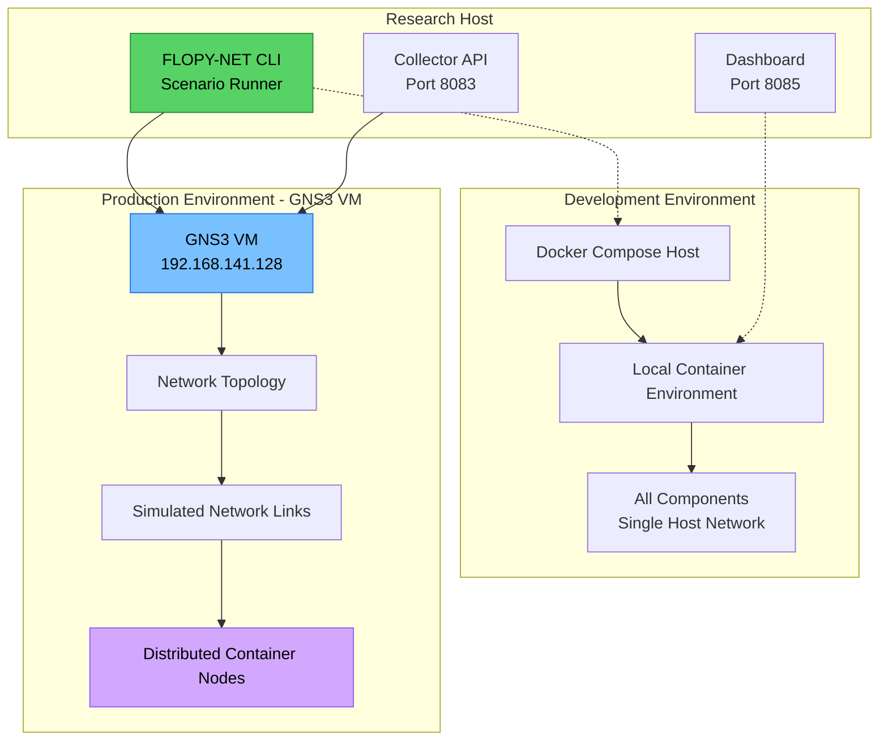
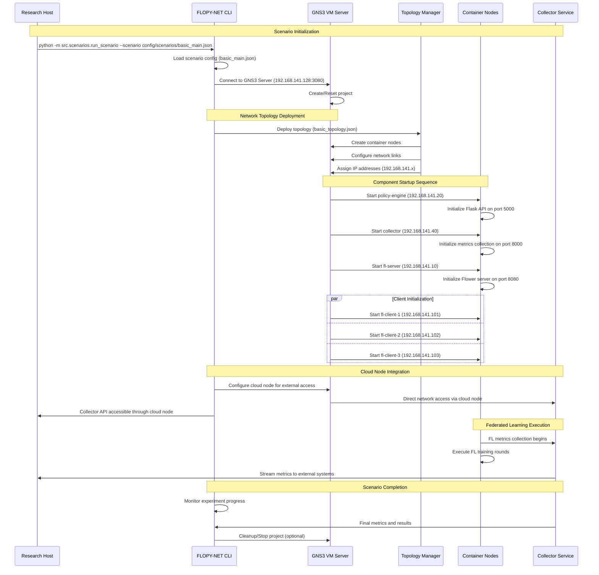
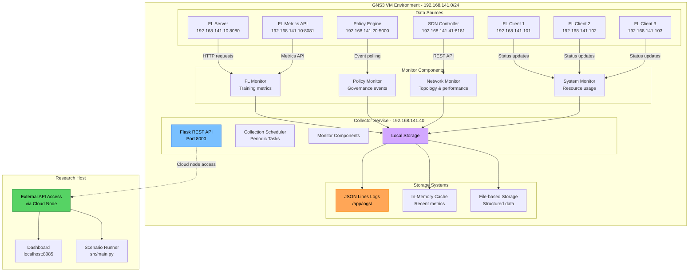
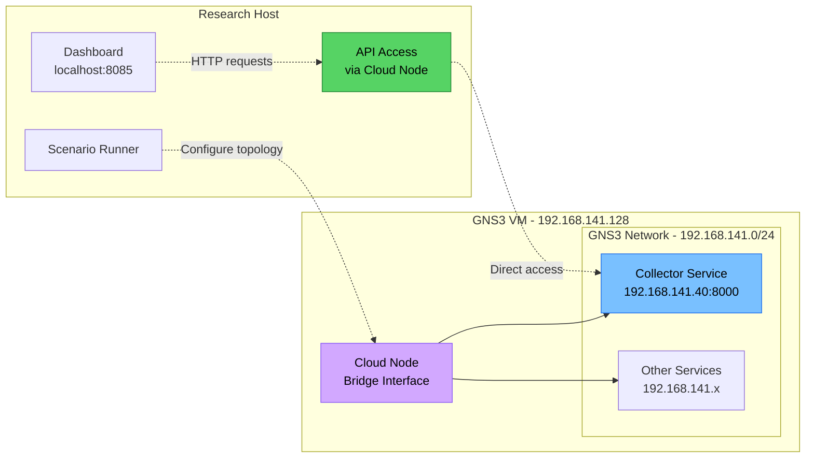

# Collector Service

The Collector service forms the observational backbone of FLOPY-NET, functioning as a comprehensive metrics aggregation and monitoring system that provides deep insights into federated learning experiments. This critical component continuously gathers data from all system elements, including the FL server, policy engine, network controllers, and individual clients, creating a unified view of system performance and behavior.

The service operates differently depending on the deployment environment: in local Docker Compose for development testing, and in GNS3 VM environments for realistic network emulation research. The GNS3 deployment represents the primary use case where network topology, latency, and packet loss can be accurately simulated to study their impact on federated learning performance.

## Deployment Architecture

FLOPY-NET supports two distinct deployment models, each serving different research and development needs:

### Development Environment (Docker Compose)
The local Docker Compose environment provides a simplified testing platform where all components run as containers on a single host machine. This environment is primarily used for component development, basic functionality testing, and initial experimentation before deploying to the full GNS3 simulation environment.

### Production Environment (GNS3 VM)
The GNS3 VM environment represents the primary research platform where realistic network conditions are emulated. In this environment, each FLOPY-NET component is deployed as a containerized node within the GNS3 topology, enabling researchers to study federated learning behavior under various network conditions including variable latency, packet loss, bandwidth limitations, and complex routing scenarios.



## GNS3 Scenario Execution Flow

The FLOPY-NET system operates through scenario-based execution, where each scenario defines a complete federated learning experiment including network topology, component configuration, and experimental parameters. This approach ensures reproducible research conditions and enables systematic study of different network and federated learning configurations.



## Architecture

The Collector service architecture adapts to the deployment environment, operating as a centralized metrics hub that maintains consistent interfaces regardless of whether components are deployed locally or distributed across a GNS3 network topology.



## Implementation Details

The Collector service is implemented as a Python application that operates within the FLOPY-NET containerized ecosystem. In GNS3 deployments, the service runs as a Docker container node with image `abdulmelink/flopynet-collector:v1.0.0-alpha.8` and is assigned a static IP address within the experimental network topology.

The service's architecture is designed to handle the unique challenges of distributed federated learning research, including intermittent network connectivity, variable latency, and the need to maintain data consistency across distributed components. The implementation uses lightweight, file-based storage systems optimized for research data collection and analysis.

### Source Code Structure
- **Main Service**: `src/collector/collector.py` - Python application with scheduled collection tasks
- **Monitor Classes**: Individual monitor components in `src/collector/` directory
- **Storage Layer**: File-based JSON and structured logging systems  
- **API Server**: Flask REST API for metrics access and external integration
- **Configuration**: Environment-driven configuration with scenario-specific overrides

### Deployment Configuration

The Collector service deployment varies significantly between development and production environments:

#### Docker Compose (Development)
```yaml
collector:
  image: abdulmelink/flopynet-collector:v1.0.0-alpha.8
  container_name: collector
  ports:
    - "8083:8000"  # Direct port mapping
  environment:
    - SERVICE_TYPE=collector
    - FL_SERVER_HOST=fl-server
    - FL_SERVER_PORT=8081
    - POLICY_ENGINE_HOST=policy-engine
    - POLICY_ENGINE_URL=http://policy-engine:5000
  networks:
    flopynet_network:
      ipv4_address: 192.168.100.40
```

#### GNS3 Topology (Production Research)
```json
{
  "name": "collector",
  "service_type": "collector", 
  "ip_address": "192.168.141.40",
  "ports": [8000],
  "template_name": "flopynet-Collector",
  "cloud_node_access": true,
  "environment": {
    "SERVICE_TYPE": "collector",
    "NETWORK_MODE": "gns3",
    "GNS3_NETWORK": "true",
    "USE_STATIC_IP": "true",
    "NODE_IP_FL_SERVER": "192.168.141.10",
    "NODE_IP_POLICY_ENGINE": "192.168.141.20",
    "POLICY_ENGINE_URL": "http://192.168.141.20:5000",
    "FL_SERVER_URL": "http://192.168.141.10:8081"
  }
}
```

### Cloud Node Architecture

In GNS3 deployments, the Collector service uses cloud node integration for external access rather than port forwarding. Cloud nodes provide direct network connectivity between the GNS3 topology and the host machine, enabling seamless access to services running within the simulation environment.



## Core Functionality

The Collector service implements a sophisticated data collection pipeline that operates continuously to capture the dynamic nature of federated learning experiments. Each component of the system generates unique types of metrics that require specialized handling, processing, and storage strategies.

The service's architecture recognizes that different data sources operate on varying time scales and have distinct reliability characteristics. For instance, FL training metrics are generated periodically during training rounds, while network performance data requires continuous monitoring to capture transient conditions that could affect federated learning performance.

### 1. Data Collection Components

The Collector service employs a distributed monitoring approach using specialized monitor classes, each designed to handle the unique characteristics and requirements of different data sources. This modular design ensures that each monitor can be optimized for its specific data source while maintaining consistent interfaces for data processing and storage.

#### FL Monitor (`src/collector/fl_monitor.py`)

The FL Monitor serves as the primary interface for capturing federated learning training dynamics within FLOPY-NET's research environment. Operating in both Docker Compose and GNS3 deployments, this monitor provides essential insights into global model performance, individual client contributions, and training progression across distributed network conditions.

In GNS3 deployments, the FL Monitor must handle realistic network challenges including variable latency, packet loss, and potential connectivity interruptions that are inherent in network simulation environments. The monitor implements robust retry mechanisms and temporal buffering to ensure comprehensive data capture even when network conditions cause temporary communication failures.

The FL Monitor captures the complete federated learning lifecycle, from initial client registration through final model convergence. This comprehensive approach enables researchers to analyze not just final performance metrics, but also how simulated network conditions affect training dynamics, communication patterns, and overall system efficiency.

**Architecture and Implementation:**
```python
class FLMonitor:
    """Federated Learning metrics collection with network-aware capabilities."""
    
    def __init__(self, config):
        self.fl_server_url = config.get('fl_server_url', 'http://fl-server:8081')
        self.collection_interval = config.get('fl_interval_sec', 5)
        self.network_aware = config.get('network_aware_collection', True)
        self.retry_attempts = 3
        self.timeout = 10  # seconds
        
    async def collect_metrics(self):
        """Collect FL training metrics with network resilience."""
        try:
            # Primary data source: FL server metrics endpoint
            metrics_response = await self.http_client.get(
                f"{self.fl_server_url}/metrics",
                timeout=self.timeout
            )
            
            # Capture training round information
            round_data = metrics_response.json()
            
            # Process and store training metrics
            processed_metrics = self.process_training_data(round_data)
            await self.store_fl_metrics(processed_metrics)
            
            logger.debug(f"FL metrics collected: Round {round_data.get('current_round', 'N/A')}")
            
        except asyncio.TimeoutError:
            logger.warning("FL server timeout - network simulation may be affecting connectivity")
            await self.record_connectivity_issue("fl_server_timeout")
        except Exception as e:
            logger.error(f"FL metrics collection failed: {e}")
            await self.record_collection_failure(str(e))
```

**Key Capabilities:**
- **Training Round Progression**: Real-time tracking of federated learning rounds with detailed timing analysis
- **Client Participation Analysis**: Monitoring of client connection patterns, participation rates, and dropout detection
- **Model Performance Evolution**: Continuous tracking of accuracy, loss, and convergence metrics across rounds
- **Network Impact Assessment**: Correlation of training performance with simulated network conditions
- **Communication Overhead Measurement**: Analysis of data transmission patterns and communication efficiency
- **Resource Utilization Tracking**: Monitoring of computational resources across distributed FL components

#### Policy Monitor (`src/collector/policy_monitor.py`)  

The Policy Monitor provides comprehensive oversight of FLOPY-NET's governance and security systems, capturing policy enforcement decisions and compliance activities across the distributed federated learning environment. This monitor is particularly critical in research scenarios where regulatory compliance, security policies, or experimental constraints must be rigorously tracked and verified.

Operating through the Policy Engine's REST API, the Policy Monitor captures decision-making processes, security events, and policy enforcement actions in real-time. In GNS3 environments, this monitoring becomes even more important as network partitions or connectivity issues can affect policy enforcement and coordination across distributed components.

**Architecture and Implementation:**
```python
class PolicyMonitor:
    """Policy Engine monitoring with comprehensive governance tracking."""
    
    def __init__(self, config):
        self.policy_engine_url = config.get('policy_engine_url', 'http://policy-engine:5000')
        self.collection_interval = config.get('policy_interval_sec', 5)
        self.track_compliance = config.get('policy_compliance_enabled', True)
        
    async def collect_policy_events(self):
        """Collect policy decisions and governance events."""
        try:
            # Query policy engine status
            health_response = await self.http_client.get(
                f"{self.policy_engine_url}/health",
                timeout=5
            )
            
            # Collect recent policy decisions
            decisions_response = await self.http_client.get(
                f"{self.policy_engine_url}/api/policies",
                timeout=5
            )
            
            # Process governance data
            policy_data = {
                "timestamp": time.time(),
                "engine_health": health_response.json(),
                "recent_decisions": decisions_response.json(),
                "compliance_status": await self.check_compliance_status()
            }
            
            await self.store_policy_data(policy_data)
            
        except Exception as e:
            logger.warning(f"Policy monitoring failed: {e}")
            await self.record_policy_engine_issue(str(e))
```

**Key Capabilities:**
- **Policy Decision Tracking**: Real-time capture of governance decisions and rule enforcement actions
- **Compliance Monitoring**: Continuous verification of system adherence to defined policies and constraints
- **Security Event Detection**: Monitoring for anomalous behavior, unauthorized access, or security violations
- **Audit Trail Generation**: Complete logging of all policy-related activities for regulatory compliance
- **Network Partition Resilience**: Robust handling of policy enforcement during simulated network failures
- **Trust Scoring Evolution**: Tracking of client reputation and trust metrics over time

- **Decision Tracking**: Complete audit trail of policy decisions with timestamps and affected components
- **Multiple Endpoints**: Legacy metrics, policy decisions, and detailed policy metrics collection
- **Compliance Monitoring**: Real-time tracking of policy adherence and violation detection  
- **Temporal Consistency**: Prevents duplicate collection while ensuring no decisions are missed
- **Security Oversight**: Authentication failures, access control violations, and anomaly detection

#### Network Monitor (`src/collector/network_monitor.py`)

The Network Monitor represents one of FLOPY-NET's most sophisticated monitoring capabilities, designed specifically to capture and analyze the complex network dynamics that are central to federated learning research. In GNS3 deployments, this monitor provides unprecedented visibility into how simulated network conditions affect distributed machine learning performance.

Operating through integration with SDN controllers and direct network measurement tools, the Network Monitor captures real-time topology changes, traffic patterns, and performance characteristics. This comprehensive network visibility enables researchers to correlate network behavior with federated learning outcomes, providing critical insights into the relationship between network infrastructure and distributed ML effectiveness.

**Architecture and Implementation:**
```python
class NetworkMonitor:
    """Network performance and topology monitoring for research environments."""
    
    def __init__(self, config):
        self.sdn_controller_url = config.get('sdn_controller_url', 'http://sdn-controller:8181')
        self.collection_interval = config.get('network_interval_sec', 5)
        self.topology_tracking = config.get('track_topology_changes', True)
        self.performance_measurement = config.get('measure_performance', True)
        
    async def collect_network_metrics(self):
        """Comprehensive network data collection."""
        try:
            # Collect SDN controller data
            topology_data = await self.get_network_topology()
            device_status = await self.get_device_status()
            flow_information = await self.get_flow_tables()
            
            # Perform active measurements
            performance_metrics = await self.measure_network_performance()
            
            # Combine network intelligence
            network_data = {
                "timestamp": time.time(),
                "topology": topology_data,
                "devices": device_status,
                "flows": flow_information,
                "performance": performance_metrics,
                "simulation_context": self.get_gns3_context()
            }
            
            await self.store_network_data(network_data)
            
        except Exception as e:
            logger.warning(f"Network monitoring failed: {e}")
```

**Key Capabilities:**
- **Real-time Topology Discovery**: Dynamic mapping of network devices, links, and connectivity changes
- **Performance Measurement**: Active monitoring of latency, bandwidth, packet loss, and jitter
- **SDN Flow Analysis**: Detailed examination of flow tables, traffic engineering, and policy enforcement
- **Traffic Pattern Recognition**: Analysis of federated learning communication patterns and optimization opportunities
- **Simulation Parameter Tracking**: Integration with GNS3 simulation parameters and network conditions
- **Quality of Service Monitoring**: Verification of QoS policy effectiveness and network service delivery

#### System Monitor (`src/collector/system_monitor.py`)

The System Monitor provides comprehensive oversight of computational resources and system health across all distributed components in the FLOPY-NET ecosystem. This monitor is particularly valuable in research environments where understanding the computational overhead of different federated learning algorithms and network conditions is crucial for performance optimization.

In GNS3 deployments, the System Monitor tracks how simulated network conditions affect resource consumption, helping researchers understand the real-world computational costs of operating federated learning systems under various network constraints and topological configurations.

**Key Capabilities:**
- **Resource Utilization Tracking**: Comprehensive monitoring of CPU, memory, disk, and network I/O across all components
- **Container Performance Analysis**: Detailed insight into Docker container resource consumption and efficiency
- **Service Health Monitoring**: Continuous health checks and availability tracking across the distributed topology
- **Performance Bottleneck Identification**: Automated detection of resource constraints and performance limitations
- **Scalability Assessment**: Analysis of system behavior under varying loads and network conditions
- **Cross-Component Correlation**: Understanding of how resource usage patterns relate to federated learning performance

### 2. Data Storage Architecture

The Collector service employs a multi-layered storage strategy optimized for federated learning research requirements. Unlike traditional production monitoring systems, FLOPY-NET's storage architecture prioritizes data completeness, research reproducibility, and analysis flexibility over pure performance optimization.

#### File-Based Storage Systems

The primary storage strategy uses structured file formats that are both human-readable and machine-processable, enabling researchers to directly examine collected data and integrate it with their preferred analysis tools:

```python
class CollectorStorage:
    """Research-optimized storage system for FLOPY-NET metrics."""
    
    def __init__(self, config):
        self.output_dir = config.get('metrics_output_dir', '/app/logs')
        self.storage_format = config.get('format', 'json')
        self.rotation_policy = config.get('rotation', 'daily')
        
    async def store_fl_metrics(self, metrics_data):
        """Store FL training metrics with research metadata."""
        filename = f"fl_metrics_{datetime.now().strftime('%Y%m%d')}.jsonl"
        filepath = os.path.join(self.output_dir, filename)
        
        # Add research context
        enriched_data = {
            **metrics_data,
            "experiment_context": self.get_experiment_context(),
            "network_simulation": self.get_simulation_state(),
            "collector_metadata": {
                "collection_timestamp": time.time(),
                "collector_version": self.version,
                "storage_format": self.storage_format
            }
        }
        
        # Append to JSON Lines file
        with open(filepath, 'a') as f:
            f.write(json.dumps(enriched_data) + '\n')
```

#### In-Memory Cache for Real-time Access

For immediate access and real-time dashboard integration, the Collector maintains an in-memory cache of recent metrics:

```python
class MemoryCache:
    """High-performance in-memory cache for real-time metrics access."""
    
    def __init__(self, max_size=1000):
        self.max_size = max_size
        self.fl_metrics = deque(maxlen=max_size)
        self.policy_events = deque(maxlen=max_size)
        self.network_data = deque(maxlen=max_size)
        self.system_metrics = deque(maxlen=max_size)
        
    async def cache_metrics(self, metric_type, data):
        """Cache metrics for immediate access."""
        cache_entry = {
            "timestamp": time.time(),
            "type": metric_type,
            "data": data
        }
        
        getattr(self, f"{metric_type}_metrics").append(cache_entry)
        
    async def get_recent_metrics(self, metric_type, count=10):
        """Retrieve recent metrics for real-time access."""
        cache = getattr(self, f"{metric_type}_metrics")
        return list(cache)[-count:]
```

## REST API Endpoints

### Metrics Retrieval

#### Current System Status
```http
GET /api/v1/status
```

**Response:**
```json
{
  "timestamp": "2025-01-16T10:30:00Z",
  "system_health": "healthy",
  "components": {
    "fl_server": {
      "status": "training",
      "current_round": 15,
      "active_clients": 8,
      "last_update": "2025-01-16T10:29:55Z"
    },
    "policy_engine": {
      "status": "active",
      "active_policies": 12,
      "events_per_minute": 3.2,
      "last_update": "2025-01-16T10:29:58Z"
    },
    "sdn_controller": {
      "status": "connected",
      "managed_devices": 5,
      "active_flows": 127,
      "last_update": "2025-01-16T10:29:59Z"
    }
  }
}
```

#### FL Training Metrics
```http
GET /api/v1/fl/metrics?experiment_id={id}&from={timestamp}&to={timestamp}
```

**Response:**
```json
{
  "experiment_id": "exp_2025_001",
  "timerange": {
    "from": "2025-01-16T09:00:00Z",
    "to": "2025-01-16T10:30:00Z"
  },
  "global_metrics": {
    "rounds": [1, 2, 3, 4, 5, 6, 7, 8, 9, 10],
    "global_accuracy": [0.45, 0.52, 0.58, 0.63, 0.67, 0.71, 0.74, 0.76, 0.78, 0.80],
    "global_loss": [0.85, 0.78, 0.72, 0.67, 0.63, 0.58, 0.55, 0.52, 0.49, 0.46],
    "participants_per_round": [10, 9, 10, 8, 9, 10, 9, 8, 10, 9],
    "round_duration_seconds": [120, 115, 125, 130, 118, 122, 127, 124, 119, 121]
  },
  "client_metrics": {
    "client-1": {
      "participation_rate": 0.9,
      "avg_local_accuracy": 0.78,
      "avg_training_time": 45.2,
      "data_contribution": 1250
    },
    "client-2": {
      "participation_rate": 0.8,
      "avg_local_accuracy": 0.76,
      "avg_training_time": 52.1,
      "data_contribution": 980
    }
  }
}
```

#### Network Performance
```http
GET /api/v1/network/metrics?timeframe={duration}
```

**Response:**
```json
{
  "timeframe": "1h",
  "topology": {
    "devices": 5,
    "hosts": 12,
    "links": 8,
    "last_change": "2025-01-16T09:45:23Z"
  },
  "performance": {
    "average_latency_ms": 23.5,
    "peak_bandwidth_mbps": 850.2,
    "packet_loss_rate": 0.001,
    "flow_table_utilization": 0.65
  },
  "traffic_analysis": {
    "fl_traffic_percentage": 78.3,
    "control_traffic_percentage": 12.1,
    "background_traffic_percentage": 9.6
  },
  "qos_metrics": {
    "high_priority_flows": 45,
    "medium_priority_flows": 23,
    "low_priority_flows": 89,
    "priority_violations": 2
  }
}
```

### Real-time Streaming

#### WebSocket Connection
```javascript
// JavaScript client example
const ws = new WebSocket('ws://collector:8083/ws/metrics');

ws.onmessage = function(event) {
    const data = JSON.parse(event.data);
    
    switch(data.type) {
        case 'fl_round_update':
            updateFLCharts(data.metrics);
            break;
        case 'network_alert':
            showNetworkAlert(data.alert);
            break;
        case 'policy_event':
            logPolicyEvent(data.event);
            break;
    }
};

// Subscribe to specific metric streams
ws.send(JSON.stringify({
    action: 'subscribe',
    streams: ['fl_training', 'network_performance', 'policy_events']
}));
```

## Data Processing Pipeline

### 1. Metric Normalization

```python
class MetricProcessor:
    """Process and normalize metrics from different sources."""
    
    def __init__(self):
        self.normalizers = {
            'fl_training': FLMetricNormalizer(),
            'network_performance': NetworkMetricNormalizer(),
            'policy_events': PolicyEventNormalizer()
        }
    
    def process_fl_metrics(self, raw_metrics: dict) -> dict:
        """Normalize FL training metrics."""
        normalized = {
            "timestamp": time.time(),
            "experiment_id": raw_metrics.get("experiment_id"),
            "round_number": raw_metrics.get("round", 0),
            "global_metrics": {
                "accuracy": self._safe_float(raw_metrics.get("accuracy")),
                "loss": self._safe_float(raw_metrics.get("loss")),
                "convergence_rate": self._calculate_convergence(raw_metrics)
            },
            "client_metrics": {}
        }
        
        # Process per-client metrics
        for client_id, client_data in raw_metrics.get("clients", {}).items():
            normalized["client_metrics"][client_id] = {
                "local_accuracy": self._safe_float(client_data.get("accuracy")),
                "local_loss": self._safe_float(client_data.get("loss")),
                "training_time": self._safe_float(client_data.get("training_time")),
                "data_samples": self._safe_int(client_data.get("data_samples")),
                "model_updates": self._safe_int(client_data.get("model_updates"))
            }
        
        return normalized
    
    def _calculate_convergence(self, metrics: dict) -> float:
        """Calculate convergence rate based on recent accuracy trend."""
        recent_accuracy = metrics.get("recent_accuracy", [])
        if len(recent_accuracy) < 3:
            return 0.0
        
        # Simple linear regression slope
        x = list(range(len(recent_accuracy)))
        y = recent_accuracy
        
        n = len(x)
        sum_x = sum(x)
        sum_y = sum(y)
        sum_xy = sum(x[i] * y[i] for i in range(n))
        sum_x2 = sum(x[i] ** 2 for i in range(n))
        
        slope = (n * sum_xy - sum_x * sum_y) / (n * sum_x2 - sum_x ** 2)
        return slope
```

### 2. Anomaly Detection

```python
class AnomalyDetector:
    """Detect anomalous patterns in collected metrics."""
    
    def __init__(self):
        self.thresholds = {
            'fl_accuracy_drop': 0.1,  # 10% accuracy drop
            'network_latency_spike': 100,  # 100ms spike
            'client_disconnect_rate': 0.3  # 30% clients disconnect
        }
        self.history_window = 100  # Keep last 100 data points
        self.metric_history = defaultdict(list)
    
    def check_fl_anomalies(self, metrics: dict) -> List[dict]:
        """Check for FL training anomalies."""
        alerts = []
        
        # Accuracy drop detection
        current_accuracy = metrics.get("global_accuracy", 0)
        self.metric_history["accuracy"].append(current_accuracy)
        
        if len(self.metric_history["accuracy"]) > 5:
            recent_avg = np.mean(self.metric_history["accuracy"][-5:])
            prev_avg = np.mean(self.metric_history["accuracy"][-10:-5])
              if recent_avg < prev_avg - self.thresholds['fl_accuracy_drop']:
                alerts.append({
                    "type": "fl_accuracy_drop",
                    "severity": "high",
                    "message": "Accuracy dropped by " + str(round(prev_avg - recent_avg, 3)),
                    "current_value": current_accuracy,
                    "expected_range": (prev_avg - 0.05, prev_avg + 0.05),
                    "timestamp": time.time()
                })
        
        # Client participation anomaly
        active_clients = metrics.get("active_clients", 0)
        total_clients = metrics.get("total_clients", 1)
        participation_rate = active_clients / total_clients
          if participation_rate < (1 - self.thresholds['client_disconnect_rate']):
            alerts.append({
                "type": "client_disconnect_spike",
                "severity": "medium",
                "message": "Only " + str(active_clients) + "/" + str(total_clients) + " clients active",
                "current_value": participation_rate,
                "threshold": self.thresholds['client_disconnect_rate'],
                "timestamp": time.time()
            })
        
        return alerts
    
    def check_network_anomalies(self, metrics: dict) -> List[dict]:
        """Check for network performance anomalies."""
        alerts = []
        
        # Latency spike detection
        current_latency = metrics.get("average_latency_ms", 0)
        self.metric_history["latency"].append(current_latency)
        
        if len(self.metric_history["latency"]) > 10:
            baseline = np.mean(self.metric_history["latency"][-10:])
            
            if current_latency > baseline + self.thresholds['network_latency_spike']:                alerts.append({
                    "type": "network_latency_spike",
                    "severity": "high",
                    "message": "Latency spike: " + str(current_latency) + "ms (baseline: " + str(round(baseline, 1)) + "ms)",
                    "current_value": current_latency,
                    "baseline": baseline,
                    "timestamp": time.time()
                })
        
        return alerts
```

## Data Export and Analysis

### Historical Data Export

```python
@app.route('/api/v1/export', methods=['POST'])
async def export_metrics(request):
    """Export historical metrics for analysis."""
    params = await request.json()
    
    export_config = {
        "experiment_id": params.get("experiment_id"),
        "components": params.get("components", ["fl", "network", "policy"]),
        "time_range": {
            "start": params.get("start_time"),
            "end": params.get("end_time")
        },
        "format": params.get("format", "json"),  # json, csv, parquet
        "aggregation": params.get("aggregation", "raw")  # raw, 1m, 5m, 1h
    }
    
    exporter = DataExporter(export_config)
    export_result = await exporter.generate_export()
      return {
        "export_id": export_result["id"],
        "download_url": "/api/v1/downloads/" + export_result['id'],
        "file_size": export_result["size_bytes"],
        "format": export_config["format"],
        "expires_at": export_result["expires_at"]
    }
```

### Integration with Analysis Tools

```python
class AnalyticsIntegration:
    """Integration with external analytics platforms."""
    
    def __init__(self):
        self.integrations = {
            'jupyter': JupyterNotebookAPI(),
            'grafana': GrafanaAPI(),
            'elasticsearch': ElasticsearchAPI()
        }
    
    def export_to_jupyter(self, experiment_id: str) -> str:
        """Create Jupyter notebook with experiment data."""
        notebook_template = {
            "cells": [                {
                    "cell_type": "markdown",
                    "source": ["# FLOPY-NET Experiment Analysis: " + experiment_id]
                },
                {
                    "cell_type": "code",
                    "source": [
                        "import pandas as pd\n",
                        "import numpy as np\n",
                        "import matplotlib.pyplot as plt\n",
                        "import seaborn as sns\n",
                        "\n# Load experiment data\n",
                        "data = pd.read_json('/exports/" + experiment_id + ".json')\n"
                    ]
                }
            ]
        }        
        notebook_path = "/exports/" + experiment_id + "_analysis.ipynb"
        with open(notebook_path, 'w') as f:
            json.dump(notebook_template, f, indent=2)
        
        return notebook_path
```

## Configuration

### Environment Variables

| Variable | Description | Default |
|----------|-------------|---------|
| `COLLECTOR_PORT` | API server port | `8083` |
| `COLLECTION_INTERVAL` | Metrics collection interval (seconds) | `5` |
| `INFLUXDB_HOST` | InfluxDB hostname | `localhost` |
| `INFLUXDB_PORT` | InfluxDB port | `8086` |
| `REDIS_HOST` | Redis hostname | `localhost` |
| `REDIS_PORT` | Redis port | `6379` |
| `FL_SERVER_URL` | FL Server API URL | `http://fl-server:8080` |
| `POLICY_ENGINE_URL` | Policy Engine API URL | `http://policy-engine:5000` |
| `SDN_CONTROLLER_URL` | SDN Controller API URL | `http://sdn-controller:8181` |
| `LOG_LEVEL` | Logging level | `INFO` |
| `ENABLE_ANOMALY_DETECTION` | Enable anomaly detection | `true` |
| `EXPORT_RETENTION_DAYS` | Days to keep export files | `7` |

### Docker Configuration

```yaml
collector:
  image: abdulmelink/flopynet-collector:v1.0.0-alpha.8
  container_name: collector
  ports:
    - "8083:8000"
  environment:
    - SERVICE_TYPE=collector
    - NETWORK_MONITOR_ENABLED=true
    - FL_SERVER_HOST=fl-server
    - FL_SERVER_PORT=8081
    - POLICY_ENGINE_HOST=policy-engine
    - POLICY_ENGINE_URL=http://policy-engine:5000
    - SDN_CONTROLLER_URL=http://sdn-controller:8181
    - LOG_LEVEL=INFO
  depends_on:
    fl-server:
      condition: service_healthy
    policy-engine:
      condition: service_healthy
  networks:
    flopynet:
      ipv4_address: 192.168.100.40
  volumes:
    - collector_data:/app/data
    - collector_exports:/app/exports
```

## Monitoring and Health Checks

### Service Health

```python
@app.route('/health')
async def health_check():
    """Comprehensive health check endpoint."""
    health_status = {
        "status": "healthy",
        "timestamp": time.time(),
        "version": "1.0.0",
        "components": {}
    }
    
    # Check database connections
    try:
        influx_health = await check_influxdb_connection()
        health_status["components"]["influxdb"] = influx_health
    except Exception as e:
        health_status["components"]["influxdb"] = {"status": "unhealthy", "error": str(e)}
        health_status["status"] = "degraded"
    
    # Check Redis connection
    try:
        redis_health = await check_redis_connection()
        health_status["components"]["redis"] = redis_health
    except Exception as e:
        health_status["components"]["redis"] = {"status": "unhealthy", "error": str(e)}
        health_status["status"] = "degraded"
    
    # Check source services connectivity
    for service, url in {
        "fl_server": "http://fl-server:8080/health",
        "policy_engine": "http://policy-engine:5000/health",
        "sdn_controller": "http://sdn-controller:8181/onos/ui"
    }.items():
        try:
            service_health = await check_service_health(url)
            health_status["components"][service] = service_health
        except Exception as e:
            health_status["components"][service] = {"status": "unreachable", "error": str(e)}
            health_status["status"] = "degraded"
    
    return health_status
```

### Performance Metrics

```python
class CollectorMetrics:
    """Internal collector performance monitoring."""
    
    def __init__(self):
        self.metrics = {
            "collection_cycles": 0,
            "successful_collections": 0,
            "failed_collections": 0,
            "avg_collection_time": 0,
            "storage_operations": 0,
            "api_requests": 0,
            "websocket_connections": 0
        }
        self.performance_history = []
    
    def record_collection_cycle(self, duration: float, success: bool):
        """Record metrics for a collection cycle."""
        self.metrics["collection_cycles"] += 1
        
        if success:
            self.metrics["successful_collections"] += 1
        else:
            self.metrics["failed_collections"] += 1
        
        # Update average collection time
        current_avg = self.metrics["avg_collection_time"]
        cycle_count = self.metrics["collection_cycles"]
        self.metrics["avg_collection_time"] = (
            (current_avg * (cycle_count - 1) + duration) / cycle_count
        )
        
        # Store performance snapshot
        self.performance_history.append({
            "timestamp": time.time(),
            "duration": duration,
            "success": success,
            "memory_usage": self._get_memory_usage(),
            "cpu_usage": self._get_cpu_usage()
        })
        
        # Keep only last 1000 entries
        if len(self.performance_history) > 1000:
            self.performance_history = self.performance_history[-1000:]
```

## Integration with System Components

### Dashboard Integration
- **Real-time Data**: WebSocket streaming for live dashboard updates
- **Historical Charts**: Time-series data for trend visualization
- **System Overview**: Aggregated metrics for system health monitoring
- **Alert Management**: Anomaly alerts forwarded to dashboard notifications

### Policy Engine Integration
- **Event Collection**: Policy execution results and security events
- **Compliance Monitoring**: Policy adherence metrics and violations
- **Trust Score Tracking**: Historical trust score evolution
- **Audit Trail**: Complete policy decision history

### FL Framework Integration
- **Training Metrics**: Round-by-round performance data
- **Client Analytics**: Individual client contribution analysis
- **Convergence Analysis**: Model improvement tracking
- **Resource Utilization**: Computational and communication overhead

### Network Integration
- **Topology Monitoring**: Real-time network state changes
- **Traffic Analysis**: FL-specific network usage patterns
- **Performance Optimization**: Network bottleneck identification
- **QoS Verification**: Traffic prioritization effectiveness

The Collector service serves as the central nervous system of FLOPY-NET, providing comprehensive observability and enabling data-driven optimization of federated learning experiments in software-defined network environments.
