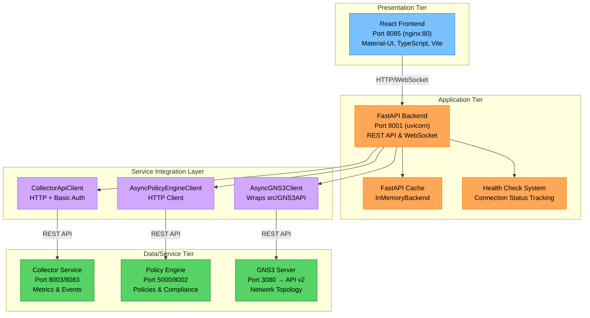

# Dashboard Component

The **Dashboard** is the central web-based interface for monitoring and controlling the FLOPY-NET system. It provides real-time visualization of federated learning training progress, network topology, system metrics, and policy compliance through a modern React-based frontend with a FastAPI backend.

## Architecture

The Dashboard follows a three-tier architecture designed for scalability and maintainability:



### Components Overview

#### 1. React Frontend (Port 8085)
- **Technology**: React 18, TypeScript, Vite, Material-UI
- **Deployment**: nginx container serving static files on port 80, exposed as 8085
- **Purpose**: Interactive web interface for system monitoring
- **Features**: Real-time charts, network topology, responsive design

#### 2. FastAPI Backend (Port 8001)
- **Technology**: FastAPI, Python 3.8+, asyncio, uvicorn ASGI server
- **Purpose**: REST API server and service aggregation layer
- **Features**: Service health monitoring, FastAPI cache, WebSocket support
- **Environment**: Configurable connection settings, timeouts, and retries

#### 3. Service Integration Clients
- **CollectorApiClient**: HTTP client with basic authentication for collector service
- **AsyncGNS3Client**: Async wrapper around the core GNS3API from `src/networking/gns3/`
- **AsyncPolicyEngineClient**: Direct HTTP client for policy engine communication

#### 4. External Service Dependencies
- **Collector Service**: Ports 8003/8083 for metrics and events collection
- **Policy Engine**: Ports 5000/8002 for policy management and compliance
- **GNS3 Server**: Port 3080 with API v2 for network topology management

## Frontend Architecture

### Technology Stack

```json
{
  "dependencies": {
    "@mui/material": "^5.14.18",
    "@mui/icons-material": "^5.14.18",
    "react": "^18.2.0",
    "react-router-dom": "^6.20.0",
    "reactflow": "^11.10.1", 
    "recharts": "^2.10.1",
    "chart.js": "^4.4.1",
    "socket.io-client": "^4.8.1",
    "axios": "^1.6.2"
  }
}
```

### Key Features

#### Real-time Monitoring
- **Training Progress**: Live federated learning metrics
- **Network Status**: SDN topology and device health
- **System Metrics**: Resource utilization and performance
- **Policy Compliance**: Security and governance status

#### Interactive Visualization
- **Charts**: Line charts, bar charts, scatter plots, heatmaps
- **Network Topology**: Drag-and-drop graph visualization
- **Data Tables**: Sortable, filterable system information
- **Dashboards**: Customizable widget layouts

#### Responsive Design
- **Mobile-First**: Optimized for all screen sizes
- **Dark Theme**: Modern neon aesthetic matching landing page
- **Accessibility**: WCAG 2.1 AA compliant
- **Performance**: Lazy loading and virtualization

## Backend Architecture

### FastAPI Application Structure

```python
# Core application setup - from main.py
app = FastAPI(
    title="Dashboard Backend API",
    description="MicroFed Dashboard API v1.0.0-alpha.8", 
    version=settings.APP_VERSION
)

# Global connection status tracking
connection_status = {
    "policy_engine": {"connected": False, "last_check": None, "error": None},
    "gns3": {"connected": False, "last_check": None, "error": None}, 
    "collector": {"connected": False, "last_check": None, "error": None}
}

# FastAPI Cache initialization
@asynccontextmanager
async def lifespan(app: FastAPI):
    # Initialize cache backend
    FastAPICache.init(InMemoryBackend(), prefix="fastapi-cache")
    yield
```

### Service Clients

#### Collector Client
```python
class CollectorApiClient:
    """Client for interacting with the Collector service."""
    
    def __init__(self, base_url: Optional[str] = None):
        self.base_url = base_url or settings.COLLECTOR_URL
        # Configurable timeout and connection limits
        self.timeout = httpx.Timeout(...)
        self.limits = httpx.Limits(...)
        # Basic authentication
        auth = httpx.BasicAuth("admin", "securepassword")
        
    async def get_metrics(self, params: dict = None) -> MetricsResponse:
        """Fetch metrics from collector service."""
        
    async def get_fl_metrics(self, params: dict = None) -> FLMetricsResponse:
        """Fetch FL-specific metrics."""
        
    async def get_events(self, params: dict = None) -> dict:
        """Fetch system events with pagination."""
```

#### GNS3 Client
```python
class AsyncGNS3Client:
    """Async wrapper for the GNS3API from the src directory."""
    
    def __init__(self, base_url: Optional[str] = None):
        self.base_url = base_url or settings.GNS3_URL
        # Wraps the synchronous GNS3API from src/networking/gns3/
        self.client = GNS3API(self.base_url)
        
    async def get_projects(self) -> List[Dict[str, Any]]:
        """Get all GNS3 projects."""
        
    async def get_nodes(self, project_id: str) -> List[Dict[str, Any]]:
        """Get nodes in a project."""
```

#### Policy Engine Client  
```python
class AsyncPolicyEngineClient:
    """Direct HTTP client for the Policy Engine API."""
    
    def __init__(self, base_url: Optional[str] = None, timeout: int = 10):
        self.base_url = base_url or settings.POLICY_ENGINE_URL
        self._client = httpx.AsyncClient(...)
        
    async def get_policies(self) -> List[Dict[str, Any]]:
        """Fetch all policies."""
        
    async def get_policy_decisions(self, params: dict = None) -> Dict[str, Any]:
        """Fetch policy decisions."""
```
        """Get all GNS3 projects."""
        
    async def get_project_topology(self, project_id: str) -> dict:
        """Get network topology for a project."""
        
    async def get_nodes(self, project_id: str) -> List[dict]:
        """Get all nodes in a project."""
```

#### Policy Engine Client
```python
class AsyncPolicyEngineClient:
    """Client for Policy Engine REST API."""
    
    def __init__(self, base_url: str = "http://localhost:5000"):
        self.base_url = base_url
        
    async def get_policies(self) -> List[dict]:
        """Get all active policies."""
        
    async def get_policy_compliance(self) -> dict:
        """Get policy compliance status."""
        
    async def get_violations(self) -> List[dict]:
        """Get policy violations log."""
```

## API Endpoints

### Overview Endpoints
- `GET /api/overview/status` - System-wide status overview
- `GET /api/overview/stats` - Key performance indicators
- `GET /api/overview/health` - Service health summary

### FL Monitoring Endpoints
- `GET /api/fl-monitoring/status` - Current training status
- `GET /api/fl-monitoring/metrics` - Training metrics and progress
- `GET /api/fl-monitoring/clients` - Connected client information
- `GET /api/fl-monitoring/rounds` - Historical round data

### Network Endpoints
- `GET /api/network/topology` - Network topology data from GNS3
- `GET /api/network/devices` - Device status and metrics
- `GET /api/network/links` - Link information and statistics
- `GET /api/network/metrics` - Network performance metrics

### Policy Engine Endpoints
- `GET /api/policy-engine/policies` - Active policies
- `GET /api/policy-engine/compliance` - Compliance status
- `GET /api/policy-engine/violations` - Policy violations
- `GET /api/policy-engine/security` - Security metrics

### Events and Logs
- `GET /api/events` - System events with filtering
- `GET /api/events/summary` - Events summary by category
- `WS /ws/logs` - Real-time log streaming
- `GET /api/log/recent` - Recent log entries

## Configuration

### Environment Variables

| Variable | Description | Default | Docker Default |
|----------|-------------|---------|---------------|
| `COLLECTOR_URL` | Collector service URL | `http://localhost:8083` | `http://192.168.1.109:8003` |
| `POLICY_ENGINE_URL` | Policy Engine URL | `http://localhost:5000` | `http://192.168.1.109:8002` |
| `GNS3_URL` | GNS3 server URL | `http://localhost:3080` | `http://192.168.1.109:8001` |
| `GNS3_API_VERSION` | GNS3 API version | `v2` | `v2` |
| `LOG_LEVEL` | Logging level | `INFO` | `DEBUG` |
| `CONNECTION_TIMEOUT` | Connection timeout (seconds) | `10` | `10` |
| `CONNECTION_RETRIES` | Service connection retries | `3` | `3` |
| `RETRY_DELAY` | Retry delay (seconds) | `2` | `2` |
| `HEALTH_CHECK_INTERVAL` | Health check interval (seconds) | `30` | `30` |
| `STARTUP_TIMEOUT` | Startup timeout (seconds) | `30` | `60` |
| `APP_VERSION` | Application version | `1.0.0` | `v1.0.0-alpha.8` |
| `BUILD_DATE` | Build date | `unknown` | `2025-06-10` |
| `ENVIRONMENT` | Environment type | `development` | `development` |
| `SCENARIOS_DIR` | Scenarios directory path | `/app/src/scenarios` | `/app/src/scenarios` |

### Frontend Configuration

```typescript
// Build-time environment variables (embedded in Vite build)
VITE_BACKEND_URL=http://localhost:8001
VITE_APP_VERSION=v1.0.0-alpha.8
VITE_BUILD_DATE=2025-06-10
VITE_GIT_COMMIT=latest
VITE_ENVIRONMENT=development
```

### Docker Compose Configuration

```yaml
services:
  dashboard-backend:
    image: abdulmelink/flopynet-dashboard-backend:v1.0.0-alpha.8
    ports:
      - "8001:8001"
    environment:
      - GNS3_URL=${GNS3_URL:-http://192.168.1.109:8001}
      - COLLECTOR_URL=${COLLECTOR_URL:-http://192.168.1.109:8003}
      - POLICY_ENGINE_URL=${POLICY_ENGINE_URL:-http://192.168.1.109:8002}
    volumes:
      - ../src:/app/src
      - ../config:/app/config
    
  dashboard-frontend:
    image: abdulmelink/flopynet-dashboard-frontend:v1.0.0-alpha.8
    ports:
      - "8085:80"
    depends_on:
      dashboard-backend:
        condition: service_healthy
```

## Service Integration

### Connection Management

The backend implements sophisticated connection management with health monitoring:

```python
async def test_connection_with_retry(url: str, service_name: str, 
                                   timeout: int = 5, 
                                   max_retries: Optional[int] = None) -> bool:
    """Test connection to a service with retry logic"""
    
    # Service-specific retry logic
    if max_retries is None:
        if service_name == "gns3":
            max_retries = 1  # GNS3 is optional
        else:
            max_retries = settings.CONNECTION_RETRIES
    
    for attempt in range(max_retries):
        try:
            # Service-specific endpoints
            test_url = url
            if service_name == "policy_engine":
                test_url = f"{url}/health"
            elif service_name == "collector": 
                test_url = f"{url}/api/metrics/latest"
            elif service_name == "gns3":
                test_url = f"{url}/v2/version"
                
            # Test connection with timeout
            async with aiohttp.ClientSession() as session:
                async with session.get(test_url, timeout=timeout) as response:
                    if response.status == 200:
                        connection_status[service_name]["connected"] = True
                        return True
                        
        except Exception as e:
            connection_status[service_name]["error"] = str(e)
            if attempt < max_retries - 1:
                await asyncio.sleep(settings.RETRY_DELAY * (2 ** attempt))
    
    return False
```

### Background Health Checks

```python
async def background_health_checks():
    """Background task to periodically check service health"""
    while True:
        await asyncio.sleep(settings.HEALTH_CHECK_INTERVAL)
        
        # Check essential services
        essential_tasks = [
            test_connection_with_retry(settings.POLICY_ENGINE_URL, "policy_engine", 3, 1),
            test_connection_with_retry(settings.COLLECTOR_URL, "collector", 3, 1)
        ]
        
        # Check optional services separately
        gns3_task = test_connection_with_retry(settings.GNS3_URL, "gns3", 2, 1)
        
        await asyncio.gather(*essential_tasks, gns3_task, return_exceptions=True)
```

## Data Visualization

### Chart Components

#### Training Progress
```typescript
// Real-time FL training metrics
const TrainingChart = () => {
  const [data, setData] = useState([]);
  
  useEffect(() => {
    const fetchMetrics = async () => {
      const response = await api.get('/api/fl-monitoring/metrics');
      setData(response.data.rounds);
    };
    
    const interval = setInterval(fetchMetrics, 5000);
    return () => clearInterval(interval);
  }, []);
  
  return (
    <LineChart width={600} height={300} data={data}>
      <XAxis dataKey="round" />
      <YAxis />
      <Line type="monotone" dataKey="accuracy" stroke="#79c0ff" />
      <Line type="monotone" dataKey="loss" stroke="#f85149" />
    </LineChart>
  );
};
```

#### Network Topology
```typescript
// Interactive network graph
const NetworkTopology = () => {
  const [nodes, setNodes] = useState([]);
  const [edges, setEdges] = useState([]);
  
  const onNodeClick = (event, node) => {
    // Handle node selection
    console.log('Node clicked:', node);
  };
  
  return (
    <ReactFlow
      nodes={nodes}
      edges={edges}
      onNodeClick={onNodeClick}
      fitView
    >
      <Background />
      <Controls />
      <MiniMap />
    </ReactFlow>
  );
};
```

### Real-time Updates

```typescript
// WebSocket connection for live updates
const useWebSocket = (url: string) => {
  const [socket, setSocket] = useState(null);
  const [data, setData] = useState(null);
  
  useEffect(() => {
    const ws = io(url);
    
    ws.on('connect', () => {
      console.log('WebSocket connected');
    });
    
    ws.on('data', (newData) => {
      setData(newData);
    });
    
    ws.on('disconnect', () => {
      console.log('WebSocket disconnected');
    });
    
    setSocket(ws);
    
    return () => {
      ws.close();
    };
  }, [url]);
  
  return { socket, data };
};
```

## Deployment

### Docker Configuration

The Dashboard is deployed using Docker Compose with two main services:

```yaml
# From dashboard/docker-compose.yml
version: '3.8'
services:
  dashboard-backend:
    build:
      context: ./backend
      dockerfile: Dockerfile
    image: abdulmelink/flopynet-dashboard-backend:v1.0.0-alpha.8
    container_name: dashboard-backend
    ports:
      - "8001:8001"    
    environment:
      - GNS3_URL=${GNS3_URL:-http://192.168.1.109:8001}
      - COLLECTOR_URL=${COLLECTOR_URL:-http://192.168.1.109:8003}
      - POLICY_ENGINE_URL=${POLICY_ENGINE_URL:-http://192.168.1.109:8002}
      - LOG_LEVEL=DEBUG
      - APP_VERSION=v1.0.0-alpha.8
      - BUILD_DATE=2025-06-10
      - ENVIRONMENT=development
    healthcheck:
      test: ["CMD", "curl", "-f", "http://localhost:8001/api/health"]
      interval: 30s
      timeout: 10s
      retries: 3
      start_period: 10s
    volumes:
      - ../src:/app/src
      - ../config:/app/config
      - client_error_logs:/app/logs
    command: ["uvicorn", "app.main:app", "--host", "0.0.0.0", "--port", "8001"]
    networks:
      - dashboard-network

  dashboard-frontend:
    build:
      context: ./frontend
      args:
        - VITE_BACKEND_URL=${VITE_BACKEND_URL:-http://localhost:8001}
        - VITE_APP_VERSION=v1.0.0-alpha.8
        - VITE_BUILD_DATE=2025-06-10
    image: abdulmelink/flopynet-dashboard-frontend:v1.0.0-alpha.8
    container_name: dashboard-frontend
    ports:
      - "8085:80"
    depends_on:
      dashboard-backend:
        condition: service_healthy
    healthcheck:
      test: ["CMD", "curl", "-f", "http://localhost/index.html"]
      interval: 30s
      timeout: 10s
      retries: 3
    networks:
      - dashboard-network

networks:
  dashboard-network:
    driver: bridge
    name: dashboard-network

volumes:
  client_error_logs:
    name: client_error_logs
```

### Production Deployment

```bash
# Navigate to dashboard directory
cd dashboard

# Build and deploy
docker-compose up -d

# Check service health
docker-compose ps
curl http://localhost:8001/api/health

# View logs
docker-compose logs -f dashboard-backend
docker-compose logs -f dashboard-frontend

# Access dashboard
open http://localhost:8085
```

## Development

### Frontend Development

```bash
# Setup
cd dashboard/frontend
npm install

# Development server
npm run dev

# Build for production
npm run build

# Type checking
npm run build:strict
```

### Backend Development  

```bash
# Setup
cd dashboard/backend
python -m venv .venv
source .venv/bin/activate  # Windows: .venv\Scripts\activate
pip install -r requirements.txt

# Development server
uvicorn app.main:app --host 0.0.0.0 --port 8001 --reload

# Run tests
pytest
```

## Monitoring and Debugging

### Health Monitoring

The dashboard provides comprehensive health monitoring:

```python
@app.get("/api/health")
async def health_check():
    """Check the health of the API and connected services."""
    return {
        "status": "ok",
        "timestamp": datetime.now().isoformat(),
        "services": connection_status,
        "uptime": time.time() - app.state.start_time
    }
```

### Debug Endpoints

```python
@app.get("/api/test/collector")
async def test_collector_connection():
    """Test endpoint to check collector connectivity."""
    client = CollectorApiClient()
    connected = await client.test_connection()
    
    if not connected:
        return {"status": "error", "message": "Could not connect to collector"}
    
    # Test various collector endpoints
    events = await client.get_events({"limit": 5})
    metrics = await client.get_metrics({"limit": 5})
    summary = await client.get_events_summary()
    
    return {
        "status": "success",
        "connection": "OK",
        "events_count": len(events.get("events", [])),
        "metrics_count": len(metrics.get("metrics", [])),
        "summary": summary
    }
```

### Logging

```python
# Structured logging configuration
logging.basicConfig(
    level=getattr(logging, settings.LOG_LEVEL),
    format='%(asctime)s - %(name)s - %(levelname)s - %(message)s',
)

logger = logging.getLogger(__name__)

# Service startup logging
logger.info("🚀 Starting Dashboard API backend...")
logger.info(f"📍 Service URLs:")
logger.info(f"   Collector: {settings.COLLECTOR_URL}")
logger.info(f"   Policy Engine: {settings.POLICY_ENGINE_URL}")
logger.info(f"   GNS3: {settings.GNS3_URL}")
```

## Security

### CORS Configuration

```python
# CORS middleware for cross-origin requests
origins = [
    "http://localhost:8085",    # Local development
    "http://127.0.0.1:8085",    # Alternative local
    "http://localhost:3000",    # Common dev port
]

if os.environ.get("ENVIRONMENT") == "production":
    production_domain = os.environ.get("PRODUCTION_DOMAIN")
    if production_domain:
        origins.append(f"https://{production_domain}")

app.add_middleware(
    CORSMiddleware,
    allow_origins=origins,
    allow_credentials=True,
    allow_methods=["*"],
    allow_headers=["*"],
)
```

### Input Validation

```python
from pydantic import BaseModel, validator

class MetricsQuery(BaseModel):
    limit: int = 100
    offset: int = 0
    start_time: Optional[datetime] = None
    end_time: Optional[datetime] = None
    
    @validator('limit')
    def validate_limit(cls, v):
        if v > 1000:
            raise ValueError('limit cannot exceed 1000')
        return v
```

## Integration with System Components

### Policy Engine Integration
- **Access Control**: Dashboard access governed by policy rules
- **Compliance Monitoring**: Real-time policy compliance status
- **Security Metrics**: Trust scores and security events
- **Violation Alerts**: Automated policy violation notifications

### Collector Integration  
- **Metrics Aggregation**: All system metrics centralized through Collector
- **Event Streaming**: Real-time event data for monitoring
- **Historical Data**: Time-series data for trend analysis
- **Performance Monitoring**: System and component performance metrics

### GNS3 Integration
- **Network Topology**: Live network topology visualization
- **Node Status**: Real-time device status and health
- **Simulation Control**: Basic simulation management capabilities
- **Performance Metrics**: Network performance and latency data

### FL Framework Integration
- **Training Progress**: Real-time federated learning metrics
- **Client Management**: Monitor participating clients
- **Model Performance**: Track accuracy, loss, and convergence
- **Round Analytics**: Detailed analysis of training rounds

The Dashboard serves as the central control plane for the entire FLOPY-NET system, providing administrators and researchers with comprehensive visibility into all aspects of the federated learning and networking infrastructure.
