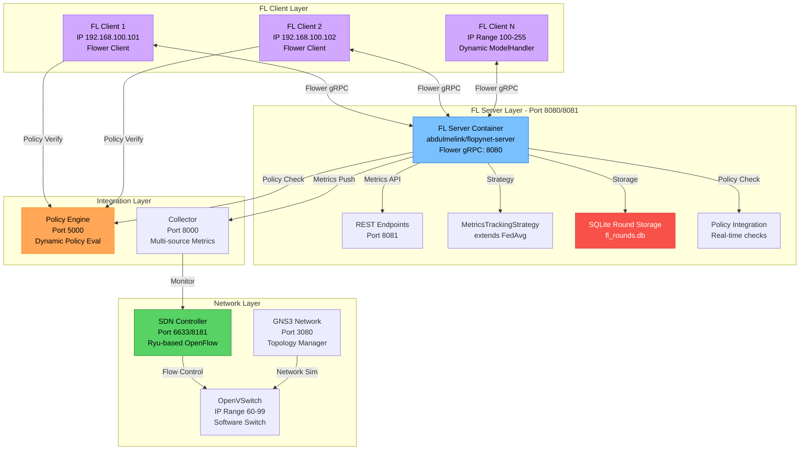

# FL Framework Component

The **FL Framework** is the core federated learning implementation built on the **Flower framework** that enables distributed machine learning across multiple clients while maintaining data privacy. It provides a scalable server-client architecture with custom enhancements for network integration, policy compliance, and comprehensive metrics collection.

## Architecture

The FL Framework consists of multiple interconnected components that work together to facilitate federated learning using the Flower framework with PyTorch backend:



## Implementation Structure

### Source Code Organization
- **FL Server**: `src/fl/server/fl_server.py` - Server-side coordination and aggregation
- **FL Client**: `src/fl/client/fl_client.py` - Client-side training and communication  
- **Common**: `src/fl/common/` - Shared utilities including model_handler.py and utils.py
- **Models**: `src/fl/common/models/` - ML model definitions and utilities
- **Utils**: `src/fl/utils/` - Helper functions and data processing
- **Main Entry**: `src/main.py` - Main application entry point with scenario management

### Core Components

#### 1. FL Server (Docker: abdulmelink/flopynet-server)
- **Container Port**: 8080 (FL protocol), 8081 (Metrics/HTTP API)
- **Static IP**: 192.168.100.10
- **Technology**: Flower framework v1.5.0 with custom MetricsTrackingStrategy
- **Dependencies**: Policy Engine (health check required)
- **Features**: SQLite-based round storage, policy integration, comprehensive metrics

#### 2. FL Clients (Docker: abdulmelink/flopynet-client)  
- **Container IPs**: 192.168.100.101, 192.168.100.102 (expandable to 100-255 range)
- **Technology**: Flower client implementation with dynamic model loading
- **Features**: Isolated data, policy compliance, network resilience, privacy mechanisms
- **Model Support**: Dynamic model loading via ModelHandler with CNN/ResNet support

#### 3. Training Coordination
- **Round Management**: Configurable min_clients and available_clients with policy enforcement
- **Client Selection**: Policy-based participant filtering with real-time policy checks
- **Network Awareness**: SDN integration for traffic management and QoS
- **Persistent Storage**: SQLite database for round history and metrics tracking
- **Strategy**: Custom MetricsTrackingStrategy extending Flower's FedAvg

## System Startup Flow

### Container Initialization Sequence

The FLOPY-NET system follows a specific startup sequence to ensure proper component dependencies:

#### 1. **Policy Engine Startup** (First Priority - No Dependencies)
```bash
# Container: policy-engine (192.168.100.20)
# Entrypoint: entrypoint-policy.sh

1. Environment validation and static IP configuration
2. Host file updates for service discovery (/etc/hosts)
3. Policy configuration loading from /app/config/policies/
4. Policy functions directory validation (/app/config/policy_functions)
5. Flask API server startup on port 5000
6. Health check endpoint activation (/health)
7. Policy function loading and validation
8. Event buffer initialization for audit logging
9. Ready state - other services can connect
```

#### 2. **FL Server Startup** (Depends on Policy Engine Health Check)
```bash
# Container: fl-server (192.168.100.10)
# Entrypoint: entrypoint-fl-server.sh

1. Wait for policy engine health check (WAIT_FOR_POLICY_ENGINE=true)
2. Environment variable processing and static IP configuration
3. Host file updates for container name resolution
4. Model directory setup and fallback model fetch
5. SQLite database initialization (fl_rounds.db)
6. Policy engine connection establishment and validation
7. Flower server configuration with MetricsTrackingStrategy
8. Flower gRPC server startup on port 8080
9. HTTP API server startup on port 8081 (health/metrics)
10. Health check activation and ready state
```

#### 3. **FL Client Startup** (Depends on Both FL Server + Policy Engine Health)
```bash
# Container: fl-client-1, fl-client-2 (192.168.100.101, 192.168.100.102)
# Entrypoint: entrypoint-fl-client.sh

1. Wait for FL server and policy engine health checks (Docker Compose)
2. Environment variable processing and CLIENT_ID validation
3. Server discovery via NODE_IP_FL_SERVER environment variable
4. Model directory setup and model synchronization with server
5. Local data loading and preprocessing (client-specific datasets)
6. Policy compliance checker initialization
7. Flower client initialization with server connection
8. Connection to FL server via gRPC on port 8080
9. Ready for federated learning participation
```

#### 4. **Support Services Startup** (Independent/Parallel)
```bash
# Collector (192.168.100.40) - Independent startup
1. Multi-source metrics collection setup
2. Storage backend initialization (SQLite/file-based)
3. API endpoint activation on port 8000
4. Monitoring targets: FL server, policy engine, SDN components

# SDN Controller (192.168.100.41) - Independent startup  
1. Ryu framework initialization
2. OpenFlow controller startup on port 6633
3. REST API activation on port 8181
4. Waiting for OpenVSwitch connections

# OpenVSwitch (192.168.100.60-99) - Independent startup
1. OVS daemon initialization
2. Bridge creation and port configuration
3. SDN controller connection establishment
4. Flow table initialization
```

### Health Check Dependencies

The system uses Docker Compose health checks to ensure proper startup order:

```yaml
# Health check dependency chain
policy-engine: 
  healthcheck:
    test: ["CMD", "curl", "-f", "http://localhost:5000/health"]
    interval: 10s
    timeout: 5s
    retries: 5
  
fl-server:
  depends_on:
    policy-engine: 
      condition: service_healthy
  healthcheck:
    test: ["CMD", "curl", "-f", "http://localhost:8081/health"]
    interval: 10s
    timeout: 5s
    retries: 5
    
fl-client-1:
  depends_on:
    fl-server: 
      condition: service_healthy
    policy-engine: 
      condition: service_healthy

fl-client-2:
  depends_on:
    fl-server: 
      condition: service_healthy
    policy-engine: 
      condition: service_healthy
```

### Critical Startup Dependencies

1. **Policy Engine** must be fully healthy before FL Server starts
2. **FL Server** must be fully healthy before any FL Client starts  
3. **Both Policy Engine and FL Server** must be healthy before FL Clients start
4. **Support services** (Collector, SDN Controller, OVS) start independently in parallel

### Service Discovery Process

Services discover each other through multiple mechanisms:

1. **Static IP Allocation**: Predefined IP ranges for each service type in docker-compose.yml
   - Policy Engine: 192.168.100.20-29 range  
   - FL Server: 192.168.100.10-19 range
   - FL Clients: 192.168.100.100-255 range
   - Collector: 192.168.100.40+ range
   - SDN Controller: 192.168.100.41
   - OpenVSwitch: 192.168.100.60-99 range

2. **Environment Variables**: `NODE_IP_*` variables provide direct IP addresses
   - NODE_IP_FL_SERVER=192.168.100.10
   - NODE_IP_POLICY_ENGINE=192.168.100.20
   - NODE_IP_SDN_CONTROLLER=192.168.100.41
   - NODE_IP_COLLECTOR=192.168.100.40

3. **Host File Updates**: Entrypoint scripts update `/etc/hosts` for container name resolution

4. **Container Names**: Docker Compose provides built-in DNS resolution
   - fl-server resolves to 192.168.100.10
   - policy-engine resolves to 192.168.100.20

### API Endpoints

#### Server Status and Control (Port 8081)
- `GET /health` - Server health check and basic information
- `GET /status` - Current training status and round information
- `GET /metrics` - Training metrics and performance data
- `GET /rounds` - Historical round data with filtering options
- `GET /rounds/{round_number}` - Specific round information

#### Training Management
- Server is managed through Flower's gRPC protocol on port 8080
- HTTP metrics endpoint provides monitoring capabilities
- Policy integration happens automatically during training rounds

### Request/Response Examples

#### Get Server Health
```http
GET /health HTTP/1.1
Host: localhost:8081

{
  "status": "healthy",
  "server_id": "flopynet-fl-server-default",
  "version": "v1.0.0-alpha.8",
  "uptime": 1234.56,
  "current_round": 3
}
```

#### Get Training Metrics
```http
GET /metrics HTTP/1.1
Host: localhost:8081

{
  "current_round": 5,
  "connected_clients": 2,
  "training_complete": false,
  "rounds_history": [
    {
      "round": 1,
      "accuracy": 0.65,
      "loss": 0.8,
      "clients": 2,
      "timestamp": "2025-06-27T10:30:00Z"
    }
  ],
  "aggregate_fit_count": 5,
  "policy_checks_performed": 15,
  "training_duration": 180.5
}
```

#### Get Round History
```http
GET /rounds?start_round=1&limit=10 HTTP/1.1
Host: localhost:8081

{
  "rounds": [
    {
      "round": 1,
      "timestamp": "2025-06-27T10:30:00Z",
      "status": "complete",
      "accuracy": 0.65,
      "loss": 0.8,
      "training_duration": 45.2,
      "clients": 2
    }
  ],
  "total_count": 5,
  "has_more": false
}
```

## FL Client Implementation

### Client Architecture

FL Clients are containerized Flower client implementations that participate in federated learning:

```python
class FLClient:
    """Federated Learning Client implementation using Flower framework."""
    
    def __init__(self, config: Dict[str, Any]):
        self.config = config
        self.client_id = config.get("client_id", "default-client")
        self.server_host = self._determine_server_host()
        self.server_port = config.get("server_port", 8080)
        self.model_handler = None
        self.policy_checker = None
        
        # Initialize model handler with dynamic loading
        self._init_model_handler()
        
        # Initialize policy checker
        self._init_policy_checker()
    
    def _determine_server_host(self) -> str:
        """Determine server host from various sources."""
        # Check GNS3_IP_MAP environment variable
        gns3_ip_map = os.environ.get("GNS3_IP_MAP", "")
        if "fl-server:" in gns3_ip_map:
            return self._parse_server_ip_from_map(gns3_ip_map)
        
        # Check NODE_IP_FL_SERVER environment variable
        if os.environ.get("NODE_IP_FL_SERVER"):
            return os.environ.get("NODE_IP_FL_SERVER")
            
        # Fall back to config
        return self.config.get("server_host", "localhost")
    
    def _init_model_handler(self):
        """Initialize model handler with dynamic model loading."""
        from src.fl.common.model_handler import ModelHandler
        
        model_type = self.config.get("model_type", "cnn")
        dataset = self.config.get("dataset", "mnist")
        
        self.model_handler = ModelHandler(
            model_type=model_type,
            dataset=dataset,
            num_classes=self.config.get("num_classes", 10)
        )
    
    def check_policy_compliance(self, operation: str, context: Dict[str, Any]) -> bool:
        """Check operation against policy engine."""
        if not self.policy_checker:
            return True
            
        return self.policy_checker.check_policy(operation, context)
    
    def get_client_capabilities(self) -> Dict[str, Any]:
        """Return client capabilities and resources."""
        import psutil
        
        return {
            "client_id": self.client_id,
            "model_types": ["pytorch"],
            "compute_power": "cpu",
            "memory_gb": round(psutil.virtual_memory().total / (1024**3), 2),
            "cpu_cores": psutil.cpu_count(),
            "dataset": self.config.get("dataset", "mnist"),
            "model_type": self.config.get("model_type", "cnn")
        }
```

### Docker Configuration

FL Clients run in isolated Docker containers with network integration:

```yaml
# docker-compose.yml excerpt
fl-client-1:
  image: abdulmelink/flopynet-client:v1.0.0-alpha.8
  container_name: fl-client-1
  privileged: true
  cap_add:
    - NET_ADMIN
  environment:
    - SERVICE_TYPE=fl-client
    - CLIENT_ID=client-1
    - SERVER_HOST=fl-server
    - POLICY_ENGINE_HOST=policy-engine
    - USE_STATIC_IP=true
    - SUBNET_PREFIX=192.168.100
    - CLIENT_IP_RANGE=100-255
    - NODE_IP_FL_SERVER=192.168.100.10
    - NODE_IP_POLICY_ENGINE=192.168.100.20
    - NODE_IP_SDN_CONTROLLER=192.168.100.41
    - NODE_IP_COLLECTOR=192.168.100.40
    - MAX_RECONNECT_ATTEMPTS=-1
    - RETRY_INTERVAL=5
  depends_on:
    fl-server:
      condition: service_healthy
    policy-engine:
      condition: service_healthy
  networks:
    flopynet_network:
      ipv4_address: 192.168.100.101
```

### Client Lifecycle

1. **Initialization**: Client starts, loads configuration, and initializes ModelHandler
2. **Server Discovery**: Determines FL server IP from environment variables or GNS3_IP_MAP
3. **Policy Check**: Verifies policy compliance before connecting
4. **Flower Connection**: Connects to FL server using Flower's gRPC protocol
5. **Training Participation**: Participates in federated learning rounds via Flower client
6. **Model Updates**: Sends/receives model updates through Flower framework
7. **Evaluation**: Performs local evaluation on private data

## Federated Learning Algorithms

### FedAvg (Federated Averaging)

The default aggregation algorithm used in FLOPY-NET:

```python
class FederatedAveraging:
    """Implementation of FedAvg algorithm."""
    
    def __init__(self, learning_rate: float = 1.0):
        self.learning_rate = learning_rate
        self.global_model = None
    
    def aggregate_models(self, client_updates: List[dict]) -> dict:
        """Aggregate client model updates using weighted averaging."""
        
        if not client_updates:
            return self.global_model
        
        # Calculate total samples across all clients
        total_samples = sum(update["num_samples"] for update in client_updates)
        
        # Initialize aggregated parameters
        aggregated_params = {}
        
        for param_name in client_updates[0]["parameters"].keys():
            weighted_sum = 0
            
            for update in client_updates:
                weight = update["num_samples"] / total_samples
                weighted_sum += weight * update["parameters"][param_name]
            
            aggregated_params[param_name] = weighted_sum
        
        # Apply learning rate
        for param_name in aggregated_params:
            if self.global_model and param_name in self.global_model:
                aggregated_params[param_name] = (
                    (1 - self.learning_rate) * self.global_model[param_name] +
                    self.learning_rate * aggregated_params[param_name]
                )
        
        self.global_model = aggregated_params
        return self.global_model
    
    def evaluate_convergence(self, metrics_history: List[dict]) -> bool:
        """Check if the model has converged."""
        if len(metrics_history) < 3:
            return False
        
        # Check if accuracy improvement is below threshold
        recent_accuracies = [m["accuracy"] for m in metrics_history[-3:]]
        improvement = max(recent_accuracies) - min(recent_accuracies)
        
        return improvement < 0.01  # 1% threshold
```

### Custom Aggregation Strategies

FLOPY-NET supports multiple aggregation strategies:

#### Weighted FedAvg
```python
def weighted_fedavg(client_updates: List[dict], weights: List[float]) -> dict:
    """FedAvg with custom client weights."""
    total_weight = sum(weights)
    
    aggregated_params = {}
    for param_name in client_updates[0]["parameters"].keys():
        weighted_sum = 0
        for i, update in enumerate(client_updates):
            normalized_weight = weights[i] / total_weight
            weighted_sum += normalized_weight * update["parameters"][param_name]
        aggregated_params[param_name] = weighted_sum
    
    return aggregated_params
```

#### FedProx (Proximal)
```python
def fedprox_aggregate(client_updates: List[dict], mu: float = 0.1) -> dict:
    """FedProx aggregation with proximal term."""
    # Implementation includes proximal regularization
    # to handle client heterogeneity
    pass
```

## Training Coordination

### Round Management

The FL Server uses a custom MetricsTrackingStrategy that extends Flower's FedAvg:

```python
class MetricsTrackingStrategy(FedAvg):
    """Custom strategy that tracks detailed metrics and integrates with policy engine."""
    
    def __init__(self, *args, server_instance=None, **kwargs):
        super().__init__(*args, **kwargs)
        self.server_instance = server_instance
        self.round_start_time = None
    
    def configure_fit(self, server_round: int, parameters: Parameters, client_manager):
        """Configure the fit round with policy checks."""
        if self.server_instance:
            # Check if training was stopped by policy
            if global_metrics.get("training_stopped_by_policy", False):
                raise StopTrainingPolicySignal("Training stopped by policy")
            
            # Wait if training is paused
            self.server_instance.wait_if_paused(f"Round {server_round}")
            
            # Policy check for client training
            current_time = time.localtime()
            training_policy_context = {
                "operation": "model_training",
                "server_id": self.server_instance.config.get("server_id"),
                "current_round": int(server_round),
                "model": self.server_instance.model_name,
                "dataset": self.server_instance.dataset,
                "available_clients": int(client_manager.num_available()),
                "current_hour": int(current_time.tm_hour),
                "current_timestamp": time.time()
            }
            
            # Check policy before proceeding
            policy_result = self.server_instance.check_policy(
                "fl_client_training", training_policy_context
            )
            
            if not policy_result.get("allowed", True):
                logger.warning(f"Round {server_round} denied by policy")
                # Could pause or skip round based on policy
        
        return super().configure_fit(server_round, parameters, client_manager)
    
    def aggregate_fit(self, server_round: int, results, failures):
        """Aggregate fit results with metrics tracking."""
        aggregated_result = super().aggregate_fit(server_round, results, failures)
        
        # Track round metrics
        if self.server_instance:
            round_data = {
                "round": server_round,
                "timestamp": datetime.datetime.now(datetime.timezone.utc).isoformat(),
                "clients": len(results),
                "failures": len(failures),
                "status": "complete"
            }
            
            # Store in persistent storage
            if fl_round_storage:
                fl_round_storage.store_round(round_data)
        
        return aggregated_result
```

### Client Selection Strategies

Different strategies for selecting clients in each round:

#### Random Selection
```python
def random_selection(clients: List[str], fraction: float = 0.5) -> List[str]:
    """Randomly select fraction of clients."""
    import random
    num_selected = max(1, int(len(clients) * fraction))
    return random.sample(clients, num_selected)
```

#### Performance-Based Selection
```python
def performance_based_selection(clients: List[str], 
                              client_metrics: dict, 
                              top_k: int = 5) -> List[str]:
    """Select clients based on past performance."""
    # Sort clients by accuracy/loss metrics
    sorted_clients = sorted(clients, 
                          key=lambda c: client_metrics.get(c, {}).get('accuracy', 0),
                          reverse=True)
    return sorted_clients[:top_k]
```

#### Resource-Aware Selection
```python
def resource_aware_selection(clients: List[str], 
                           client_resources: dict,
                           min_compute: float = 0.5) -> List[str]:
    """Select clients based on available resources."""
    eligible_clients = [
        client for client in clients
        if client_resources.get(client, {}).get('compute_available', 0) >= min_compute
    ]
    return eligible_clients
```

## Network Integration

### SDN Controller Integration

The FL Framework integrates with the SDN controller for network optimization:

```python
class FLNetworkIntegration:
    """Integration with SDN controller for FL optimization."""
    
    def __init__(self, sdn_controller_url: str):
        self.sdn_url = sdn_controller_url
    
    def register_fl_server(self, server_ip: str):
        """Register FL server with SDN controller."""        response = requests.post(self.sdn_url + "/fl/register/server",
                                 json={"server_ip": server_ip})
        return response.json()
    
    def register_fl_client(self, client_ip: str):
        """Register FL client with SDN controller."""        response = requests.post(self.sdn_url + "/fl/register/client",
                                 json={"client_ip": client_ip})
        return response.json()
    
    def prioritize_fl_traffic(self, client_ip: str, server_ip: str):
        """Request traffic prioritization for FL communication."""
        response = requests.post(f"{self.sdn_url}/fl/prioritize",
                               json={
                                   "src_ip": client_ip,
                                   "dst_ip": server_ip,
                                   "priority": 200,
                                   "duration": 600
                               })
        return response.json()
    
    def get_network_metrics(self) -> dict:
        """Get network performance metrics."""
        response = requests.get(f"{self.sdn_url}/fl/stats")
        return response.json()
```

### Policy Compliance

FL operations are governed by the Policy Engine:

```python
class FLPolicyChecker:
    """Check FL operations against policy engine."""
    
    def __init__(self, policy_engine_url: str):
        self.policy_url = policy_engine_url
    
    def check_client_eligibility(self, client_data: dict) -> bool:
        """Check if client can participate in training."""
        response = requests.post(f"{self.policy_url}/check/client_eligibility",
                               json=client_data)
        return response.json().get("allowed", False)
    
    def check_model_sharing(self, model_size: int, client_trust: float) -> bool:
        """Check if model sharing is allowed."""
        response = requests.post(f"{self.policy_url}/check/model_sharing",
                               json={
                                   "model_size_mb": model_size / (1024 * 1024),
                                   "client_trust_score": client_trust
                               })
        return response.json().get("allowed", False)
    
    def log_training_event(self, event_data: dict):
        """Log FL training event for audit."""
        requests.post(f"{self.policy_url}/log/training_event",
                     json=event_data)
```

## Model Management

### Model Serialization

Efficient model serialization for network transmission:

```python
class ModelSerializer:
    """Handle model serialization and compression."""
    
    @staticmethod
    def serialize_model(model_params: dict) -> bytes:
        """Serialize model parameters to bytes."""
        import pickle
        import gzip
        
        # Serialize and compress
        serialized = pickle.dumps(model_params)
        compressed = gzip.compress(serialized)
        
        return compressed
    
    @staticmethod
    def deserialize_model(model_bytes: bytes) -> dict:
        """Deserialize model parameters from bytes."""
        import pickle
        import gzip
        
        # Decompress and deserialize
        decompressed = gzip.decompress(model_bytes)
        model_params = pickle.loads(decompressed)
        
        return model_params
    
    @staticmethod
    def calculate_model_size(model_params: dict) -> int:
        """Calculate model size in bytes."""
        import sys
        
        total_size = 0
        for param_name, param_value in model_params.items():
            total_size += sys.getsizeof(param_value)
        
        return total_size
```

### Model Versioning

Track model versions across training rounds:

```python
class ModelVersionManager:
    """Manage model versions and history."""
    
    def __init__(self):
        self.model_history = {}
        self.current_version = 0
    
    def save_model_version(self, model_params: dict, 
                          round_number: int, 
                          metrics: dict):
        """Save a model version with metadata."""
        self.current_version += 1
        
        version_data = {
            "version": self.current_version,
            "round": round_number,
            "timestamp": time.time(),
            "model_params": model_params,
            "metrics": metrics,
            "model_size": self.calculate_size(model_params)
        }
        
        self.model_history[self.current_version] = version_data
        return self.current_version
    
    def get_model_version(self, version: int) -> dict:
        """Retrieve a specific model version."""
        return self.model_history.get(version)
    
    def get_latest_model(self) -> dict:
        """Get the latest model version."""
        if self.current_version > 0:
            return self.model_history[self.current_version]
        return None
    
    def compare_versions(self, version1: int, version2: int) -> dict:
        """Compare two model versions."""
        v1 = self.get_model_version(version1)
        v2 = self.get_model_version(version2)
        
        if not v1 or not v2:
            return None
        
        return {
            "accuracy_diff": v2["metrics"]["accuracy"] - v1["metrics"]["accuracy"],
            "loss_diff": v1["metrics"]["loss"] - v2["metrics"]["loss"],
            "size_diff": v2["model_size"] - v1["model_size"],
            "round_diff": v2["round"] - v1["round"]
        }
```

## Privacy and Security

### Differential Privacy

Optional differential privacy for enhanced security:

```python
class DifferentialPrivacy:
    """Add differential privacy to model updates."""
    
    def __init__(self, epsilon: float = 1.0, delta: float = 1e-5):
        self.epsilon = epsilon
        self.delta = delta
    
    def add_noise_to_gradients(self, gradients: dict, 
                              sensitivity: float = 1.0) -> dict:
        """Add calibrated noise to gradients."""
        import numpy as np
        
        # Calculate noise scale
        noise_scale = sensitivity / self.epsilon
        
        noisy_gradients = {}
        for param_name, gradient in gradients.items():
            # Add Gaussian noise
            noise = np.random.normal(0, noise_scale, gradient.shape)
            noisy_gradients[param_name] = gradient + noise
        
        return noisy_gradients
    
    def clip_gradients(self, gradients: dict, max_norm: float = 1.0) -> dict:
        """Clip gradients to bound sensitivity."""
        import numpy as np
        
        clipped_gradients = {}
        for param_name, gradient in gradients.items():
            # Calculate gradient norm
            grad_norm = np.linalg.norm(gradient)
            
            # Clip if necessary
            if grad_norm > max_norm:
                clipped_gradients[param_name] = gradient * (max_norm / grad_norm)
            else:
                clipped_gradients[param_name] = gradient
        
        return clipped_gradients
```

### Secure Aggregation

Secure multi-party computation for model aggregation:

```python
class SecureAggregation:
    """Secure aggregation using cryptographic techniques."""
    
    def __init__(self, num_clients: int):
        self.num_clients = num_clients
        self.threshold = max(2, num_clients // 2 + 1)
    
    def generate_shares(self, secret_value: float) -> List[float]:
        """Generate secret shares using Shamir's Secret Sharing."""
        import random
        
        # Simplified implementation
        shares = []
        for i in range(self.num_clients):
            share = secret_value + random.uniform(-0.1, 0.1)
            shares.append(share)
        
        return shares
    
    def reconstruct_secret(self, shares: List[float]) -> float:
        """Reconstruct secret from shares."""
        if len(shares) < self.threshold:
            raise ValueError("Insufficient shares for reconstruction")
        
        # Simplified reconstruction
        return sum(shares) / len(shares)
    
    def secure_aggregate(self, client_models: List[dict]) -> dict:
        """Perform secure aggregation of client models."""
        if len(client_models) < self.threshold:
            raise ValueError("Insufficient participants for secure aggregation")
        
        aggregated_model = {}
        
        for param_name in client_models[0].keys():
            param_values = [model[param_name] for model in client_models]
            
            # Simple secure aggregation (in practice, use proper cryptographic protocols)
            aggregated_value = sum(param_values) / len(param_values)
            aggregated_model[param_name] = aggregated_value
        
        return aggregated_model
```

## Monitoring and Metrics

### Training Metrics Collection

Comprehensive metrics collection during training:

```python
class FLMetricsCollector:
    """Collect and analyze FL training metrics."""
    
    def __init__(self):
        self.round_metrics = {}
        self.client_metrics = {}
        self.global_metrics = {}
    
    def record_round_metrics(self, round_number: int, metrics: dict):
        """Record metrics for a training round."""
        self.round_metrics[round_number] = {
            "timestamp": time.time(),
            "participants": metrics.get("participants", []),
            "global_accuracy": metrics.get("accuracy", 0),
            "global_loss": metrics.get("loss", float('inf')),
            "aggregation_time": metrics.get("aggregation_time", 0),
            "communication_time": metrics.get("communication_time", 0)
        }
    
    def record_client_metrics(self, client_id: str, round_number: int, 
                            metrics: dict):
        """Record client-specific metrics."""
        if client_id not in self.client_metrics:
            self.client_metrics[client_id] = {}
        
        self.client_metrics[client_id][round_number] = {
            "local_accuracy": metrics.get("accuracy", 0),
            "local_loss": metrics.get("loss", float('inf')),
            "training_time": metrics.get("training_time", 0),
            "data_samples": metrics.get("data_samples", 0),
            "model_size": metrics.get("model_size", 0)
        }
    
    def calculate_convergence_metrics(self) -> dict:
        """Calculate convergence-related metrics."""
        rounds = sorted(self.round_metrics.keys())
        if len(rounds) < 2:
            return {}
        
        accuracies = [self.round_metrics[r]["global_accuracy"] for r in rounds]
        losses = [self.round_metrics[r]["global_loss"] for r in rounds]
        
        return {
            "accuracy_trend": self.calculate_trend(accuracies),
            "loss_trend": self.calculate_trend(losses),
            "convergence_rate": self.estimate_convergence_rate(accuracies),
            "stability": self.calculate_stability(accuracies[-5:]) if len(accuracies) >= 5 else 0
        }
    
    def calculate_trend(self, values: List[float]) -> float:
        """Calculate trend direction (-1 to 1)."""
        if len(values) < 2:
            return 0
        
        differences = [values[i+1] - values[i] for i in range(len(values)-1)]
        avg_diff = sum(differences) / len(differences)
        
        # Normalize to [-1, 1] range
        return max(-1, min(1, avg_diff * 10))
    
    def estimate_convergence_rate(self, accuracies: List[float]) -> float:
        """Estimate how quickly the model is converging."""
        if len(accuracies) < 3:
            return 0
        
        recent_improvement = accuracies[-1] - accuracies[-3]
        max_possible = 1.0 - accuracies[-3]
        
        if max_possible > 0:
            return recent_improvement / max_possible
        return 0
    
    def get_training_summary(self) -> dict:
        """Get comprehensive training summary."""
        if not self.round_metrics:
            return {}
        
        rounds = sorted(self.round_metrics.keys())
        latest_round = rounds[-1]
        
        return {
            "total_rounds": len(rounds),
            "latest_accuracy": self.round_metrics[latest_round]["global_accuracy"],
            "latest_loss": self.round_metrics[latest_round]["global_loss"],
            "total_participants": len(self.client_metrics),
            "convergence_metrics": self.calculate_convergence_metrics(),
            "average_round_time": self.calculate_average_round_time(),
            "communication_efficiency": self.calculate_communication_efficiency()
        }
```

## Configuration

### Environment Variables

| Variable | Description | Default |
|----------|-------------|---------|
| `FL_SERVER_HOST` | FL Server hostname | `[::]` |
| `FL_SERVER_PORT` | FL Server port | `8080` |
| `METRICS_PORT` | Metrics API port | `8081` |
| `POLICY_ENGINE_HOST` | Policy Engine hostname | `policy-engine` |
| `POLICY_ENGINE_URL` | Policy Engine URL | `http://policy-engine:5000` |
| `MIN_CLIENTS` | Minimum clients for training | `1` |
| `MIN_AVAILABLE_CLIENTS` | Minimum available clients | `1` |
| `NODE_IP_FL_SERVER` | Static IP for FL server | `192.168.100.10` |
| `NODE_IP_POLICY_ENGINE` | Static IP for policy engine | `192.168.100.20` |
| `USE_STATIC_IP` | Enable static IP allocation | `true` |
| `SUBNET_PREFIX` | Network subnet prefix | `192.168.100` |
| `CLIENT_IP_RANGE` | IP range for clients | `100-255` |

### Training Configuration

```json
{
  "server_id": "flopynet-fl-server-default",
  "host": "[::]",
  "port": 8080,
  "metrics_port": 8081,
  "model": "cnn",
  "dataset": "mnist",
  "rounds": 5,
  "min_clients": 1,
  "min_available_clients": 1,
  "policy_engine_url": "http://policy-engine:5000",
  "policy_timeout": 10,
  "policy_max_retries": 3,
  "strict_policy_mode": true,
  "stay_alive_after_training": false,
  "log_level": "INFO",
  "enable_grpc_verbose": false
}
```

## Deployment

### Docker Compose Configuration

```yaml
version: '3.8'
services:
  fl-server:
    image: abdulmelink/flopynet-server:v1.0.0-alpha.8
    container_name: fl-server
    privileged: true
    cap_add:
      - NET_ADMIN
    depends_on:
      policy-engine:
        condition: service_healthy
    environment:
      - SERVICE_TYPE=fl-server
      - FL_SERVER_PORT=8080
      - METRICS_PORT=8081
      - POLICY_ENGINE_HOST=policy-engine
      - MIN_CLIENTS=1
      - MIN_AVAILABLE_CLIENTS=1
      - USE_STATIC_IP=true
      - SUBNET_PREFIX=192.168.100
      - NODE_IP_FL_SERVER=192.168.100.10
      - NODE_IP_POLICY_ENGINE=192.168.100.20
      - NODE_IP_SDN_CONTROLLER=192.168.100.41
      - NODE_IP_COLLECTOR=192.168.100.40
    networks:
      flopynet_network:
        ipv4_address: 192.168.100.10
    healthcheck:
      test: ["CMD", "curl", "-f", "http://localhost:8081/health"]
      interval: 10s
      timeout: 5s
      retries: 5

  fl-client-1:
    image: abdulmelink/flopynet-client:v1.0.0-alpha.8
    container_name: fl-client-1
    privileged: true
    cap_add:
      - NET_ADMIN
    environment:
      - SERVICE_TYPE=fl-client
      - CLIENT_ID=client-1
      - SERVER_HOST=fl-server
      - POLICY_ENGINE_HOST=policy-engine
      - USE_STATIC_IP=true
      - NODE_IP_FL_SERVER=192.168.100.10
      - MAX_RECONNECT_ATTEMPTS=-1
      - RETRY_INTERVAL=5
    depends_on:
      fl-server:
        condition: service_healthy
      policy-engine:
        condition: service_healthy
    networks:
      flopynet_network:
        ipv4_address: 192.168.100.101

networks:
  flopynet_network:
    driver: bridge
    ipam:
      config:
        - subnet: 192.168.100.0/24
          gateway: 192.168.100.1
```

### Health Checks

```yaml
healthcheck:
  test: ["CMD", "curl", "-f", "http://localhost:8081/health"]
  interval: 10s
  timeout: 5s
  retries: 5
  start_period: 40s
```

## Integration with System Components

### Dashboard Integration
- **Real-time Monitoring**: Live training progress and metrics
- **Client Management**: View and manage participating clients
- **Round Analytics**: Detailed analysis of training rounds
- **Performance Visualization**: Charts and graphs of model performance

### Policy Engine Integration
- **Client Authorization**: Check if clients can participate
- **Resource Limits**: Enforce computational and network limits
- **Privacy Compliance**: Ensure privacy requirements are met
- **Audit Logging**: Log all FL activities for compliance

### Collector Integration
- **Metrics Collection**: Automated collection of training metrics
- **Event Logging**: Log significant FL events and state changes
- **Performance Monitoring**: Track resource usage and timing
- **Historical Analysis**: Store and analyze training history

### SDN Integration
- **Traffic Prioritization**: Prioritize FL communication traffic
- **Bandwidth Allocation**: Allocate network resources for training
- **Network Monitoring**: Monitor network performance during training
- **QoS Management**: Maintain quality of service for FL traffic

The FL Framework serves as the core engine for federated learning in FLOPY-NET, providing a robust, scalable, and privacy-preserving platform for distributed machine learning research and experimentation.
