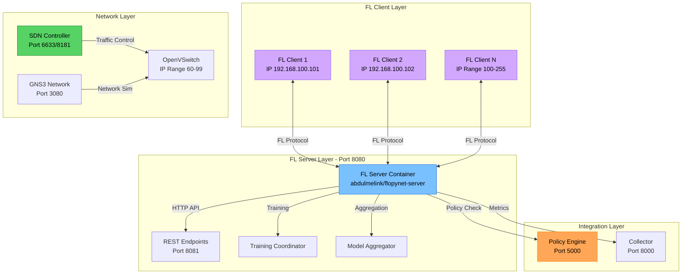

# FL Framework Component

The **FL Framework** is the core federated learning implementation that enables distributed machine learning across multiple clients while maintaining data privacy. It provides a scalable server-client architecture built with custom enhancements for network integration and policy compliance.

## Architecture

The FL Framework consists of multiple interconnected components that work together to facilitate federated learning:



## Implementation Structure

### Source Code Organization
- **FL Server**: `src/fl/server/` - Server-side coordination and aggregation
- **FL Client**: `src/fl/client/` - Client-side training and communication  
- **Common**: `src/fl/common/` - Shared utilities and protocols
- **Models**: `src/fl/models/` - ML model definitions and utilities
- **Utils**: `src/fl/utils/` - Helper functions and data processing
- **Main Script**: `src/fl/run_flower_federated_learning.py` - Flower framework integration

### Core Components

#### 1. FL Server (Docker: abdulmelink/flopynet-server)
- **Container Port**: 8080 (FL protocol), 8081 (HTTP API)
- **Static IP**: 192.168.100.10
- **Technology**: Custom FL server with policy integration
- **Dependencies**: Policy Engine (health check required)

#### 2. FL Clients (Docker: abdulmelink/flopynet-client)  
- **Container IPs**: 192.168.100.101, 192.168.100.102 (expandable to 100-255 range)
- **Technology**: Containerized training environments
- **Features**: Isolated data, policy compliance, network resilience

#### 3. Training Coordination
- **Round Management**: Configurable min_clients and available_clients
- **Client Selection**: Policy-based participant filtering
- **Network Awareness**: SDN integration for traffic management
    
    def _training_loop(self):
        """Simulated training loop."""
        for _ in range(10):  # Simulate 10 rounds
            self.rounds += 1
            logger.info("Training round " + str(self.rounds))
            
            # Simulate metrics improvement
            accuracy = 0.5 + (self.rounds / 20)  # Increases over time
            loss = 1.0 - (self.rounds / 15)      # Decreases over time
            
            self.metrics["accuracy"].append(accuracy)
            self.metrics["loss"].append(loss)
            
            time.sleep(2)  # Simulate training time
        
        self.status = "completed"
```

### API Endpoints

#### Server Status and Control
- `GET /` - Server information and version
- `GET /status` - Current training status and round information
- `POST /start` - Start federated learning training
- `GET /metrics` - Training metrics and performance data

#### Client Management
- `GET /clients` - List of registered clients
- `POST /register` - Register a new FL client
- `GET /clients/{client_id}` - Get specific client information

### Request/Response Examples

#### Get Server Status
```http
GET /status HTTP/1.1
Host: localhost:8080

{
  "status": "training",
  "rounds": 5,
  "clients": 3,
  "current_accuracy": 0.75,
  "estimated_completion": "2025-06-16T14:30:00Z"
}
```

#### Register Client
```http
POST /register HTTP/1.1
Host: localhost:8080
Content-Type: application/json

{
  "client_id": "client-1",
  "ip_address": "192.168.100.100",
  "capabilities": {
    "model_types": ["pytorch", "tensorflow"],
    "compute_power": "gpu",
    "data_samples": 1000
  }
}
```

#### Get Training Metrics
```http
GET /metrics HTTP/1.1
Host: localhost:8080

{
  "accuracy": [0.5, 0.55, 0.6, 0.65, 0.7, 0.72, 0.75],
  "loss": [1.0, 0.93, 0.87, 0.8, 0.73, 0.67, 0.6],
  "rounds": 7,
  "participants_per_round": [3, 3, 2, 3, 3, 2, 3],
  "convergence_rate": 0.85
}
```

## FL Client Implementation

### Client Architecture

FL Clients are containerized applications that participate in federated learning:

```python
class FLClient:
    """Federated Learning Client implementation."""
    
    def __init__(self, client_id: str, server_url: str):
        self.client_id = client_id
        self.server_url = server_url
        self.model = None
        self.local_data = None
        self.training_metrics = {}
    
    def register_with_server(self):
        """Register this client with the FL server."""
        registration_data = {
            "client_id": self.client_id,
            "ip_address": self.get_local_ip(),
            "capabilities": self.get_capabilities()
        }
          response = requests.post(self.server_url + "/register", 
                                 json=registration_data)
        return response.json()
    
    def train_local_model(self, global_model: dict, epochs: int = 5):
        """Train model locally on private data."""
        # Load global model
        self.model = self.load_model(global_model)
        
        # Train on local data
        for epoch in range(epochs):
            loss = self.model.train_epoch(self.local_data)
            self.training_metrics["epoch_" + str(epoch)] = {"loss": loss}
        
        # Return model updates
        return self.model.get_parameters()
    
    def get_capabilities(self) -> dict:
        """Return client capabilities and resources."""
        return {
            "model_types": ["pytorch"],
            "compute_power": "cpu",
            "data_samples": len(self.local_data),
            "memory_gb": 4,
            "network_bandwidth": "100mbps"
        }
```

### Docker Configuration

FL Clients run in isolated Docker containers with network integration:

```yaml
# docker-compose.yml excerpt
fl-client-1:
  image: abdulmelink/flopynet-client:v1.0.0-alpha.8
  container_name: fl-client-1
  privileged: true
  cap_add:
    - NET_ADMIN
  environment:
    - SERVICE_TYPE=fl-client
    - CLIENT_ID=client-1
    - SERVER_HOST=fl-server
    - POLICY_ENGINE_HOST=policy-engine
    - USE_STATIC_IP=true
    - SUBNET_PREFIX=192.168.100
    - CLIENT_IP_RANGE=100-255
  depends_on:
    fl-server:
      condition: service_healthy
    policy-engine:
      condition: service_healthy
  networks:
    flopynet:
      ipv4_address: 192.168.100.100
```

### Client Lifecycle

1. **Initialization**: Client starts and loads local configuration
2. **Registration**: Client registers with FL server
3. **Policy Check**: Client verifies policy compliance
4. **Training Loop**: Participates in federated learning rounds
5. **Model Updates**: Sends local model updates to server
6. **Aggregation**: Receives updated global model
7. **Evaluation**: Tests global model on local validation data

## Federated Learning Algorithms

### FedAvg (Federated Averaging)

The default aggregation algorithm used in FLOPY-NET:

```python
class FederatedAveraging:
    """Implementation of FedAvg algorithm."""
    
    def __init__(self, learning_rate: float = 1.0):
        self.learning_rate = learning_rate
        self.global_model = None
    
    def aggregate_models(self, client_updates: List[dict]) -> dict:
        """Aggregate client model updates using weighted averaging."""
        
        if not client_updates:
            return self.global_model
        
        # Calculate total samples across all clients
        total_samples = sum(update["num_samples"] for update in client_updates)
        
        # Initialize aggregated parameters
        aggregated_params = {}
        
        for param_name in client_updates[0]["parameters"].keys():
            weighted_sum = 0
            
            for update in client_updates:
                weight = update["num_samples"] / total_samples
                weighted_sum += weight * update["parameters"][param_name]
            
            aggregated_params[param_name] = weighted_sum
        
        # Apply learning rate
        for param_name in aggregated_params:
            if self.global_model and param_name in self.global_model:
                aggregated_params[param_name] = (
                    (1 - self.learning_rate) * self.global_model[param_name] +
                    self.learning_rate * aggregated_params[param_name]
                )
        
        self.global_model = aggregated_params
        return self.global_model
    
    def evaluate_convergence(self, metrics_history: List[dict]) -> bool:
        """Check if the model has converged."""
        if len(metrics_history) < 3:
            return False
        
        # Check if accuracy improvement is below threshold
        recent_accuracies = [m["accuracy"] for m in metrics_history[-3:]]
        improvement = max(recent_accuracies) - min(recent_accuracies)
        
        return improvement < 0.01  # 1% threshold
```

### Custom Aggregation Strategies

FLOPY-NET supports multiple aggregation strategies:

#### Weighted FedAvg
```python
def weighted_fedavg(client_updates: List[dict], weights: List[float]) -> dict:
    """FedAvg with custom client weights."""
    total_weight = sum(weights)
    
    aggregated_params = {}
    for param_name in client_updates[0]["parameters"].keys():
        weighted_sum = 0
        for i, update in enumerate(client_updates):
            normalized_weight = weights[i] / total_weight
            weighted_sum += normalized_weight * update["parameters"][param_name]
        aggregated_params[param_name] = weighted_sum
    
    return aggregated_params
```

#### FedProx (Proximal)
```python
def fedprox_aggregate(client_updates: List[dict], mu: float = 0.1) -> dict:
    """FedProx aggregation with proximal term."""
    # Implementation includes proximal regularization
    # to handle client heterogeneity
    pass
```

## Training Coordination

### Round Management

The FL Server orchestrates training rounds with sophisticated coordination:

```python
class TrainingCoordinator:
    """Coordinates federated learning training rounds."""
    
    def __init__(self, min_clients: int = 2, max_rounds: int = 100):
        self.min_clients = min_clients
        self.max_rounds = max_rounds
        self.current_round = 0
        self.registered_clients = {}
        self.active_clients = set()
    
    def start_training_round(self) -> dict:
        """Start a new federated learning round."""
        self.current_round += 1
        
        # Select participating clients
        selected_clients = self.select_clients()
        
        if len(selected_clients) < self.min_clients:
            return {"status": "error", "message": "Insufficient clients"}
        
        # Send global model to selected clients
        round_config = {
            "round_id": self.current_round,
            "global_model": self.get_global_model(),
            "training_config": {
                "epochs": 5,
                "batch_size": 32,
                "learning_rate": 0.01
            },
            "deadline": time.time() + 300  # 5 minutes
        }
        
        return self.broadcast_to_clients(selected_clients, round_config)
    
    def select_clients(self, fraction: float = 0.8) -> List[str]:
        """Select clients for training round."""
        available_clients = list(self.active_clients)
        num_selected = max(self.min_clients, 
                          int(len(available_clients) * fraction))
        
        # Random selection with optional criteria
        import random
        return random.sample(available_clients, 
                           min(num_selected, len(available_clients)))
    
    def collect_updates(self, timeout: int = 300) -> List[dict]:
        """Collect model updates from participating clients."""
        updates = []
        start_time = time.time()
        
        while time.time() - start_time < timeout:
            # Check for client updates
            for client_id in self.active_clients:
                update = self.get_client_update(client_id)
                if update and update not in updates:
                    updates.append(update)
            
            # Break if all clients responded
            if len(updates) >= len(self.active_clients):
                break
            
            time.sleep(1)
        
        return updates
```

### Client Selection Strategies

Different strategies for selecting clients in each round:

#### Random Selection
```python
def random_selection(clients: List[str], fraction: float = 0.5) -> List[str]:
    """Randomly select fraction of clients."""
    import random
    num_selected = max(1, int(len(clients) * fraction))
    return random.sample(clients, num_selected)
```

#### Performance-Based Selection
```python
def performance_based_selection(clients: List[str], 
                              client_metrics: dict, 
                              top_k: int = 5) -> List[str]:
    """Select clients based on past performance."""
    # Sort clients by accuracy/loss metrics
    sorted_clients = sorted(clients, 
                          key=lambda c: client_metrics.get(c, {}).get('accuracy', 0),
                          reverse=True)
    return sorted_clients[:top_k]
```

#### Resource-Aware Selection
```python
def resource_aware_selection(clients: List[str], 
                           client_resources: dict,
                           min_compute: float = 0.5) -> List[str]:
    """Select clients based on available resources."""
    eligible_clients = [
        client for client in clients
        if client_resources.get(client, {}).get('compute_available', 0) >= min_compute
    ]
    return eligible_clients
```

## Network Integration

### SDN Controller Integration

The FL Framework integrates with the SDN controller for network optimization:

```python
class FLNetworkIntegration:
    """Integration with SDN controller for FL optimization."""
    
    def __init__(self, sdn_controller_url: str):
        self.sdn_url = sdn_controller_url
    
    def register_fl_server(self, server_ip: str):
        """Register FL server with SDN controller."""        response = requests.post(self.sdn_url + "/fl/register/server",
                                 json={"server_ip": server_ip})
        return response.json()
    
    def register_fl_client(self, client_ip: str):
        """Register FL client with SDN controller."""        response = requests.post(self.sdn_url + "/fl/register/client",
                                 json={"client_ip": client_ip})
        return response.json()
    
    def prioritize_fl_traffic(self, client_ip: str, server_ip: str):
        """Request traffic prioritization for FL communication."""
        response = requests.post(f"{self.sdn_url}/fl/prioritize",
                               json={
                                   "src_ip": client_ip,
                                   "dst_ip": server_ip,
                                   "priority": 200,
                                   "duration": 600
                               })
        return response.json()
    
    def get_network_metrics(self) -> dict:
        """Get network performance metrics."""
        response = requests.get(f"{self.sdn_url}/fl/stats")
        return response.json()
```

### Policy Compliance

FL operations are governed by the Policy Engine:

```python
class FLPolicyChecker:
    """Check FL operations against policy engine."""
    
    def __init__(self, policy_engine_url: str):
        self.policy_url = policy_engine_url
    
    def check_client_eligibility(self, client_data: dict) -> bool:
        """Check if client can participate in training."""
        response = requests.post(f"{self.policy_url}/check/client_eligibility",
                               json=client_data)
        return response.json().get("allowed", False)
    
    def check_model_sharing(self, model_size: int, client_trust: float) -> bool:
        """Check if model sharing is allowed."""
        response = requests.post(f"{self.policy_url}/check/model_sharing",
                               json={
                                   "model_size_mb": model_size / (1024 * 1024),
                                   "client_trust_score": client_trust
                               })
        return response.json().get("allowed", False)
    
    def log_training_event(self, event_data: dict):
        """Log FL training event for audit."""
        requests.post(f"{self.policy_url}/log/training_event",
                     json=event_data)
```

## Model Management

### Model Serialization

Efficient model serialization for network transmission:

```python
class ModelSerializer:
    """Handle model serialization and compression."""
    
    @staticmethod
    def serialize_model(model_params: dict) -> bytes:
        """Serialize model parameters to bytes."""
        import pickle
        import gzip
        
        # Serialize and compress
        serialized = pickle.dumps(model_params)
        compressed = gzip.compress(serialized)
        
        return compressed
    
    @staticmethod
    def deserialize_model(model_bytes: bytes) -> dict:
        """Deserialize model parameters from bytes."""
        import pickle
        import gzip
        
        # Decompress and deserialize
        decompressed = gzip.decompress(model_bytes)
        model_params = pickle.loads(decompressed)
        
        return model_params
    
    @staticmethod
    def calculate_model_size(model_params: dict) -> int:
        """Calculate model size in bytes."""
        import sys
        
        total_size = 0
        for param_name, param_value in model_params.items():
            total_size += sys.getsizeof(param_value)
        
        return total_size
```

### Model Versioning

Track model versions across training rounds:

```python
class ModelVersionManager:
    """Manage model versions and history."""
    
    def __init__(self):
        self.model_history = {}
        self.current_version = 0
    
    def save_model_version(self, model_params: dict, 
                          round_number: int, 
                          metrics: dict):
        """Save a model version with metadata."""
        self.current_version += 1
        
        version_data = {
            "version": self.current_version,
            "round": round_number,
            "timestamp": time.time(),
            "model_params": model_params,
            "metrics": metrics,
            "model_size": self.calculate_size(model_params)
        }
        
        self.model_history[self.current_version] = version_data
        return self.current_version
    
    def get_model_version(self, version: int) -> dict:
        """Retrieve a specific model version."""
        return self.model_history.get(version)
    
    def get_latest_model(self) -> dict:
        """Get the latest model version."""
        if self.current_version > 0:
            return self.model_history[self.current_version]
        return None
    
    def compare_versions(self, version1: int, version2: int) -> dict:
        """Compare two model versions."""
        v1 = self.get_model_version(version1)
        v2 = self.get_model_version(version2)
        
        if not v1 or not v2:
            return None
        
        return {
            "accuracy_diff": v2["metrics"]["accuracy"] - v1["metrics"]["accuracy"],
            "loss_diff": v1["metrics"]["loss"] - v2["metrics"]["loss"],
            "size_diff": v2["model_size"] - v1["model_size"],
            "round_diff": v2["round"] - v1["round"]
        }
```

## Privacy and Security

### Differential Privacy

Optional differential privacy for enhanced security:

```python
class DifferentialPrivacy:
    """Add differential privacy to model updates."""
    
    def __init__(self, epsilon: float = 1.0, delta: float = 1e-5):
        self.epsilon = epsilon
        self.delta = delta
    
    def add_noise_to_gradients(self, gradients: dict, 
                              sensitivity: float = 1.0) -> dict:
        """Add calibrated noise to gradients."""
        import numpy as np
        
        # Calculate noise scale
        noise_scale = sensitivity / self.epsilon
        
        noisy_gradients = {}
        for param_name, gradient in gradients.items():
            # Add Gaussian noise
            noise = np.random.normal(0, noise_scale, gradient.shape)
            noisy_gradients[param_name] = gradient + noise
        
        return noisy_gradients
    
    def clip_gradients(self, gradients: dict, max_norm: float = 1.0) -> dict:
        """Clip gradients to bound sensitivity."""
        import numpy as np
        
        clipped_gradients = {}
        for param_name, gradient in gradients.items():
            # Calculate gradient norm
            grad_norm = np.linalg.norm(gradient)
            
            # Clip if necessary
            if grad_norm > max_norm:
                clipped_gradients[param_name] = gradient * (max_norm / grad_norm)
            else:
                clipped_gradients[param_name] = gradient
        
        return clipped_gradients
```

### Secure Aggregation

Secure multi-party computation for model aggregation:

```python
class SecureAggregation:
    """Secure aggregation using cryptographic techniques."""
    
    def __init__(self, num_clients: int):
        self.num_clients = num_clients
        self.threshold = max(2, num_clients // 2 + 1)
    
    def generate_shares(self, secret_value: float) -> List[float]:
        """Generate secret shares using Shamir's Secret Sharing."""
        import random
        
        # Simplified implementation
        shares = []
        for i in range(self.num_clients):
            share = secret_value + random.uniform(-0.1, 0.1)
            shares.append(share)
        
        return shares
    
    def reconstruct_secret(self, shares: List[float]) -> float:
        """Reconstruct secret from shares."""
        if len(shares) < self.threshold:
            raise ValueError("Insufficient shares for reconstruction")
        
        # Simplified reconstruction
        return sum(shares) / len(shares)
    
    def secure_aggregate(self, client_models: List[dict]) -> dict:
        """Perform secure aggregation of client models."""
        if len(client_models) < self.threshold:
            raise ValueError("Insufficient participants for secure aggregation")
        
        aggregated_model = {}
        
        for param_name in client_models[0].keys():
            param_values = [model[param_name] for model in client_models]
            
            # Simple secure aggregation (in practice, use proper cryptographic protocols)
            aggregated_value = sum(param_values) / len(param_values)
            aggregated_model[param_name] = aggregated_value
        
        return aggregated_model
```

## Monitoring and Metrics

### Training Metrics Collection

Comprehensive metrics collection during training:

```python
class FLMetricsCollector:
    """Collect and analyze FL training metrics."""
    
    def __init__(self):
        self.round_metrics = {}
        self.client_metrics = {}
        self.global_metrics = {}
    
    def record_round_metrics(self, round_number: int, metrics: dict):
        """Record metrics for a training round."""
        self.round_metrics[round_number] = {
            "timestamp": time.time(),
            "participants": metrics.get("participants", []),
            "global_accuracy": metrics.get("accuracy", 0),
            "global_loss": metrics.get("loss", float('inf')),
            "aggregation_time": metrics.get("aggregation_time", 0),
            "communication_time": metrics.get("communication_time", 0)
        }
    
    def record_client_metrics(self, client_id: str, round_number: int, 
                            metrics: dict):
        """Record client-specific metrics."""
        if client_id not in self.client_metrics:
            self.client_metrics[client_id] = {}
        
        self.client_metrics[client_id][round_number] = {
            "local_accuracy": metrics.get("accuracy", 0),
            "local_loss": metrics.get("loss", float('inf')),
            "training_time": metrics.get("training_time", 0),
            "data_samples": metrics.get("data_samples", 0),
            "model_size": metrics.get("model_size", 0)
        }
    
    def calculate_convergence_metrics(self) -> dict:
        """Calculate convergence-related metrics."""
        rounds = sorted(self.round_metrics.keys())
        if len(rounds) < 2:
            return {}
        
        accuracies = [self.round_metrics[r]["global_accuracy"] for r in rounds]
        losses = [self.round_metrics[r]["global_loss"] for r in rounds]
        
        return {
            "accuracy_trend": self.calculate_trend(accuracies),
            "loss_trend": self.calculate_trend(losses),
            "convergence_rate": self.estimate_convergence_rate(accuracies),
            "stability": self.calculate_stability(accuracies[-5:]) if len(accuracies) >= 5 else 0
        }
    
    def calculate_trend(self, values: List[float]) -> float:
        """Calculate trend direction (-1 to 1)."""
        if len(values) < 2:
            return 0
        
        differences = [values[i+1] - values[i] for i in range(len(values)-1)]
        avg_diff = sum(differences) / len(differences)
        
        # Normalize to [-1, 1] range
        return max(-1, min(1, avg_diff * 10))
    
    def estimate_convergence_rate(self, accuracies: List[float]) -> float:
        """Estimate how quickly the model is converging."""
        if len(accuracies) < 3:
            return 0
        
        recent_improvement = accuracies[-1] - accuracies[-3]
        max_possible = 1.0 - accuracies[-3]
        
        if max_possible > 0:
            return recent_improvement / max_possible
        return 0
    
    def get_training_summary(self) -> dict:
        """Get comprehensive training summary."""
        if not self.round_metrics:
            return {}
        
        rounds = sorted(self.round_metrics.keys())
        latest_round = rounds[-1]
        
        return {
            "total_rounds": len(rounds),
            "latest_accuracy": self.round_metrics[latest_round]["global_accuracy"],
            "latest_loss": self.round_metrics[latest_round]["global_loss"],
            "total_participants": len(self.client_metrics),
            "convergence_metrics": self.calculate_convergence_metrics(),
            "average_round_time": self.calculate_average_round_time(),
            "communication_efficiency": self.calculate_communication_efficiency()
        }
```

## Configuration

### Environment Variables

| Variable | Description | Default |
|----------|-------------|---------|
| `FL_SERVER_HOST` | FL Server hostname | `0.0.0.0` |
| `FL_SERVER_PORT` | FL Server port | `8080` |
| `POLICY_ENGINE_URL` | Policy Engine URL | `http://localhost:5000` |
| `SDN_CONTROLLER_URL` | SDN Controller URL | `http://localhost:8181` |
| `MIN_CLIENTS` | Minimum clients for training | `2` |
| `MAX_ROUNDS` | Maximum training rounds | `100` |
| `AGGREGATION_STRATEGY` | Model aggregation strategy | `fedavg` |
| `CLIENT_FRACTION` | Fraction of clients per round | `0.8` |
| `DIFFERENTIAL_PRIVACY` | Enable differential privacy | `false` |

### Training Configuration

```json
{
  "training_config": {
    "algorithm": "fedavg",
    "min_clients": 2,
    "max_rounds": 50,
    "client_fraction": 0.8,
    "local_epochs": 5,
    "learning_rate": 0.01,
    "batch_size": 32,
    "convergence_threshold": 0.01,
    "timeout_seconds": 300
  },
  "model_config": {
    "architecture": "cnn",
    "input_shape": [28, 28, 1],
    "num_classes": 10,
    "compression": true,
    "versioning": true
  },
  "privacy_config": {
    "differential_privacy": false,
    "epsilon": 1.0,
    "delta": 1e-5,
    "secure_aggregation": false,
    "gradient_clipping": true,
    "max_grad_norm": 1.0
  },
  "network_config": {
    "sdn_integration": true,
    "traffic_prioritization": true,
    "bandwidth_allocation": "adaptive",
    "qos_enabled": true
  }
}
```

## Deployment

### Docker Compose Configuration

```yaml
version: '3.8'
services:
  fl-server:
    image: abdulmelink/flopynet-server:v1.0.0-alpha.8
    container_name: fl-server
    ports:
      - "8080:8080"
    environment:
      - SERVICE_TYPE=fl-server
      - POLICY_ENGINE_HOST=policy-engine
      - SDN_CONTROLLER_HOST=sdn-controller
      - MIN_CLIENTS=2
      - MAX_ROUNDS=50
    depends_on:
      policy-engine:
        condition: service_healthy
    networks:
      flopynet:
        ipv4_address: 192.168.100.10

  fl-client-1:
    image: abdulmelink/flopynet-client:v1.0.0-alpha.8
    container_name: fl-client-1
    environment:
      - CLIENT_ID=client-1
      - SERVER_HOST=fl-server
      - LOCAL_EPOCHS=5
      - BATCH_SIZE=32
    depends_on:
      fl-server:
        condition: service_healthy
    networks:
      flopynet:
        ipv4_address: 192.168.100.100

  fl-client-2:
    image: abdulmelik/flopynet-client:v1.0.0-alpha.8
    container_name: fl-client-2
    environment:
      - CLIENT_ID=client-2
      - SERVER_HOST=fl-server
      - LOCAL_EPOCHS=5
      - BATCH_SIZE=32
    depends_on:
      fl-server:
        condition: service_healthy
    networks:
      flopynet:
        ipv4_address: 192.168.100.101
```

### Health Checks

```yaml
healthcheck:
  test: ["CMD", "curl", "-f", "http://localhost:8080/status"]
  interval: 30s
  timeout: 10s
  retries: 3
  start_period: 40s
```

## Integration with System Components

### Dashboard Integration
- **Real-time Monitoring**: Live training progress and metrics
- **Client Management**: View and manage participating clients
- **Round Analytics**: Detailed analysis of training rounds
- **Performance Visualization**: Charts and graphs of model performance

### Policy Engine Integration
- **Client Authorization**: Check if clients can participate
- **Resource Limits**: Enforce computational and network limits
- **Privacy Compliance**: Ensure privacy requirements are met
- **Audit Logging**: Log all FL activities for compliance

### Collector Integration
- **Metrics Collection**: Automated collection of training metrics
- **Event Logging**: Log significant FL events and state changes
- **Performance Monitoring**: Track resource usage and timing
- **Historical Analysis**: Store and analyze training history

### SDN Integration
- **Traffic Prioritization**: Prioritize FL communication traffic
- **Bandwidth Allocation**: Allocate network resources for training
- **Network Monitoring**: Monitor network performance during training
- **QoS Management**: Maintain quality of service for FL traffic

The FL Framework serves as the core engine for federated learning in FLOPY-NET, providing a robust, scalable, and privacy-preserving platform for distributed machine learning research and experimentation.
