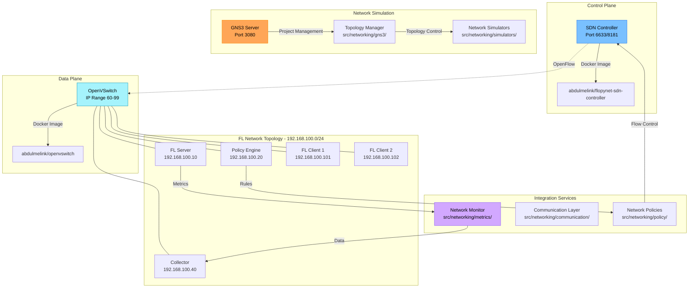

# Networking and SDN Integration

The FLOPY-NET networking layer provides a comprehensive Software-Defined Network (SDN) infrastructure for realistic federated learning experimentation. It combines Ryu-based SDN controllers, OpenVSwitch instances, and GNS3 network simulation to create controlled, repeatable network environments that mirror real-world distributed learning scenarios.

## Architecture Overview

The networking layer is implemented as containerized services with static IP assignment in the 192.168.100.0/24 subnet:



## Implementation Structure

### Source Code Organization (`src/networking/`)
- **GNS3 Integration**: `gns3/` - GNS3 API client and project management
- **SDN Controller**: `sdn/` - OpenFlow controller implementation
- **Network Simulators**: `simulators/` - Network simulation abstraction layer
- **Communication**: `communication/` - Network protocols and messaging
- **Metrics Collection**: `metrics/` - Network performance monitoring
- **Policy Integration**: `policy/` - Network-level policy enforcement
- **Utilities**: `utils/` - Helper functions and shared utilities

### Docker Components

#### SDN Controller (abdulmelink/flopynet-sdn-controller)
- **Container IP**: 192.168.100.41 (Controller IP range 30-49)
- **OpenFlow Port**: 6633 (Standard OpenFlow control channel)
- **REST API Port**: 8181 (Northbound API interface)
- **Policy Integration**: Queries Policy Engine for network decisions
- **Features**: Flow management, QoS control, traffic engineering

#### OpenVSwitch (abdulmelink/openvswitch)
- **Container IP Range**: 192.168.100.60-99 (OVS IP range)
- **Technology**: Open vSwitch with OpenFlow 1.3+ support
- **Features**: VLAN support, tunneling, network monitoring
- **Management**: Controlled via OpenFlow and OVSDB protocols

## SDN Controller Implementation

The SDN controller manages network behavior through a centralized control plane:

```python
class SDNController:
    """SDN Controller for FL network management."""
    
    def __init__(self, host, port, username=None, password=None, 
                 controller_type=ControllerType.ONOS, ryu_port=8080):
        self.controller_type = controller_type
        
        if controller_type == ControllerType.ONOS:
            from .onos_client import ONOSClient
            self.onos_client = ONOSClient(host, port, username, password)
        elif controller_type == ControllerType.RYU:
            self.ryu_url = "http://" + host + ":" + str(ryu_port)
        else:
            raise ValueError("Unsupported controller type: " + str(controller_type))
    
    def get_topology(self):
        """Get the network topology."""
        if self.controller_type == ControllerType.ONOS:
            return self.onos_client.get_topology()
        elif self.controller_type == ControllerType.RYU:
            return self._ryu_request("GET", "/fl/stats")
    
    def get_devices(self):
        """Get all network devices."""
        if self.controller_type == ControllerType.ONOS:
            return self.onos_client.get_devices()
        elif self.controller_type == ControllerType.RYU:
            return self._ryu_request("GET", "/fl/devices")
    
    def get_hosts(self):
        """Get all network hosts."""
        if self.controller_type == ControllerType.ONOS:
            return self.onos_client.get_hosts()
        elif self.controller_type == ControllerType.RYU:
            return self._ryu_request("GET", "/fl/hosts")
```
```

### Ryu Controller Application

The Ryu-based SDN application provides FL-specific network optimization:

```python
from ryu.base import app_manager
from ryu.controller import ofp_event
from ryu.controller.handler import CONFIG_DISPATCHER, MAIN_DISPATCHER, set_ev_cls
from ryu.ofproto import ofproto_v1_3
from ryu.lib.packet import packet, ethernet, ether_types, ipv4
from ryu.topology import event
import networkx as nx

class FLNetworkMonitor(app_manager.RyuApp):
    """Ryu application for Federated Learning network optimization."""
    
    OFP_VERSIONS = [ofproto_v1_3.OFP_VERSION]
    
    def __init__(self, *args, **kwargs):
        super(FLNetworkMonitor, self).__init__(*args, **kwargs)
        
        # Network state
        self.network = nx.Graph()
        self.switches = {}
        self.hosts = {}
        self.fl_server_ips = set()
        self.fl_client_ips = set()
        
        # Performance monitoring
        self.latency_stats = {}
        self.bandwidth_stats = {}
        self.flow_stats = {}
        
        # FL-specific optimization parameters
        self.fl_priority = 200
        self.background_priority = 100
        self.update_interval = 10  # seconds
        
        # Start monitoring thread
        self.monitor_thread = self.hub.spawn(self._monitor)
    
    def _monitor(self):
        """Periodic monitoring of network conditions."""
        while True:
            # Update latency measurements
            self._measure_latencies()
            
            # Update bandwidth usage
            self._measure_bandwidth()
            
            # Adjust flows based on current conditions
            self._optimize_network()
            
            # Wait for next monitoring cycle
            self.hub.sleep(self.update_interval)
    
    def _measure_latencies(self):
        """Measure latencies between FL nodes."""
        for server_ip in self.fl_server_ips:
            for client_ip in self.fl_client_ips:
                # In production, this would use LLDP or custom probes
                latency = self._probe_latency(client_ip, server_ip)
                self.latency_stats[(client_ip, server_ip)] = latency
    
    def _optimize_network(self):
        """Optimize network flows for FL performance."""
        # Prioritize FL traffic during training rounds
        for server_ip in self.fl_server_ips:
            for client_ip in self.fl_client_ips:
                latency = self.latency_stats.get((client_ip, server_ip), 0)
                
                # High latency detection and mitigation
                if latency > 100:  # 100ms threshold
                    self._apply_high_priority_path(client_ip, server_ip)
                    logger.info(f"Applied high priority path for {client_ip} -> {server_ip} (latency: {latency}ms)")
    
    def _apply_high_priority_path(self, src_ip: str, dst_ip: str):
        """Apply high-priority flow rules for FL traffic."""
        # Find optimal path through network graph
        src_switch = self._find_host_switch(src_ip)
        dst_switch = self._find_host_switch(dst_ip)
        
        if src_switch and dst_switch and self.network.has_node(src_switch) and self.network.has_node(dst_switch):
            try:
                path = nx.shortest_path(self.network, src_switch, dst_switch)
                self._install_path_flows(path, src_ip, dst_ip, 
                                       self.hosts[src_ip]['mac'], 
                                       self.hosts[dst_ip]['mac'])
            except nx.NetworkXNoPath:
                logger.warning(f"No path found between {src_switch} and {dst_switch}")
    
    @set_ev_cls(ofp_event.EventOFPSwitchFeatures, CONFIG_DISPATCHER)
    def switch_features_handler(self, ev):
        """Handle switch connection and install table-miss flow entry."""
        datapath = ev.msg.datapath
        ofproto = datapath.ofproto
        parser = datapath.ofproto_parser
        
        # Install table-miss flow entry
        match = parser.OFPMatch()
        actions = [parser.OFPActionOutput(ofproto.OFPP_CONTROLLER,
                                        ofproto.OFPCML_NO_BUFFER)]
        self._add_flow(datapath, 0, match, actions)
        
        # Register switch
        self.switches[datapath.id] = {
            'datapath': datapath,
            'ports': {}
        }
        
        logger.info(f"Switch {datapath.id} connected")
    
    @set_ev_cls(ofp_event.EventOFPPacketIn, MAIN_DISPATCHER)
    def packet_in_handler(self, ev):
        """Handle packet-in events to learn hosts and track FL traffic."""
        msg = ev.msg
        datapath = msg.datapath
        ofproto = datapath.ofproto
        parser = datapath.ofproto_parser
        in_port = msg.match['in_port']
        
        pkt = packet.Packet(msg.data)
        eth = pkt.get_protocols(ethernet.ethernet)[0]
        
        # Learn host location
        src_mac = eth.src
        dst_mac = eth.dst
        dpid = datapath.id
        
        # Update host table
        if src_mac not in self.hosts:
            ip_pkt = pkt.get_protocol(ipv4.ipv4)
            if ip_pkt:
                self.hosts[ip_pkt.src] = {
                    'mac': src_mac,
                    'switch': dpid,
                    'port': in_port,
                    'last_seen': time.time()
                }
                logger.info(f"Learned host {ip_pkt.src} at switch {dpid} port {in_port}")
        
        # Check if this is FL traffic
        if ip_pkt and self._is_fl_traffic(ip_pkt.src, ip_pkt.dst):
            # Apply FL-specific handling
            self._handle_fl_packet(msg, pkt, eth, ip_pkt)
        else:
            # Standard forwarding
            self._handle_packet(msg, eth, ip_pkt)
    
    def register_fl_server(self, server_ip: str):
        """Register an FL server IP address for tracking."""
        self.fl_server_ips.add(server_ip)
        logger.info(f"Registered FL server: {server_ip}")
    
    def register_fl_client(self, client_ip: str):
        """Register an FL client IP address for tracking."""
        self.fl_client_ips.add(client_ip)
        logger.info(f"Registered FL client: {client_ip}")
    
    def prioritize_traffic(self, src_ip: str, dst_ip: str, priority: int = 200, duration: int = 600):
        """Prioritize traffic between two IP addresses."""
        # Find switches hosting these IPs
        src_switch = self._find_host_switch(src_ip)
        dst_switch = self._find_host_switch(dst_ip)
        
        if not src_switch or not dst_switch:
            logger.error(f"Cannot find switches for {src_ip} or {dst_ip}")
            return False
        
        # Install high-priority flows
        try:
            path = nx.shortest_path(self.network, src_switch, dst_switch)
            self._install_priority_flows(path, src_ip, dst_ip, priority, duration)
            return True
        except nx.NetworkXNoPath:
            logger.error(f"No path between {src_ip} and {dst_ip}")
            return False
```

### ONOS Controller Integration

ONOS integration provides enterprise-grade SDN capabilities:

```python
import requests
from requests.auth import HTTPBasicAuth
from typing import Dict, List, Optional

class ONOSClient:
    """Client for interacting with ONOS SDN controller."""
    
    def __init__(
        self,
        host: str = "localhost",
        port: int = 8181,
        username: str = "onos",
        password: str = "rocks",
        verify_ssl: bool = False,
    ):
        self.base_url = f"http://{host}:{port}/onos/v1"
        self.session = requests.Session()
        self.session.auth = HTTPBasicAuth(username, password)
        self.session.verify = verify_ssl
        
        # Test connection
        try:
            response = self.session.get(f"{self.base_url}/applications")
            response.raise_for_status()
            logger.info(f"Connected to ONOS controller at {host}:{port}")
        except requests.RequestException as e:
            logger.error(f"Failed to connect to ONOS: {e}")
            raise
    
    def get_topology(self) -> Dict:
        """Get the network topology overview."""
        response = self._request("GET", "topology")
        return response
    
    def get_devices(self) -> List[Dict]:
        """Get all devices in the network."""
        response = self._request("GET", "devices")
        return response.get("devices", [])
    
    def get_hosts(self) -> List[Dict]:
        """Get all hosts in the network."""
        response = self._request("GET", "hosts")
        return response.get("hosts", [])
    
    def get_flows(self, device_id: Optional[str] = None) -> List[Dict]:
        """Get flow rules for a device or all devices."""
        if device_id:
            endpoint = f"flows/{device_id}"
        else:
            endpoint = "flows"
        
        response = self._request("GET", endpoint)
        return response.get("flows", [])
    
    def add_flow(self, device_id: str, flow: Dict) -> Dict:
        """Add a flow rule to a device."""
        return self._request("POST", f"flows/{device_id}", data=flow)
    
    def create_path_intent(
        self,
        src_host: str,
        dst_host: str,
        priority: int = 100,
        bidirectional: bool = True,
    ) -> Dict:
        """Create a path intent between two hosts."""
        intent = {
            "type": "HostToHostIntent",
            "appId": "org.onosproject.flopynet",
            "priority": priority,
            "one": src_host,
            "two": dst_host,
            "selector": {
                "criteria": [
                    {"type": "ETH_TYPE", "ethType": "0x800"}  # IPv4
                ]
            },
            "treatment": {
                "instructions": []
            }
        }
        
        if bidirectional:
            intent["constraints"] = [
                {"type": "BandwidthConstraint", "bandwidth": 100000000}  # 100 Mbps
            ]
        
        return self._request("POST", "intents", data=intent)
    
    def allocate_bandwidth(
        self,
        src_device: str,
        dst_device: str,
        bandwidth_mbps: int,
        priority: int = 100,
    ) -> Dict:
        """Allocate bandwidth between devices using meters and flows."""
        
        # Create meter for bandwidth limiting
        meter = {
            "deviceId": src_device,
            "unit": "KB_PER_SEC",
            "burst": True,
            "bands": [
                {
                    "type": "DROP",
                    "rate": bandwidth_mbps * 1000,  # Convert to KB/s
                    "burstSize": bandwidth_mbps * 1000 * 2  # 2 second burst
                }
            ]
        }
        
        meter_response = self._request("POST", "meters", data=meter)
        meter_id = meter_response.get("id")
        
        if not meter_id:
            raise RuntimeError("Failed to create meter")
        
        # Find link between devices
        links = self.get_topology_links()
        target_link = None
        
        for link in links:
            if (link["src"]["device"] == src_device and 
                link["dst"]["device"] == dst_device):
                target_link = link
                break
        
        if not target_link:
            raise RuntimeError(f"No link found between {src_device} and {dst_device}")
        
        # Create flow rule that uses the meter
        flow = {
            "priority": priority,
            "timeout": 0,
            "isPermanent": True,
            "deviceId": src_device,
            "treatment": {
                "instructions": [
                    {"type": "OUTPUT", "port": target_link["src"]["port"]},
                    {"type": "METER", "meterId": meter_id}
                ]
            },
            "selector": {
                "criteria": [
                    {"type": "ETH_TYPE", "ethType": "0x800"}
                ]
            }
        }
        
        return self.add_flow(src_device, flow)
    
    def isolate_node(self, host_id: str, duration_seconds: int = 300) -> Dict:
        """Isolate a node from the network temporarily."""
        # Get host information
        host = self.get_host(host_id)
        if not host:
            raise ValueError(f"Host {host_id} not found")
        
        # Extract device and port information
        locations = host.get("locations", [])
        if not locations:
            raise ValueError(f"Host {host_id} has no location information")
        
        device_id = locations[0].get("elementId")
        port = locations[0].get("port")
        
        if not device_id or not port:
            logger.error(f"Host {host_id} device or port not found")
            raise ValueError(f"Host {host_id} device or port not found")
        
        # Create a flow rule to drop all traffic from this host
        flow = {
            "priority": 1000,  # High priority
            "timeout": duration_seconds,
            "isPermanent": False,
            "deviceId": device_id,
            "treatment": {
                "instructions": [
                    {"type": "NOACTION"}
                ]
            },
            "selector": {
                "criteria": [
                    {"type": "IN_PORT", "port": port},
                    {"type": "ETH_SRC", "mac": host.get("mac")}
                ]
            }
        }
        
        result = self.add_flow(device_id, flow)
        return {
            "status": "isolated",
            "host_id": host_id,
            "device_id": device_id,
            "duration": duration_seconds,
            "flow_id": result.get("id")
        }
```

## Network Traffic Management

### QoS Implementation

Quality of Service (QoS) mechanisms ensure FL traffic receives appropriate network resources:

```python
class QoSManager:
    """Manage Quality of Service for FL traffic."""
    
    def __init__(self, controller: SDNController):
        self.controller = controller
        self.traffic_classes = {
            'fl_model_updates': {'priority': 300, 'bandwidth': '50%'},
            'fl_control': {'priority': 250, 'bandwidth': '20%'},
            'fl_heartbeat': {'priority': 200, 'bandwidth': '10%'},
            'background': {'priority': 100, 'bandwidth': '20%'}
        }
        self.active_flows = {}
    
    def classify_fl_traffic(self, src_ip: str, dst_ip: str, port: int) -> str:
        """Classify FL traffic into QoS categories."""
        
        # FL model update traffic (high bandwidth, high priority)
        if port in [8080, 8081]:  # FL server ports
            return 'fl_model_updates'
        
        # FL control messages (low bandwidth, high priority)
        elif port in [8082, 8083]:  # FL control ports
            return 'fl_control'
        
        # Heartbeat and monitoring (low bandwidth, medium priority)
        elif port in [9090, 9091]:  # Monitoring ports
            return 'fl_heartbeat'
        
        else:
            return 'background'
    
    def apply_qos_policy(self, src_ip: str, dst_ip: str, port: int):
        """Apply QoS policy to FL traffic flow."""
        traffic_class = self.classify_fl_traffic(src_ip, dst_ip, port)
        policy = self.traffic_classes[traffic_class]
        
        flow_key = f"{src_ip}->{dst_ip}:{port}"
        
        if self.controller.controller_type == ControllerType.ONOS:
            # ONOS-based QoS implementation
            intent_result = self.controller.onos_client.create_path_intent(
                src_host=self._ip_to_host_id(src_ip),
                dst_host=self._ip_to_host_id(dst_ip),
                priority=policy['priority']
            )
            
            self.active_flows[flow_key] = {
                'intent_id': intent_result.get('id'),
                'traffic_class': traffic_class,
                'policy': policy,
                'created_at': time.time()
            }
            
        elif self.controller.controller_type == ControllerType.RYU:
            # Ryu-based QoS implementation
            result = self.controller._ryu_request("POST", "/fl/qos", data={
                'src_ip': src_ip,
                'dst_ip': dst_ip,
                'port': port,
                'priority': policy['priority'],
                'bandwidth': policy['bandwidth']
            })
            
            self.active_flows[flow_key] = {
                'flow_id': result.get('flow_id'),
                'traffic_class': traffic_class,
                'policy': policy,
                'created_at': time.time()
            }
        
        logger.info(f"Applied {traffic_class} QoS policy to {flow_key}")
    
    def monitor_qos_performance(self) -> Dict:
        """Monitor QoS policy effectiveness."""
        performance_metrics = {
            'total_flows': len(self.active_flows),
            'traffic_class_distribution': {},
            'policy_violations': [],
            'bandwidth_utilization': {}
        }
        
        # Analyze traffic class distribution
        for flow_info in self.active_flows.values():
            traffic_class = flow_info['traffic_class']
            if traffic_class not in performance_metrics['traffic_class_distribution']:
                performance_metrics['traffic_class_distribution'][traffic_class] = 0
            performance_metrics['traffic_class_distribution'][traffic_class] += 1
        
        # Check for policy violations
        for flow_key, flow_info in self.active_flows.items():
            # Get current flow statistics
            flow_stats = self._get_flow_statistics(flow_info.get('flow_id'))
            
            if flow_stats and self._detect_policy_violation(flow_info, flow_stats):
                performance_metrics['policy_violations'].append({
                    'flow': flow_key,
                    'violation_type': 'bandwidth_exceeded',
                    'current_usage': flow_stats.get('bandwidth_mbps', 0),
                    'policy_limit': flow_info['policy']['bandwidth']
                })
        
        return performance_metrics
```

### Traffic Prioritization

FL traffic prioritization ensures model updates receive network resources when needed:

```python
class TrafficPrioritization:
    """Implement traffic prioritization for FL operations."""
    
    def __init__(self, controller: SDNController):
        self.controller = controller
        self.priority_rules = []
        self.current_training_round = None
        self.round_start_time = None
    
    def start_training_round(self, round_number: int, participating_clients: List[str]):
        """Configure network for FL training round start."""
        self.current_training_round = round_number
        self.round_start_time = time.time()
        
        logger.info(f"Configuring network for FL round {round_number}")
        
        # Clear previous round's priority rules
        self._clear_priority_rules()
        
        # Set high priority for FL server to client communication
        fl_server_ip = "192.168.100.10"  # From docker-compose configuration
        
        for client_ip in participating_clients:
            # Bidirectional high-priority flows
            self._create_priority_flow(
                src_ip=fl_server_ip,
                dst_ip=client_ip,
                priority=300,
                description=f"FL server->client {client_ip} round {round_number}"
            )
            
            self._create_priority_flow(
                src_ip=client_ip,
                dst_ip=fl_server_ip,
                priority=300,
                description=f"FL client {client_ip}->server round {round_number}"
            )
        
        # Apply traffic shaping for background traffic
        self._apply_background_traffic_limits()
        
        logger.info(f"Network configured for {len(participating_clients)} clients in round {round_number}")
    
    def end_training_round(self):
        """Reset network configuration after training round."""
        if self.current_training_round is None:
            return
        
        round_duration = time.time() - self.round_start_time
        logger.info(f"FL round {self.current_training_round} completed in {round_duration:.2f} seconds")
        
        # Gradually reduce FL traffic priority
        self._gradual_priority_reduction()
        
        # Reset to normal traffic patterns
        self._reset_to_normal_priority()
        
        self.current_training_round = None
        self.round_start_time = None
    
    def _create_priority_flow(self, src_ip: str, dst_ip: str, priority: int, description: str):
        """Create high-priority flow rule."""
        if self.controller.controller_type == ControllerType.ONOS:
            intent = self.controller.onos_client.create_path_intent(
                src_host=self._ip_to_host_id(src_ip),
                dst_host=self._ip_to_host_id(dst_ip),
                priority=priority
            )
            
            rule = {
                'id': intent.get('id'),
                'type': 'onos_intent',
                'src_ip': src_ip,
                'dst_ip': dst_ip,
                'priority': priority,
                'description': description,
                'created_at': time.time()
            }
            
        elif self.controller.controller_type == ControllerType.RYU:
            result = self.controller._ryu_request("POST", "/fl/prioritize", data={
                'src_ip': src_ip,
                'dst_ip': dst_ip,
                'priority': priority,
                'duration': 600  # 10 minutes
            })
            
            rule = {
                'id': result.get('flow_id'),
                'type': 'ryu_flow',
                'src_ip': src_ip,
                'dst_ip': dst_ip,
                'priority': priority,
                'description': description,
                'created_at': time.time()
            }
        
        self.priority_rules.append(rule)
        logger.debug(f"Created priority flow: {description}")
    
    def _apply_background_traffic_limits(self):
        """Limit background traffic during FL training."""
        # Identify non-FL traffic and apply rate limiting
        all_devices = self.controller.get_devices()
        
        for device in all_devices:
            device_id = device.get('id')
            if not device_id:
                continue
            
            # Create flow rule to limit non-FL traffic
            background_limit_flow = {
                'priority': 50,  # Lower than FL traffic
                'timeout': 600,  # 10 minutes
                'deviceId': device_id,
                'selector': {
                    'criteria': [
                        {'type': 'ETH_TYPE', 'ethType': '0x800'},  # IPv4
                        {'type': 'IP_PROTO', 'protocol': 6}  # TCP
                    ]
                },
                'treatment': {
                    'instructions': [
                        {'type': 'METER', 'meterId': self._create_background_meter(device_id)}
                    ]
                }
            }
            
            if self.controller.controller_type == ControllerType.ONOS:
                self.controller.onos_client.add_flow(device_id, background_limit_flow)
    
    def handle_network_congestion(self, congested_links: List[Dict]):
        """Respond to network congestion during FL training."""
        if not self.current_training_round:
            return
        
        logger.warning(f"Network congestion detected on {len(congested_links)} links during FL round {self.current_training_round}")
        
        for link in congested_links:
            src_device = link.get('src_device')
            dst_device = link.get('dst_device')
            utilization = link.get('utilization', 0)
            
            if utilization > 0.8:  # 80% utilization threshold
                # Apply emergency traffic management
                self._apply_emergency_traffic_control(src_device, dst_device)
                
                # Find alternative paths for FL traffic
                self._reroute_fl_traffic(src_device, dst_device)
    
    def _reroute_fl_traffic(self, congested_src: str, congested_dst: str):
        """Reroute FL traffic around congested links."""
        # Get current topology
        topology = self.controller.get_topology()
        
        # Find FL flows using the congested link
        fl_flows = [rule for rule in self.priority_rules if rule['priority'] >= 200]
        
        for flow in fl_flows:
            # Calculate alternative path
            alternative_path = self._find_alternative_path(
                src_ip=flow['src_ip'],
                dst_ip=flow['dst_ip'],
                avoid_link=(congested_src, congested_dst)
            )
            
            if alternative_path:
                # Create new flow with alternative path
                self._create_explicit_path_flow(flow['src_ip'], flow['dst_ip'], alternative_path)
                logger.info(f"Rerouted FL traffic from {flow['src_ip']} to {flow['dst_ip']} via alternative path")
```

## Network Monitoring and Analytics

### Real-time Network Metrics

Comprehensive network monitoring provides insights into FL performance:

```python
class NetworkMonitor:
    """Monitor network performance and FL traffic patterns."""
    
    def __init__(self, controller: SDNController, collector_url: str):
        self.controller = controller
        self.collector_url = collector_url
        self.monitoring_active = False
        self.metrics_buffer = deque(maxlen=1000)
        
        # Monitoring configuration
        self.monitor_interval = 5  # seconds
        self.alert_thresholds = {
            'latency_ms': 100,
            'packet_loss_rate': 0.01,
            'bandwidth_utilization': 0.8,
            'flow_table_utilization': 0.9
        }
    
    def start_monitoring(self):
        """Start network monitoring."""
        self.monitoring_active = True
        self.monitor_thread = threading.Thread(target=self._monitoring_loop, daemon=True)
        self.monitor_thread.start()
        logger.info("Network monitoring started")
    
    def stop_monitoring(self):
        """Stop network monitoring."""
        self.monitoring_active = False
        logger.info("Network monitoring stopped")
    
    def _monitoring_loop(self):
        """Main monitoring loop."""
        while self.monitoring_active:
            try:
                # Collect comprehensive network metrics
                metrics = self._collect_network_metrics()
                
                # Store metrics locally
                self.metrics_buffer.append(metrics)
                
                # Send to collector service
                self._send_metrics_to_collector(metrics)
                
                # Check for alert conditions
                alerts = self._check_alert_conditions(metrics)
                if alerts:
                    self._handle_alerts(alerts)
                
                time.sleep(self.monitor_interval)
                
            except Exception as e:
                logger.error(f"Error in monitoring loop: {e}")
                time.sleep(self.monitor_interval)
    
    def _collect_network_metrics(self) -> Dict:
        """Collect comprehensive network metrics."""
        timestamp = time.time()
        
        # Get topology information
        topology = self.controller.get_topology()
        devices = self.controller.get_devices()
        hosts = self.controller.get_hosts()
        
        # Collect device statistics
        device_stats = {}
        for device in devices:
            device_id = device.get('id')
            if device_id:
                flows = self.controller.get_flows(device_id)
                device_stats[device_id] = {
                    'flow_count': len(flows),
                    'active_flows': len([f for f in flows if f.get('state') == 'ADDED']),
                    'flow_table_utilization': len(flows) / 1000  # Assume 1000 flow table size
                }
        
        # Calculate network-wide metrics
        total_flows = sum(stats['flow_count'] for stats in device_stats.values())
        avg_flow_table_util = np.mean([stats['flow_table_utilization'] for stats in device_stats.values()])
        
        # Estimate traffic patterns (in production, use actual flow statistics)
        fl_traffic_estimate = self._estimate_fl_traffic_volume()
        
        metrics = {
            'timestamp': timestamp,
            'topology': {
                'devices': len(devices),
                'hosts': len(hosts),
                'active_devices': len([d for d in devices if d.get('available', False)])
            },
            'flows': {
                'total_flows': total_flows,
                'avg_flow_table_utilization': avg_flow_table_util
            },
            'traffic': {
                'fl_traffic_mbps': fl_traffic_estimate,
                'estimated_total_traffic_mbps': fl_traffic_estimate * 1.3  # Add overhead
            },
            'performance': {
                'avg_latency_ms': self._estimate_network_latency(),
                'estimated_packet_loss': self._estimate_packet_loss()
            },
            'device_stats': device_stats
        }
        
        return metrics
    
    def _estimate_fl_traffic_volume(self) -> float:
        """Estimate FL traffic volume based on active training."""
        # This would integrate with FL server to get actual training state
        # For now, provide estimates based on typical FL patterns
        
        base_traffic = 10.0  # 10 Mbps baseline
        
        # During training rounds, traffic increases significantly
        if hasattr(self, 'current_training_round') and self.current_training_round:
            active_clients = 8  # From docker-compose
            model_size_mb = 50  # Typical model size
            
            # Model download + upload per client
            round_traffic = active_clients * model_size_mb * 2 / 60  # Assume 1-minute rounds
            return base_traffic + round_traffic
        
        return base_traffic
    
    def _check_alert_conditions(self, metrics: Dict) -> List[Dict]:
        """Check metrics against alert thresholds."""
        alerts = []
        
        # Flow table utilization alert
        avg_flow_util = metrics['flows']['avg_flow_table_utilization']
        if avg_flow_util > self.alert_thresholds['flow_table_utilization']:
            alerts.append({
                'type': 'flow_table_full',
                'severity': 'warning',
                'message': f'Flow table utilization high: {avg_flow_util:.2%}',
                'threshold': self.alert_thresholds['flow_table_utilization'],
                'current_value': avg_flow_util,
                'timestamp': metrics['timestamp']
            })
        
        # Network latency alert
        avg_latency = metrics['performance']['avg_latency_ms']
        if avg_latency > self.alert_thresholds['latency_ms']:
            alerts.append({
                'type': 'high_latency',
                'severity': 'warning',
                'message': f'Network latency high: {avg_latency:.1f}ms',
                'threshold': self.alert_thresholds['latency_ms'],
                'current_value': avg_latency,
                'timestamp': metrics['timestamp']
            })
        
        return alerts
    
    def get_fl_network_summary(self) -> Dict:
        """Get summary of FL-specific network performance."""
        if len(self.metrics_buffer) < 10:
            return {'status': 'insufficient_data'}
        
        recent_metrics = list(self.metrics_buffer)[-10:]  # Last 10 measurements
        
        # Calculate averages and trends
        avg_latency = np.mean([m['performance']['avg_latency_ms'] for m in recent_metrics])
        avg_fl_traffic = np.mean([m['traffic']['fl_traffic_mbps'] for m in recent_metrics])
        avg_flow_util = np.mean([m['flows']['avg_flow_table_utilization'] for m in recent_metrics])
        
        # Calculate trends
        latency_trend = np.polyfit(range(len(recent_metrics)), 
                                 [m['performance']['avg_latency_ms'] for m in recent_metrics], 1)[0]
        traffic_trend = np.polyfit(range(len(recent_metrics)),
                                 [m['traffic']['fl_traffic_mbps'] for m in recent_metrics], 1)[0]
        
        return {
            'timestamp': time.time(),
            'summary': {
                'avg_latency_ms': avg_latency,
                'avg_fl_traffic_mbps': avg_fl_traffic,
                'avg_flow_table_utilization': avg_flow_util,
                'network_health': self._calculate_network_health_score(recent_metrics)
            },
            'trends': {
                'latency_trend_ms_per_minute': latency_trend * 12,  # 5-second intervals to minutes
                'traffic_trend_mbps_per_minute': traffic_trend * 12,
                'trend_status': 'improving' if latency_trend < 0 else 'degrading'
            },
            'recommendations': self._generate_network_recommendations(recent_metrics)
        }
```

## Integration with GNS3

### GNS3 Topology Management

Integration with GNS3 provides realistic network simulation:

```python
import requests
from typing import Dict, List, Optional

class GNS3Integration:
    """Integration with GNS3 network simulation platform."""
    
    def __init__(self, gns3_url: str = "http://localhost:3080"):
        self.gns3_url = gns3_url
        self.session = requests.Session()
        self.projects = {}
        
        # Test connection
        try:
            response = self.session.get(f"{self.gns3_url}/v2/version")
            response.raise_for_status()
            logger.info(f"Connected to GNS3 server at {gns3_url}")
        except requests.RequestException as e:
            logger.error(f"Failed to connect to GNS3: {e}")
            raise
    
    def create_fl_topology(self, config: Dict) -> str:
        """Create a GNS3 project with FL topology."""
        project_name = f"FLOPY-NET-{int(time.time())}"
        
        # Create project
        project_data = {
            "name": project_name,
            "auto_start": True,
            "auto_open": True
        }
        
        response = self.session.post(f"{self.gns3_url}/v2/projects", json=project_data)
        response.raise_for_status()
        project = response.json()
        project_id = project["project_id"]
        
        # Add FL server node
        fl_server = self._create_node(
            project_id=project_id,
            name="FL-Server",
            node_type="docker",
            image="abdulmelink/flopynet-server:v1.0.0-alpha.8",
            x=300, y=200
        )
        
        # Add FL clients
        fl_clients = []
        client_count = config.get("client_count", 3)
        
        for i in range(client_count):
            client = self._create_node(
                project_id=project_id,
                name=f"FL-Client-{i+1}",
                node_type="docker",
                image="abdulmelink/flopynet-client:v1.0.0-alpha.8",
                x=100 + i * 200, y=400
            )
            fl_clients.append(client)
        
        # Add SDN switches
        switches = []
        switch_count = config.get("switch_count", 2)
        
        for i in range(switch_count):
            switch = self._create_node(
                project_id=project_id,
                name=f"Switch-{i+1}",
                node_type="openvswitch",
                x=200 + i * 300, y=300
            )
            switches.append(switch)
        
        # Create network links
        self._create_star_topology_links(project_id, fl_server, fl_clients, switches)
        
        # Start the project
        self.session.post(f"{self.gns3_url}/v2/projects/{project_id}/start")
        
        self.projects[project_id] = {
            "name": project_name,
            "fl_server": fl_server,
            "fl_clients": fl_clients,
            "switches": switches,
            "config": config,
            "created_at": time.time()
        }
        
        logger.info(f"Created GNS3 FL topology: {project_name} ({project_id})")
        return project_id
    
    def _create_node(self, project_id: str, name: str, node_type: str, 
                    image: str = None, x: int = 0, y: int = 0) -> Dict:
        """Create a node in GNS3 project."""
        node_data = {
            "name": name,
            "node_type": node_type,
            "x": x,
            "y": y
        }
        
        if image:
            node_data["properties"] = {"image": image}
        
        response = self.session.post(
            f"{self.gns3_url}/v2/projects/{project_id}/nodes",
            json=node_data
        )
        response.raise_for_status()
        return response.json()
    
    def apply_network_conditions(self, project_id: str, conditions: Dict):
        """Apply network conditions like latency, packet loss."""
        if project_id not in self.projects:
            raise ValueError(f"Project {project_id} not found")
        
        project = self.projects[project_id]
        
        # Apply conditions to links
        for link_id, link_conditions in conditions.get("links", {}).items():
            self._apply_link_conditions(project_id, link_id, link_conditions)
        
        # Apply conditions to nodes
        for node_name, node_conditions in conditions.get("nodes", {}).items():
            node = self._find_node_by_name(project, node_name)
            if node:
                self._apply_node_conditions(project_id, node["node_id"], node_conditions)
    
    def _apply_link_conditions(self, project_id: str, link_id: str, conditions: Dict):
        """Apply network conditions to a specific link."""
        # Get link information
        response = self.session.get(f"{self.gns3_url}/v2/projects/{project_id}/links/{link_id}")
        response.raise_for_status()
        link = response.json()
        
        # Update link properties with network conditions
        link_updates = {}
        
        if "latency_ms" in conditions:
            link_updates["delay"] = conditions["latency_ms"]
        
        if "packet_loss_percent" in conditions:
            link_updates["packet_loss"] = conditions["packet_loss_percent"]
        
        if "bandwidth_mbps" in conditions:
            link_updates["bandwidth"] = conditions["bandwidth_mbps"] * 1000  # Convert to Kbps
        
        if "jitter_ms" in conditions:
            link_updates["jitter"] = conditions["jitter_ms"]
        
        if link_updates:
            response = self.session.put(
                f"{self.gns3_url}/v2/projects/{project_id}/links/{link_id}",
                json={"properties": link_updates}
            )
            response.raise_for_status()
            logger.info(f"Applied network conditions to link {link_id}: {link_updates}")
    
    def get_topology_status(self, project_id: str) -> Dict:
        """Get current status of GNS3 topology."""
        if project_id not in self.projects:
            raise ValueError(f"Project {project_id} not found")
        
        # Get project status
        response = self.session.get(f"{self.gns3_url}/v2/projects/{project_id}")
        response.raise_for_status()
        project_info = response.json()
        
        # Get node statuses
        response = self.session.get(f"{self.gns3_url}/v2/projects/{project_id}/nodes")
        response.raise_for_status()
        nodes = response.json()
        
        # Get link statuses
        response = self.session.get(f"{self.gns3_url}/v2/projects/{project_id}/links")
        response.raise_for_status()
        links = response.json()
        
        return {
            "project_id": project_id,
            "project_name": project_info["name"],
            "status": project_info["status"],
            "nodes": {
                "total": len(nodes),
                "running": len([n for n in nodes if n["status"] == "started"]),
                "stopped": len([n for n in nodes if n["status"] == "stopped"])
            },
            "links": {
                "total": len(links),
                "active": len([l for l in links if l.get("link_type") != "ethernet"])
            },
            "network_conditions": self._analyze_current_conditions(project_id)
        }
```

## Configuration and Deployment

### Docker Compose Integration

Network components are integrated into the Docker Compose stack:

```yaml
# SDN Controller Service
sdn-controller:
  image: abdulmelink/flopynet-sdn-controller:v1.0.0-alpha.8
  container_name: sdn-controller
  privileged: true
  cap_add:
    - NET_ADMIN
  environment:
    - SERVICE_TYPE=sdn-controller
    - CONTROLLER_HOST=0.0.0.0
    - CONTROLLER_PORT=6633
    - REST_PORT=8181
    - POLICY_ENGINE_HOST=policy-engine
  networks:
    flopynet:
      ipv4_address: 192.168.100.41
  ports:
    - "8181:8181"  # REST API
    - "6633:6633"  # OpenFlow

# OpenVSwitch Service
openvswitch:
  image: abdulmelink/openvswitch:v1.0.0-alpha.8
  container_name: openvswitch
  privileged: true
  cap_add:
    - NET_ADMIN
  environment:
    - OVS_NUM_PORTS=16
    - OVS_BRIDGE_NAME=br0
    - SDN_CONTROLLER_HOST=sdn-controller
    - SDN_CONTROLLER_PORT=6633
    - OVS_PROTOCOL=OpenFlow13
  networks:
    flopynet:
      ipv4_address: 192.168.100.60
  depends_on:
    sdn-controller:
      condition: service_started
```

### Environment Configuration

| Variable | Description | Default |
|----------|-------------|---------|
| `CONTROLLER_TYPE` | SDN controller type (ryu/onos) | `onos` |
| `CONTROLLER_HOST` | Controller hostname | `0.0.0.0` |
| `CONTROLLER_PORT` | OpenFlow port | `6633` |
| `REST_PORT` | REST API port | `8181` |
| `OVS_BRIDGE_NAME` | OVS bridge name | `br0` |
| `OVS_PROTOCOL` | OpenFlow version | `OpenFlow13` |
| `QOS_ENABLED` | Enable QoS features | `true` |
| `GNS3_URL` | GNS3 server URL | `http://localhost:3080` |
| `NETWORK_SIMULATION` | Enable network simulation | `true` |

The networking layer provides the foundation for realistic federated learning experimentation, enabling researchers to study the impact of network conditions on distributed machine learning performance while maintaining full control over the network environment.
