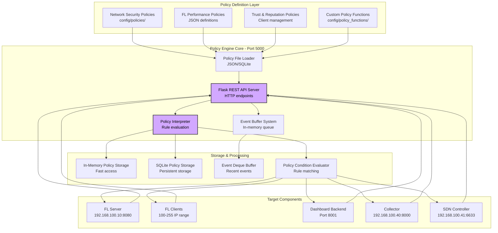

# Policy Engine

The **Policy Engine** is the heart of FLOPY-NET's security, governance, and compliance system. It operates as a centralized Flask-based REST API service (Port 5000, IP 192.168.100.20) that enforces rules across all components, monitors compliance, detects anomalies, and ensures that federated learning operations adhere to defined policies.

## Overview

As stated in the project architecture: "*Policy Engine is the heart: If anything related to the Policy Engine needs fix first try to match the component architecture with policy engine architecture instead of trying to modify Policy Engine.*"

The Policy Engine operates as a centralized Docker container service (`abdulmelink/flopynet-policy-engine:v1.0.0-alpha.8`) that:
- Defines and enforces security, privacy, and performance policies
- Monitors federated learning component compliance in real-time
- Detects and responds to anomalies and policy violations
- Manages client trust scores and reputation systems
- Controls FL client access and participation permissions
- Integrates with SDN Controller for network-level policy enforcement

## Container Architecture

### Docker Service Configuration
```yaml
policy-engine:
  image: abdulmelink/flopynet-policy-engine:v1.0.0-alpha.8
  container_name: policy-engine
  networks:
    flopynet_network:
      ipv4_address: 192.168.100.20
  ports:
    - "5000:5000"
  environment:
    - SERVICE_TYPE=policy-engine
    - POLICY_PORT=5000
    - POLICY_CONFIG=/app/config/policies/policy_config.json
    - POLICY_FUNCTIONS_DIR=/app/config/policy_functions
```

### Service Dependencies
- **Health Check**: Curl-based health monitoring on `/health` endpoint
- **FL Server**: Depends on Policy Engine health check before startup
- **FL Clients**: Query Policy Engine for participation authorization
- **Collector**: Monitors Policy Engine events and compliance metrics
- **SDN Controller**: Receives network policy enforcement directives

## Architecture



## Key Features

### 🛡️ Network Security Enforcement

- **Connection Control**: Manages which components can communicate with each other
- **Port-Based Access**: Controls access to specific service ports (FL Server: 8080, Collector: 8000, Policy Engine: 5000)
- **Protocol Filtering**: TCP/UDP protocol-based traffic filtering
- **IP-Based Rules**: Source and destination IP address matching and filtering

### 📋 Policy File Management

- **JSON-Based Policies**: Declarative policy definitions in JSON format located at `config/policies/policies.json`
- **Dynamic Loading**: Hot-reload policies from file without system restart
- **Hierarchical Structure**: Policies organized by type (network_security, fl_performance, trust_reputation)
- **Priority System**: Numeric priority values determine policy application order

### 📊 Event Logging & Monitoring

- **Real-time Event Buffer**: Thread-safe deque buffer storing up to 1000 recent events
- **Event Types**: ENGINE_START, POLICY_LOADED, POLICY_APPLIED, POLICY_VIOLATION events
- **UUID Tracking**: Each event has unique identifier for correlation
- **Timestamp Recording**: ISO 8601 timestamps with UTC timezone

### 🔧 REST API Interface

- **Flask-Based Server**: HTTP REST API running on port 5000 (configurable)
- **Policy CRUD Operations**: Create, Read, Update, Delete policy operations
- **Health Checks**: `/health` endpoint for service monitoring
- **Event Retrieval**: API endpoints to fetch event logs and policy status

## Policy Types

### Network Security Policies

```json title="Network Security Policy Example"
{
  "default-net-sec-001": {
    "id": "default-net-sec-001",
    "name": "base_network_security",
    "type": "network_security",
    "description": "Base network security policy allowing essential FL system communication",
    "priority": 100,
    "rules": [
      {
        "action": "allow",
        "description": "Allow FL clients to connect to FL server",
        "match": {
          "protocol": "tcp",
          "src_type": "fl-client",
          "dst_type": "fl-server",
          "dst_port": 8080
        }
      },
      {
        "action": "allow",
        "description": "Allow metrics reporting to collector",
        "match": {
          "protocol": "tcp",
          "dst_type": "collector",
          "dst_port": 8000
        }
      }
    ]
  }
}
```

### FL Performance Policies

```json title="FL Performance Policy Example"
{
  "fl-perf-001": {
    "id": "fl-perf-001",
    "name": "client_participation_monitor",
    "type": "fl_performance",
    "description": "Monitor and enforce client participation rates",
    "priority": 80,
    "rules": [
      {
        "action": "monitor",
        "description": "Track client round participation",
        "match": {
          "component_type": "fl-client",
          "event_type": "round_participation"
        }
      }
    ]
  }
}
```

### Trust & Reputation Policies

```json title="Trust Policy Example"
{
  "trust-001": {
    "id": "trust-001", 
    "name": "client_trust_evaluation",
    "type": "trust_reputation",
    "description": "Evaluate and maintain client trust scores",
    "priority": 90,
    "rules": [
      {
        "action": "evaluate_trust",
        "description": "Calculate trust scores based on behavior",
        "match": {
          "component_type": "fl-client",
          "metric_type": "model_contribution"
        }
      }
    ]
  }
}
```

## Configuration

### Policy Engine Docker Configuration

The Policy Engine runs as a Docker container with the following configuration:

```yaml title="docker-compose.yml - Policy Engine Service"
policy-engine:
  build:
    context: .
    dockerfile: docker/flopynet_policy_engine.Dockerfile
  image: abdulmelink/flopynet-policy-engine:v1.0.0-alpha.8
  container_name: policy-engine
  privileged: true
  cap_add:
    - NET_ADMIN
  environment:
    - SERVICE_TYPE=policy-engine
    - SERVICE_VERSION=v1.0.0-alpha.8
    - HOST=0.0.0.0
    - POLICY_PORT=5000
    - LOG_LEVEL=INFO
    - NODE_IP_POLICY_ENGINE=192.168.100.20
    - POLICY_CONFIG=/app/config/policies/policy_config.json
    - POLICY_FUNCTIONS_DIR=/app/config/policy_functions
  networks:
    flopynet_network:
      ipv4_address: 192.168.100.20
  ports:
    - "5000:5000"
```

### Policy Engine Configuration File

```json title="config/policy_engine/policy_config.json"
{
  "policy_id": "policy-engine",
  "host": "0.0.0.0",
  "port": 5000,
  "metrics_port": 9091,
  "log_level": "INFO",
  "log_file": "/app/logs/policy-engine.log",
  "policy_file": "/app/config/policies/policies.json",
  "policy_ip": "192.168.100.20",
  "collector_host": "metrics-collector",
  "fl_server_port": 8080,
  "collector_port": 8081,
  "node_ip_collector": "192.168.100.40",
  "node_ip_fl_server": "192.168.100.10",
  "node_ip_openvswitch": "192.168.100.60",
  "node_ip_policy_engine": "192.168.100.20",
  "node_ip_sdn_controller": "192.168.100.41"
}
```

### Policy Definitions File Structure

```json title="config/policies/policies.json"
{
  "version": 2,
  "policies": {
    "policy-id": {
      "id": "policy-id",
      "name": "policy_name",
      "type": "policy_type",
      "description": "Policy description",
      "priority": 100,
      "rules": [
        {
          "action": "allow|deny|monitor",
          "description": "Rule description",
          "match": {
            "protocol": "tcp|udp",
            "src_type": "component-type",
            "dst_type": "component-type", 
            "dst_port": 8080
          }
        }
      ]
    }
  }
}
```

## Policy Implementation

### Policy Engine Core Classes

The Policy Engine is implemented using several key Python classes:

#### PolicyEngine Class

```python title="src/policy_engine/policy_engine.py"
class PolicyEngine(IPolicyEngine):
    """
    Main Policy Engine implementation for federated learning.
    
    Features:
    - Thread-safe event buffer (deque with max 1000 events)
    - JSON policy file loading and parsing
    - Flask REST API server integration
    - Component communication validation
    """
    
    # Class-level shared event buffer
    _event_buffer = collections.deque(maxlen=1000)
    _buffer_lock = threading.Lock()
    
    def __init__(self, policy_file: str = None):
        self.policies = {}
        self.policy_file = policy_file or os.path.join('config', 'policies', 'policies.json')
        self.load_policies()
        self._log_event("ENGINE_START", {})
```

#### Event Logging System

```python title="Event Logging Implementation"
def _log_event(self, event_type: str, details: Dict[str, Any]):
    """
    Log an event to the thread-safe event buffer.
    
    Event Schema:
    {
        "event_id": "uuid4-string",
        "timestamp": "ISO8601-UTC-timestamp", 
        "source_component": "POLICY_ENGINE",
        "event_type": "ENGINE_START|POLICY_LOADED|POLICY_APPLIED|POLICY_VIOLATION",
        "details": {...}
    }
    """
    event = {
        "event_id": str(uuid.uuid4()),
        "timestamp": datetime.datetime.now(datetime.timezone.utc).isoformat(),
        "source_component": "POLICY_ENGINE",
        "event_type": event_type,
        "details": details
    }
    
    with PolicyEngine._buffer_lock:
        PolicyEngine._event_buffer.append(event)
```

### Flask REST API Server

The Policy Engine exposes a Flask-based REST API:

```python title="src/policy_engine/policy_engine_server.py"
from flask import Flask, jsonify, request
from src.policy_engine.policy_engine import PolicyEngine

app = Flask(__name__)
policy_engine = PolicyEngine()

@app.route('/health', methods=['GET'])
def health_check():
    """Health check endpoint for monitoring."""
    return jsonify({"status": "healthy", "timestamp": datetime.now().isoformat()})

@app.route('/policies', methods=['GET'])
def get_policies():
    """Get all loaded policies."""
    return jsonify({"policies": policy_engine.policies})

@app.route('/events', methods=['GET'])
def get_events():
    """Get recent events from the event buffer."""
    with PolicyEngine._buffer_lock:
        events = list(PolicyEngine._event_buffer)
    return jsonify({"events": events, "total": len(events)})
```

## Trust Management

### Trust Score Calculation

The Policy Engine maintains dynamic trust scores for all participants:

```python title="Trust Score Algorithm"
def calculate_trust_score(client_id: str) -> float:
    """Calculate trust score based on multiple factors."""
    
    factors = {
        'participation_rate': get_participation_rate(client_id),      # 0.3 weight
        'update_quality': get_update_quality_score(client_id),       # 0.3 weight
        'behavioral_consistency': get_behavior_score(client_id),     # 0.2 weight
        'compliance_history': get_compliance_score(client_id),       # 0.2 weight
    }
    
    weights = [0.3, 0.3, 0.2, 0.2]
    trust_score = sum(score * weight for score, weight in zip(factors.values(), weights))
    
    return max(0.0, min(1.0, trust_score))  # Clamp to [0, 1]
```

### Trust-Based Actions

```json title="Trust-Based Policy Example"
{
  "name": "trust_based_participation",
  "type": "security",
  "rules": [
    {
      "condition": "client.trust_score < 0.3",
      "action": "exclude_client",
      "severity": "high"
    },
    {
      "condition": "client.trust_score < 0.6",
      "action": "weight_reduction",
      "severity": "medium",
      "parameters": {
        "weight_multiplier": 0.5
      }
    }
  ]
}
```

## API Reference

### Policy Management API

The Policy Engine exposes a Flask-based REST API on port 5000:

```http
GET    /health                          # Health check endpoint
GET    /policies                        # Get all loaded policies  
GET    /events                          # Get recent events from buffer
POST   /policies                        # Create new policy (if implemented)
GET    /policies/{policy_id}            # Get specific policy details
PUT    /policies/{policy_id}            # Update policy (if implemented)
DELETE /policies/{policy_id}            # Delete policy (if implemented)
```

### Health Check API

```bash title="Health Check Example"
curl http://localhost:5000/health

# Response:
{
  "status": "healthy",
  "timestamp": "2025-06-16T12:00:00.000Z"
}
```

### Policy Retrieval API

```bash title="Get All Policies"
curl http://localhost:5000/policies

# Response:
{
  "policies": {
    "default-net-sec-001": {
      "id": "default-net-sec-001",
      "name": "base_network_security",
      "type": "network_security",
      "description": "Base network security policy",
      "priority": 100,
      "rules": [...]
    }
  }
}
```

### Event Logging API

```bash title="Get Recent Events"
curl http://localhost:5000/events

# Response:
{
  "events": [
    {
      "event_id": "550e8400-e29b-41d4-a716-446655440000",
      "timestamp": "2025-06-16T12:00:00.000000+00:00",
      "source_component": "POLICY_ENGINE",
      "event_type": "ENGINE_START",
      "details": {}
    },
    {
      "event_id": "550e8400-e29b-41d4-a716-446655440001",
      "timestamp": "2025-06-16T12:00:01.000000+00:00", 
      "source_component": "POLICY_ENGINE",
      "event_type": "POLICY_LOADED",
      "details": {
        "policy_id": "default-net-sec-001",
        "source": "/app/config/policies/policies.json"
      }
    }
  ],
  "total": 2
}
```

## Flask REST API Endpoints

The Policy Engine provides a comprehensive REST API using Flask (not FastAPI, so no automatic `/docs` endpoint). Key endpoints include:

### Core Policy Management
- `GET /api/v1/policies` - List all policies
- `GET /api/v1/policies/<policy_id>` - Get specific policy
- `POST /api/v1/policies` - Create new policy
- `PUT /api/v1/policies/<policy_id>` - Update policy
- `DELETE /api/v1/policies/<policy_id>` - Delete policy
- `POST /api/v1/policies/<policy_id>/enable` - Enable policy
- `POST /api/v1/policies/<policy_id>/disable` - Disable policy

### Policy Evaluation and Enforcement
- `POST /api/v1/check` - Check policy compliance for a given context
- `POST /api/check_policy` - Legacy policy check endpoint
- `GET /events` - Get policy enforcement events

### Policy Functions Management
- `GET /api/v1/functions` - List custom policy functions
- `POST /api/v1/functions` - Register new policy function
- `PUT /api/v1/functions/<function_id>` - Update policy function
- `DELETE /api/v1/functions/<function_id>` - Remove policy function
- `POST /api/v1/functions/validate` - Validate policy function syntax
- `POST /api/v1/functions/test` - Test policy function execution

### Health and Status
- `GET /health` - Health check endpoint for container monitoring

## Integration with Components

### FL Server Integration

The FL Server checks with the Policy Engine for permission before accepting client connections:

```python title="FL Server Policy Integration Example"
import requests
import logging

logger = logging.getLogger(__name__)

class FLServer:
    def __init__(self):
        self.policy_engine_url = "http://policy-engine:5000"
    
    async def handle_client_connection(self, client_id: str, client_ip: str):
        # Check if client is allowed to connect
        try:
            response = requests.get(f"{self.policy_engine_url}/policies")
            if response.status_code == 200:
                policies = response.json().get("policies", {})
                
                # Check network security policies
                for policy_id, policy in policies.items():
                    if policy.get("type") == "network_security":
                        if self._check_connection_allowed(policy, client_ip):
                            logger.info(f"Client {client_id} connection allowed by policy {policy_id}")
                            return True
                        
            return False
        except Exception as e:
            logger.error(f"Error checking policy engine: {e}")
            return False  # Fail closed
    
    def _check_connection_allowed(self, policy: dict, client_ip: str) -> bool:
        """Check if connection is allowed based on policy rules."""
        for rule in policy.get("rules", []):
            if rule.get("action") == "allow":
                match = rule.get("match", {})
                if (match.get("src_type") == "fl-client" and 
                    match.get("dst_type") == "fl-server" and
                    match.get("dst_port") == 8080):
                    return True
        return False
```

### Dashboard Integration

The Dashboard queries the Policy Engine for status and events:

```python title="Dashboard Policy Integration"
import requests
from typing import List, Dict, Any

class DashboardConnector:
    def __init__(self):
        self.policy_engine_url = "http://policy-engine:5000"
    
    def get_policies(self) -> List[Dict[str, Any]]:
        """Get all policies from the policy engine."""
        try:
            response = requests.get(f"{self.policy_engine_url}/policies")
            if response.status_code == 200:
                return list(response.json().get("policies", {}).values())
            else:
                logger.error(f"Failed to get policies: {response.status_code}")
                return []
        except Exception as e:
            logger.error(f"Error getting policies: {e}")
            return []
    
    def get_policy_events(self) -> List[Dict[str, Any]]:
        """Get recent policy events."""
        try:
            response = requests.get(f"{self.policy_engine_url}/events")
            if response.status_code == 200:
                return response.json().get("events", [])
            else:
                logger.error(f"Failed to get events: {response.status_code}")
                return []
        except Exception as e:
            logger.error(f"Error getting events: {e}")
            return []
```

### Network Component Integration

Network components like the SDN Controller can query policies for traffic control decisions:

```python title="SDN Controller Policy Integration"
import requests

class SDNController:
    def __init__(self):
        self.policy_engine_url = "http://policy-engine:5000"
    
    def should_allow_traffic(self, src_ip: str, dst_ip: str, dst_port: int) -> bool:
        """Check if traffic should be allowed based on policies."""
        try:
            response = requests.get(f"{self.policy_engine_url}/policies")
            if response.status_code == 200:
                policies = response.json().get("policies", {})
                
                for policy_id, policy in policies.items():
                    if policy.get("type") == "network_security":
                        for rule in policy.get("rules", []):
                            match = rule.get("match", {})
                            if (match.get("dst_port") == dst_port and
                                rule.get("action") == "allow"):
                                return True
                                
            return False  # Deny by default
        except Exception as e:
            logger.error(f"Error checking policy: {e}")
            return False
```

## Monitoring & Alerting

### Real-time Monitoring

The Policy Engine provides comprehensive monitoring:

- **Policy Evaluation Metrics**: Success/failure rates, evaluation times
- **Compliance Status**: Overall and per-component compliance
- **Trust Score Distribution**: Trust score histograms and trends
- **Violation Patterns**: Analysis of violation types and frequencies

### Alert Configuration

```json title="Policy Alert Configuration"
{
  "alerts": {
    "critical_violation": {
      "condition": "violation.severity == 'critical'",
      "action": "immediate_alert",
      "channels": ["email", "slack", "dashboard"]
    },
    "trust_score_drop": {
      "condition": "trust_score_change < -0.3",
      "action": "investigation_alert",
      "threshold": "any_client"
    },
    "policy_engine_down": {
      "condition": "policy_engine.status != 'healthy'",
      "action": "system_alert",
      "escalation": "immediate"
    }
  }
}
```

## Troubleshooting

### Common Issues

#### Policy Not Enforcing

```bash
# Check policy engine status
curl http://localhost:8003/health

# Verify policy is loaded
curl http://localhost:8003/api/v1/policies

# Check enforcement points
curl http://localhost:8003/api/v1/enforcement/status
```

#### High Policy Evaluation Latency

```bash
# Check policy complexity
curl http://localhost:8003/api/v1/policies/performance

# Review policy engine logs
docker-compose logs policy-engine

# Monitor resource usage
curl http://localhost:8003/api/v1/metrics
```

#### Trust Scores Not Updating

```bash
# Trigger trust recalculation
curl -X POST http://localhost:8003/api/v1/trust/recalculate

# Check trust calculation logs
grep "trust_calculation" logs/policy_engine.log

# Verify data sources
curl http://localhost:8003/api/v1/trust/data-sources
```

### Performance Optimization

- **Policy Caching**: Cache policy evaluation results
- **Lazy Evaluation**: Only evaluate policies when necessary
- **Batch Processing**: Process multiple events together
- **Asynchronous Actions**: Non-blocking enforcement actions

## Security Considerations

The Policy Engine itself must be secured:

- **Authentication**: Strong authentication for policy management
- **Authorization**: Role-based access to policy functions
- **Audit Logging**: Comprehensive audit trails
- **Secure Communication**: TLS for all communications
- **Policy Integrity**: Digital signatures for policies

The Policy Engine ensures that FLOPY-NET operates securely, efficiently, and in compliance with defined governance rules, making it the foundation of trustworthy federated learning research.
