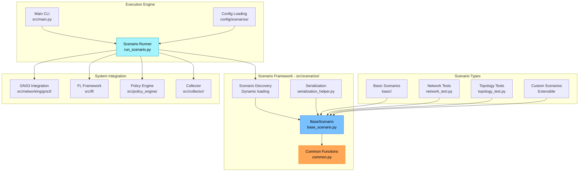

# Scenarios and Experiments

FLOPY-NET scenarios are comprehensive experiment definitions that combine federated learning configurations, network topologies, and dynamic conditions to create realistic and reproducible research environments. Scenarios enable systematic evaluation of FL algorithms under various network conditions and operational constraints.

## Architecture



## Implementation Structure

### Source Code Organization (`src/scenarios/`)
- **Base Classes**: `base_scenario.py` - Abstract scenario framework
- **Common Utilities**: `common.py`, `common_functions.py` - Shared scenario functionality
- **Scenario Discovery**: Dynamic loading and registration of scenario classes
- **Serialization**: `serialization_helper.py` - Scenario state persistence
- **Execution**: `run_scenario.py` - Scenario execution engine
- **Test Scenarios**: `network_test.py`, `topology_test.py` - Built-in test cases

### Scenario Discovery System

The scenarios system uses dynamic discovery to find and load scenario implementations:

```python
# From src/scenarios/common.py
def discover_scenarios() -> Dict[str, str]:
    """
    Dynamically discover available scenario modules from subdirectories.
    
    Each scenario should be in its own subdirectory with a scenario.py file
    that contains a class ending with 'Scenario'.
    
    Returns:
        Dictionary mapping scenario IDs to their module:class paths
    """
    scenarios = {}
    
    # Check for scenario modules in the scenarios directory
    scenarios_dir = Path(__file__).parent
    
    # Focus only on subdirectories for full implementations
    subdirs = [d for d in scenarios_dir.iterdir() 
              if d.is_dir() and not d.name.startswith("__")]
    
    for subdir in subdirs:
        scenario_name = subdir.name.lower()
        scenario_file = subdir / "scenario.py"
        
        if scenario_file.exists():
            try:
                module_path = f"src.scenarios.{subdir.name}.scenario"
                module = importlib.import_module(module_path)
                
                # Find scenario class in the module (should end with 'Scenario')
                for attr_name in dir(module):
                    if attr_name.endswith("Scenario"):
                        scenarios[scenario_name] = f"{module_path}:{attr_name}"
                        break
            except Exception as e:
                logger.error(f"Failed to load scenario {scenario_name}: {e}")
    
    return scenarios
```
    model_parameters: Dict[str, Any]
    
    # Training configuration
    total_rounds: int
    clients_per_round: int
    local_epochs: int
    batch_size: int
    learning_rate: float
    
    # Data configuration
    dataset: str
    data_distribution: str  # "iid", "non_iid", "custom"
    client_data_sizes: List[int]
    
    # Aggregation strategy
    aggregation_method: str  # "fedavg", "fedprox", "scaffold"
    aggregation_parameters: Dict[str, Any]

@dataclass
class NetworkConfig:
    """Network topology and configuration."""
    
    # Topology definition
    topology_type: str  # "star", "mesh", "tree", "custom"
    node_count: int
    switch_count: int
    link_bandwidth_mbps: int
    base_latency_ms: int
    
    # GNS3 integration
    gns3_template: Optional[str]
    custom_topology_file: Optional[str]
    
    # SDN configuration
    controller_type: str  # "ryu", "onos"
    qos_enabled: bool
    traffic_prioritization: bool
```

### 2. Event System

Scenarios can define dynamic events that occur during execution:

```python
@dataclass
class ScenarioEvent:
    """Dynamic event during scenario execution."""
    
    event_type: str
    trigger_time: float  # Seconds from scenario start
    target: str  # What the event affects
    parameters: Dict[str, Any]
    duration: Optional[float] = None
    description: str = ""

class EventType(Enum):
    """Supported event types."""
    
    # Network events
    NETWORK_LATENCY_INCREASE = "network_latency_increase"
    NETWORK_PACKET_LOSS = "network_packet_loss"
    NETWORK_BANDWIDTH_LIMIT = "network_bandwidth_limit"
    NETWORK_PARTITION = "network_partition"
    LINK_FAILURE = "link_failure"
    
    # FL events
    CLIENT_JOIN = "client_join"
    CLIENT_LEAVE = "client_leave"
    CLIENT_FAILURE = "client_failure"
    MODEL_POISONING = "model_poisoning"
    DATA_DRIFT = "data_drift"
    
    # System events
    POLICY_CHANGE = "policy_change"
    RESOURCE_CONSTRAINT = "resource_constraint"
    SECURITY_EVENT = "security_event"

# Example event definitions
network_congestion_event = ScenarioEvent(
    event_type="network_latency_increase",
    trigger_time=300,  # 5 minutes into scenario
    target="all_links",
    parameters={
        "latency_increase_ms": 50,
        "affected_percentage": 0.7
    },
    duration=120,  # 2 minutes
    description="Simulate network congestion affecting 70% of links"
)

client_failure_event = ScenarioEvent(
    event_type="client_failure",
    trigger_time=600,  # 10 minutes into scenario
    target="client_3",
    parameters={
        "failure_type": "hard_failure",
        "recovery_time": 180
    },
    description="Client 3 experiences hardware failure and recovers after 3 minutes"
)
```

## Built-in Scenarios

### 1. Basic FL Training

Standard federated learning training scenario:

```python
basic_fl_scenario = ScenarioConfig(
    name="basic_fl_training",
    description="Basic federated learning training with stable network conditions",
    version="1.0.0",
    author="FLOPY-NET Team",
    duration_minutes=30,
    
    fl_config=FLConfig(
        model_type="pytorch",
        model_architecture="cnn",
        model_parameters={
            "num_classes": 10,
            "input_channels": 3,
            "hidden_layers": [64, 128, 256]
        },
        total_rounds=20,
        clients_per_round=8,
        local_epochs=5,
        batch_size=32,
        learning_rate=0.01,
        dataset="cifar10",
        data_distribution="iid",
        client_data_sizes=[1000] * 10,
        aggregation_method="fedavg",
        aggregation_parameters={}
    ),
    
    network_config=NetworkConfig(
        topology_type="star",
        node_count=10,  # 1 server + 9 clients
        switch_count=3,
        link_bandwidth_mbps=100,
        base_latency_ms=10,
        controller_type="onos",
        qos_enabled=True,
        traffic_prioritization=True
    ),
    
    events=[],  # No dynamic events in basic scenario
    
    analysis_config=AnalysisConfig(
        metrics_to_collect=["accuracy", "loss", "convergence_time", "communication_cost"],
        generate_plots=True,
        export_data=True
    ),
    
    requirements=ResourceRequirements(
        min_memory_gb=8,
        min_cpu_cores=4,
        estimated_duration_minutes=30
    )
)
```

### 2. Network Instability Scenario

Scenario testing FL robustness under network instability:

```python
network_instability_scenario = ScenarioConfig(
    name="network_instability",
    description="FL training under varying network conditions",
    version="1.0.0",
    author="FLOPY-NET Team",
    duration_minutes=45,
    
    fl_config=FLConfig(
        model_type="pytorch",
        model_architecture="lstm",
        model_parameters={
            "input_size": 100,
            "hidden_size": 128,
            "num_layers": 2,
            "num_classes": 5
        },
        total_rounds=30,
        clients_per_round=6,
        local_epochs=3,
        batch_size=64,
        learning_rate=0.001,
        dataset="synthetic_time_series",
        data_distribution="non_iid",
        client_data_sizes=[800, 1200, 900, 1100, 950, 1050],
        aggregation_method="fedprox",
        aggregation_parameters={"mu": 0.1}
    ),
    
    network_config=NetworkConfig(
        topology_type="mesh",
        node_count=8,
        switch_count=4,
        link_bandwidth_mbps=50,
        base_latency_ms=20,
        controller_type="ryu",
        qos_enabled=True,
        traffic_prioritization=True
    ),
    
    events=[
        # Gradual latency increase
        ScenarioEvent(
            event_type="network_latency_increase",
            trigger_time=300,
            target="all_links",
            parameters={"latency_increase_ms": 30, "affected_percentage": 0.5},
            duration=180,
            description="Gradual latency increase on 50% of links"
        ),
        
        # Packet loss simulation
        ScenarioEvent(
            event_type="network_packet_loss",
            trigger_time=600,
            target="client_links",
            parameters={"packet_loss_rate": 0.02, "burst_duration": 5},
            duration=120,
            description="2% packet loss on client connections"
        ),
        
        # Bandwidth limitation
        ScenarioEvent(
            event_type="network_bandwidth_limit",
            trigger_time=900,
            target="server_links",
            parameters={"bandwidth_limit_mbps": 25},
            duration=240,
            description="Bandwidth limitation on server connections"
        ),
        
        # Network partition and recovery
        ScenarioEvent(
            event_type="network_partition",
            trigger_time=1200,
            target="client_group",
            parameters={
                "partitioned_clients": ["client_1", "client_2"],
                "partition_duration": 90
            },
            description="Network partition affecting 2 clients"
        )
    ],
    
    analysis_config=AnalysisConfig(
        metrics_to_collect=[
            "accuracy", "loss", "convergence_time", "communication_cost",
            "network_latency", "packet_loss", "bandwidth_utilization",
            "client_participation_rate", "model_staleness"
        ],
        generate_plots=True,
        export_data=True,
        custom_analysis=["network_impact_analysis", "robustness_metrics"]
    ),
    
    requirements=ResourceRequirements(
        min_memory_gb=12,
        min_cpu_cores=6,
        estimated_duration_minutes=45
    )
)
```

### 3. Security and Adversarial Scenario

Scenario evaluating FL security mechanisms:

```python
security_scenario = ScenarioConfig(
    name="adversarial_attacks",
    description="FL training with Byzantine clients and security measures",
    version="1.0.0",
    author="FLOPY-NET Security Team",
    duration_minutes=60,
    
    fl_config=FLConfig(
        model_type="pytorch",
        model_architecture="resnet18",
        model_parameters={
            "num_classes": 100,
            "pretrained": False
        },
        total_rounds=40,
        clients_per_round=10,
        local_epochs=4,
        batch_size=32,
        learning_rate=0.01,
        dataset="cifar100",
        data_distribution="non_iid",
        client_data_sizes=[500, 600, 700, 800, 900, 1000, 550, 650, 750, 850, 950, 1050],
        aggregation_method="krum",  # Byzantine-robust aggregation
        aggregation_parameters={"f": 2}  # Up to 2 Byzantine clients
    ),
    
    network_config=NetworkConfig(
        topology_type="tree",
        node_count=12,
        switch_count=5,
        link_bandwidth_mbps=100,
        base_latency_ms=15,
        controller_type="onos",
        qos_enabled=True,
        traffic_prioritization=True
    ),
    
    events=[
        # Byzantine client activation
        ScenarioEvent(
            event_type="model_poisoning",
            trigger_time=480,  # 8 minutes
            target="client_8",
            parameters={
                "attack_type": "label_flipping",
                "attack_intensity": 0.3
            },
            duration=600,  # Continues for 10 minutes
            description="Client 8 becomes Byzantine with label flipping attack"
        ),
        
        # Second Byzantine client
        ScenarioEvent(
            event_type="model_poisoning",
            trigger_time=720,  # 12 minutes
            target="client_11",
            parameters={
                "attack_type": "gaussian_noise",
                "noise_std": 0.1
            },
            duration=480,  # 8 minutes
            description="Client 11 adds Gaussian noise to model updates"
        ),
        
        # Security policy enforcement
        ScenarioEvent(
            event_type="policy_change",
            trigger_time=900,  # 15 minutes
            target="policy_engine",
            parameters={
                "policy_name": "strict_anomaly_detection",
                "detection_threshold": 0.05,
                "quarantine_duration": 300
            },
            description="Activate strict anomaly detection policy"
        ),
        
        # DDoS simulation on FL server
        ScenarioEvent(
            event_type="security_event",
            trigger_time=1800,  # 30 minutes
            target="fl_server",
            parameters={
                "attack_type": "ddos",
                "request_rate_multiplier": 10,
                "attack_duration": 120
            },
            description="DDoS attack on FL server"
        )
    ],
    
    analysis_config=AnalysisConfig(
        metrics_to_collect=[
            "accuracy", "loss", "convergence_time", "communication_cost",
            "attack_detection_rate", "false_positive_rate", "model_robustness",
            "client_trust_scores", "security_violations", "recovery_time"
        ],
        generate_plots=True,
        export_data=True,
        custom_analysis=[
            "security_analysis", "attack_impact_assessment", 
            "defense_effectiveness", "trust_evolution"
        ]
    ),
    
    requirements=ResourceRequirements(
        min_memory_gb=16,
        min_cpu_cores=8,
        estimated_duration_minutes=60
    )
)
```

## Scenario Execution Engine

### 1. Orchestrator Implementation

```python
import asyncio
from typing import Dict, List, Optional, Callable
from dataclasses import dataclass
from enum import Enum
import json
import time
import logging

class ScenarioState(Enum):
    """Scenario execution states."""
    PENDING = "pending"
    INITIALIZING = "initializing"
    RUNNING = "running"
    PAUSED = "paused"
    COMPLETED = "completed"
    FAILED = "failed"
    CANCELLED = "cancelled"

@dataclass
class ScenarioExecution:
    """Track scenario execution state."""
    scenario_id: str
    config: ScenarioConfig
    state: ScenarioState
    start_time: Optional[float] = None
    end_time: Optional[float] = None
    current_round: int = 0
    events_triggered: List[str] = None
    metrics: Dict[str, List[float]] = None
    error_message: Optional[str] = None
    
    def __post_init__(self):
        if self.events_triggered is None:
            self.events_triggered = []
        if self.metrics is None:
            self.metrics = {}

class ScenarioOrchestrator:
    """Orchestrate scenario execution across system components."""
    
    def __init__(self, 
                 fl_controller: 'FLController',
                 network_controller: 'NetworkController',
                 policy_engine: 'PolicyEngineClient',
                 collector: 'CollectorClient',
                 gns3_client: 'GNS3Client'):
        
        self.fl_controller = fl_controller
        self.network_controller = network_controller
        self.policy_engine = policy_engine
        self.collector = collector
        self.gns3_client = gns3_client
        
        # Execution state
        self.active_scenarios: Dict[str, ScenarioExecution] = {}
        self.event_scheduler = EventScheduler()
        
        # Callbacks for external integration
        self.status_callbacks: List[Callable] = []
        
        logger.info("Scenario orchestrator initialized")
    
    async def execute_scenario(self, scenario_config: ScenarioConfig) -> str:
        """Execute a complete scenario."""
        
        scenario_id = f"scenario_{int(time.time())}"
        execution = ScenarioExecution(
            scenario_id=scenario_id,
            config=scenario_config,
            state=ScenarioState.PENDING
        )
        
        self.active_scenarios[scenario_id] = execution
        
        try:
            # Initialize scenario
            execution.state = ScenarioState.INITIALIZING
            await self._notify_status_change(execution)
            
            await self._initialize_scenario(execution)
            
            # Start execution
            execution.state = ScenarioState.RUNNING
            execution.start_time = time.time()
            await self._notify_status_change(execution)
            
            # Schedule events
            await self._schedule_events(execution)
            
            # Start FL training
            await self._start_fl_training(execution)
            
            # Monitor and wait for completion
            await self._monitor_execution(execution)
            
            # Finalize
            execution.state = ScenarioState.COMPLETED
            execution.end_time = time.time()
            await self._finalize_scenario(execution)
            
            logger.info(f"Scenario {scenario_id} completed successfully")
            
        except Exception as e:
            execution.state = ScenarioState.FAILED
            execution.error_message = str(e)
            execution.end_time = time.time()
            logger.error(f"Scenario {scenario_id} failed: {e}")
            
        finally:
            await self._notify_status_change(execution)
        
        return scenario_id
    
    async def _initialize_scenario(self, execution: ScenarioExecution):
        """Initialize all components for scenario execution."""
        config = execution.config
        
        # Setup network topology
        if config.network_config.gns3_template:
            await self._setup_gns3_topology(execution)
        
        # Configure SDN controller
        await self._configure_sdn_controller(execution)
        
        # Setup FL clients and server
        await self._setup_fl_components(execution)
        
        # Configure policies
        await self._configure_policies(execution)
        
        # Initialize metrics collection
        await self._initialize_metrics_collection(execution)
        
        logger.info(f"Scenario {execution.scenario_id} initialized")
    
    async def _setup_gns3_topology(self, execution: ScenarioExecution):
        """Setup GNS3 network topology."""
        config = execution.config.network_config
        
        # Create GNS3 project
        topology_config = {
            "client_count": config.node_count - 1,  # Subtract FL server
            "switch_count": config.switch_count,
            "bandwidth_mbps": config.link_bandwidth_mbps,
            "base_latency_ms": config.base_latency_ms
        }
        
        project_id = await self.gns3_client.create_fl_topology(topology_config)
        execution.gns3_project_id = project_id
        
        # Wait for topology to be ready
        await asyncio.sleep(30)  # Allow time for nodes to start
        
        logger.info(f"GNS3 topology created for scenario {execution.scenario_id}")
    
    async def _setup_fl_components(self, execution: ScenarioExecution):
        """Setup FL server and clients."""
        fl_config = execution.config.fl_config
        
        # Configure FL server
        server_config = {
            "model_type": fl_config.model_type,
            "model_architecture": fl_config.model_architecture,
            "model_parameters": fl_config.model_parameters,
            "total_rounds": fl_config.total_rounds,
            "clients_per_round": fl_config.clients_per_round,
            "aggregation_method": fl_config.aggregation_method,
            "aggregation_parameters": fl_config.aggregation_parameters
        }
        
        await self.fl_controller.configure_server(server_config)
        
        # Configure FL clients
        for i in range(fl_config.clients_per_round):
            client_config = {
                "client_id": f"client_{i+1}",
                "local_epochs": fl_config.local_epochs,
                "batch_size": fl_config.batch_size,
                "learning_rate": fl_config.learning_rate,
                "dataset": fl_config.dataset,
                "data_size": fl_config.client_data_sizes[i] if i < len(fl_config.client_data_sizes) else 1000
            }
            
            await self.fl_controller.configure_client(f"client_{i+1}", client_config)
        
        logger.info(f"FL components configured for scenario {execution.scenario_id}")
    
    async def _schedule_events(self, execution: ScenarioExecution):
        """Schedule all scenario events."""
        for event in execution.config.events:
            await self.event_scheduler.schedule_event(
                event=event,
                scenario_id=execution.scenario_id,
                callback=self._handle_event
            )
        
        logger.info(f"Scheduled {len(execution.config.events)} events for scenario {execution.scenario_id}")
    
    async def _handle_event(self, event: ScenarioEvent, scenario_id: str):
        """Handle a triggered scenario event."""
        execution = self.active_scenarios.get(scenario_id)
        if not execution:
            return
        
        logger.info(f"Triggering event: {event.event_type} for scenario {scenario_id}")
        
        try:
            if event.event_type == EventType.NETWORK_LATENCY_INCREASE.value:
                await self._handle_network_latency_event(event, execution)
            
            elif event.event_type == EventType.NETWORK_PACKET_LOSS.value:
                await self._handle_packet_loss_event(event, execution)
            
            elif event.event_type == EventType.CLIENT_FAILURE.value:
                await self._handle_client_failure_event(event, execution)
            
            elif event.event_type == EventType.MODEL_POISONING.value:
                await self._handle_model_poisoning_event(event, execution)
            
            elif event.event_type == EventType.POLICY_CHANGE.value:
                await self._handle_policy_change_event(event, execution)
            
            # Record event execution
            execution.events_triggered.append(f"{event.event_type}@{time.time()}")
            
            # Schedule event end if duration is specified
            if event.duration:
                await self.event_scheduler.schedule_event_end(
                    event=event,
                    scenario_id=scenario_id,
                    delay=event.duration,
                    callback=self._handle_event_end
                )
            
        except Exception as e:
            logger.error(f"Error handling event {event.event_type}: {e}")
    
    async def _handle_network_latency_event(self, event: ScenarioEvent, execution: ScenarioExecution):
        """Handle network latency increase event."""
        parameters = event.parameters
        
        if hasattr(execution, 'gns3_project_id'):
            # Apply latency to GNS3 topology
            conditions = {
                "links": {
                    "all": {
                        "latency_ms": parameters.get("latency_increase_ms", 50)
                    }
                }
            }
            
            await self.gns3_client.apply_network_conditions(
                execution.gns3_project_id, 
                conditions
            )
        
        # Also notify SDN controller for flow adjustments
        await self.network_controller.handle_latency_increase(
            increase_ms=parameters.get("latency_increase_ms", 50),
            affected_percentage=parameters.get("affected_percentage", 1.0)
        )
    
    async def _monitor_execution(self, execution: ScenarioExecution):
        """Monitor scenario execution and collect metrics."""
        config = execution.config
        start_time = execution.start_time
        duration_seconds = config.duration_minutes * 60
        
        while (time.time() - start_time) < duration_seconds:
            if execution.state != ScenarioState.RUNNING:
                break
            
            # Collect current metrics
            metrics = await self._collect_current_metrics(execution)
            
            # Update execution metrics
            for metric_name, value in metrics.items():
                if metric_name not in execution.metrics:
                    execution.metrics[metric_name] = []
                execution.metrics[metric_name].append(value)
            
            # Check FL training progress
            fl_status = await self.fl_controller.get_training_status()
            execution.current_round = fl_status.get("current_round", 0)
            
            # Check if FL training completed early
            if fl_status.get("status") == "completed":
                logger.info(f"FL training completed early for scenario {execution.scenario_id}")
                break
            
            await asyncio.sleep(10)  # Monitor every 10 seconds
    
    async def _collect_current_metrics(self, execution: ScenarioExecution) -> Dict[str, float]:
        """Collect current metrics from all components."""
        metrics = {}
        
        # FL metrics
        fl_metrics = await self.fl_controller.get_current_metrics()
        metrics.update({
            "fl_accuracy": fl_metrics.get("accuracy", 0),
            "fl_loss": fl_metrics.get("loss", 0),
            "fl_round": fl_metrics.get("round", 0),
            "fl_active_clients": fl_metrics.get("active_clients", 0)
        })
        
        # Network metrics
        network_metrics = await self.network_controller.get_network_stats()
        metrics.update({
            "network_latency_ms": network_metrics.get("avg_latency_ms", 0),
            "network_bandwidth_utilization": network_metrics.get("bandwidth_utilization", 0),
            "network_packet_loss": network_metrics.get("packet_loss_rate", 0)
        })
        
        # Policy metrics
        policy_metrics = await self.policy_engine.get_current_metrics()
        metrics.update({
            "policy_violations": policy_metrics.get("violations_per_minute", 0),
            "security_events": policy_metrics.get("security_events_per_minute", 0)
        })
        
        return metrics
```

### 2. Event Scheduler

```python
import asyncio
import heapq
from typing import Callable, List, Tuple
import time

class EventScheduler:
    """Schedule and execute scenario events at specific times."""
    
    def __init__(self):
        self.event_queue: List[Tuple[float, str, ScenarioEvent, str, Callable]] = []
        self.running = False
        self.scheduler_task = None
    
    async def schedule_event(self, 
                           event: ScenarioEvent, 
                           scenario_id: str, 
                           callback: Callable):
        """Schedule an event for future execution."""
        trigger_time = time.time() + event.trigger_time
        event_id = f"{scenario_id}_{event.event_type}_{event.trigger_time}"
        
        heapq.heappush(
            self.event_queue,
            (trigger_time, event_id, event, scenario_id, callback)
        )
        
        # Start scheduler if not running
        if not self.running:
            await self.start_scheduler()
    
    async def schedule_event_end(self,
                               event: ScenarioEvent,
                               scenario_id: str,
                               delay: float,
                               callback: Callable):
        """Schedule event end/cleanup."""
        end_time = time.time() + delay
        end_event_id = f"{scenario_id}_{event.event_type}_end_{delay}"
        
        # Create end event
        end_event = ScenarioEvent(
            event_type=f"{event.event_type}_end",
            trigger_time=0,  # Already calculated
            target=event.target,
            parameters=event.parameters,
            description=f"End of {event.description}"
        )
        
        heapq.heappush(
            self.event_queue,
            (end_time, end_event_id, end_event, scenario_id, callback)
        )
    
    async def start_scheduler(self):
        """Start the event scheduler."""
        if self.running:
            return
        
        self.running = True
        self.scheduler_task = asyncio.create_task(self._scheduler_loop())
        logger.info("Event scheduler started")
    
    async def stop_scheduler(self):
        """Stop the event scheduler."""
        self.running = False
        if self.scheduler_task:
            self.scheduler_task.cancel()
            try:
                await self.scheduler_task
            except asyncio.CancelledError:
                pass
        logger.info("Event scheduler stopped")
    
    async def _scheduler_loop(self):
        """Main scheduler loop."""
        while self.running:
            current_time = time.time()
            
            # Process all events that should trigger now
            while self.event_queue and self.event_queue[0][0] <= current_time:
                trigger_time, event_id, event, scenario_id, callback = heapq.heappop(self.event_queue)
                
                # Execute event asynchronously
                try:
                    await callback(event, scenario_id)
                    logger.info(f"Executed event: {event_id}")
                except Exception as e:
                    logger.error(f"Error executing event {event_id}: {e}")
            
            # Sleep for a short time before checking again
            await asyncio.sleep(1)
```

## Scenario Analysis and Results

### 1. Automated Analysis

```python
class ScenarioAnalyzer:
    """Analyze scenario execution results."""
    
    def __init__(self):
        self.analysis_methods = {
            "convergence_analysis": self._analyze_convergence,
            "network_impact_analysis": self._analyze_network_impact,
            "security_analysis": self._analyze_security,
            "robustness_metrics": self._calculate_robustness_metrics,
            "efficiency_analysis": self._analyze_efficiency
        }
    
    async def analyze_scenario(self, execution: ScenarioExecution) -> Dict[str, Any]:
        """Perform comprehensive scenario analysis."""
        
        if execution.state != ScenarioState.COMPLETED:
            return {"error": "Scenario not completed", "state": execution.state.value}
        
        analysis_results = {
            "scenario_id": execution.scenario_id,
            "scenario_name": execution.config.name,
            "execution_summary": self._generate_execution_summary(execution),
            "metrics_analysis": {},
            "custom_analysis": {},
            "recommendations": [],
            "export_files": []
        }
        
        # Basic metrics analysis
        analysis_results["metrics_analysis"] = await self._analyze_basic_metrics(execution)
        
        # Custom analysis based on configuration
        for analysis_type in execution.config.analysis_config.custom_analysis:
            if analysis_type in self.analysis_methods:
                try:
                    result = await self.analysis_methods[analysis_type](execution)
                    analysis_results["custom_analysis"][analysis_type] = result
                except Exception as e:
                    logger.error(f"Error in {analysis_type}: {e}")
                    analysis_results["custom_analysis"][analysis_type] = {"error": str(e)}
        
        # Generate recommendations
        analysis_results["recommendations"] = await self._generate_recommendations(execution, analysis_results)
        
        # Export data if requested
        if execution.config.analysis_config.export_data:
            analysis_results["export_files"] = await self._export_scenario_data(execution)
        
        return analysis_results
    
    def _generate_execution_summary(self, execution: ScenarioExecution) -> Dict[str, Any]:
        """Generate high-level execution summary."""
        duration = execution.end_time - execution.start_time if execution.end_time else 0
        
        return {
            "total_duration_seconds": duration,
            "total_duration_minutes": duration / 60,
            "fl_rounds_completed": execution.current_round,
            "events_triggered": len(execution.events_triggered),
            "final_accuracy": execution.metrics.get("fl_accuracy", [0])[-1] if execution.metrics.get("fl_accuracy") else 0,
            "final_loss": execution.metrics.get("fl_loss", [float('inf')])[-1] if execution.metrics.get("fl_loss") else float('inf'),
            "avg_network_latency": np.mean(execution.metrics.get("network_latency_ms", [0])),
            "max_network_latency": max(execution.metrics.get("network_latency_ms", [0]), default=0),
            "total_policy_violations": sum(execution.metrics.get("policy_violations", []))
        }
    
    async def _analyze_convergence(self, execution: ScenarioExecution) -> Dict[str, Any]:
        """Analyze FL convergence characteristics."""
        accuracy_history = execution.metrics.get("fl_accuracy", [])
        loss_history = execution.metrics.get("fl_loss", [])
        
        if not accuracy_history or not loss_history:
            return {"error": "Insufficient convergence data"}
        
        # Calculate convergence metrics
        convergence_round = self._find_convergence_round(accuracy_history, threshold=0.01)
        convergence_time = convergence_round * 10 if convergence_round else None  # Assume 10s per round
        
        final_accuracy = accuracy_history[-1]
        max_accuracy = max(accuracy_history)
        accuracy_stability = np.std(accuracy_history[-5:]) if len(accuracy_history) >= 5 else 0
        
        # Learning curve analysis
        accuracy_trend = np.polyfit(range(len(accuracy_history)), accuracy_history, 1)[0]
        loss_trend = np.polyfit(range(len(loss_history)), loss_history, 1)[0]
        
        return {
            "convergence_round": convergence_round,
            "convergence_time_seconds": convergence_time,
            "final_accuracy": final_accuracy,
            "max_accuracy": max_accuracy,
            "accuracy_stability": accuracy_stability,
            "accuracy_trend": accuracy_trend,
            "loss_trend": loss_trend,
            "convergence_quality": "good" if accuracy_stability < 0.05 else "unstable"
        }
    
    async def _analyze_network_impact(self, execution: ScenarioExecution) -> Dict[str, Any]:
        """Analyze impact of network conditions on FL performance."""
        accuracy_history = execution.metrics.get("fl_accuracy", [])
        latency_history = execution.metrics.get("network_latency_ms", [])
        
        if len(accuracy_history) != len(latency_history):
            return {"error": "Mismatched metric histories"}
        
        # Correlation analysis
        correlation = np.corrcoef(accuracy_history, latency_history)[0, 1] if len(accuracy_history) > 1 else 0
        
        # Event impact analysis
        event_impacts = []
        for event_record in execution.events_triggered:
            event_type, trigger_time_str = event_record.split('@')
            trigger_time = float(trigger_time_str)
            
            # Find metrics before and after event
            event_index = int((trigger_time - execution.start_time) / 10)  # 10s intervals
            
            if 0 <= event_index < len(accuracy_history) - 5:
                before_accuracy = np.mean(accuracy_history[max(0, event_index-5):event_index])
                after_accuracy = np.mean(accuracy_history[event_index:event_index+5])
                
                impact = {
                    "event_type": event_type,
                    "accuracy_before": before_accuracy,
                    "accuracy_after": after_accuracy,
                    "impact_magnitude": abs(after_accuracy - before_accuracy),
                    "impact_direction": "positive" if after_accuracy > before_accuracy else "negative"
                }
                event_impacts.append(impact)
        
        return {
            "latency_accuracy_correlation": correlation,
            "network_sensitivity": "high" if abs(correlation) > 0.5 else "low",
            "event_impacts": event_impacts,
            "most_impactful_event": max(event_impacts, key=lambda x: x["impact_magnitude"]) if event_impacts else None
        }
    
    async def _generate_recommendations(self, execution: ScenarioExecution, analysis: Dict[str, Any]) -> List[Dict[str, str]]:
        """Generate recommendations based on analysis results."""
        recommendations = []
        
        # Convergence recommendations
        convergence = analysis.get("custom_analysis", {}).get("convergence_analysis", {})
        if convergence.get("convergence_quality") == "unstable":
            recommendations.append({
                "category": "FL Training",
                "priority": "high",
                "recommendation": "Consider reducing learning rate or increasing local epochs for better stability",
                "evidence": f"Accuracy stability: {convergence.get('accuracy_stability', 0):.4f}"
            })
        
        # Network recommendations
        network_impact = analysis.get("custom_analysis", {}).get("network_impact_analysis", {})
        if network_impact.get("network_sensitivity") == "high":
            recommendations.append({
                "category": "Network",
                "priority": "medium",
                "recommendation": "Implement adaptive strategies for high-latency conditions",
                "evidence": f"Latency-accuracy correlation: {network_impact.get('latency_accuracy_correlation', 0):.3f}"
            })
        
        # Performance recommendations
        summary = analysis.get("execution_summary", {})
        if summary.get("final_accuracy", 0) < 0.7:
            recommendations.append({
                "category": "Model Performance",
                "priority": "high",
                "recommendation": "Consider increasing model complexity or training duration",
                "evidence": f"Final accuracy: {summary.get('final_accuracy', 0):.3f}"
            })
        
        return recommendations
```

## Usage Examples

### 1. Running a Basic Scenario

```python
# Load and execute a scenario
from flopynet.scenarios import ScenarioRunner

runner = ScenarioRunner()

# Load built-in scenario
scenario_id = await runner.run_scenario("basic_fl_training")

# Monitor progress
status = await runner.get_scenario_status(scenario_id)
print(f"Scenario status: {status['state']}")
print(f"Current round: {status['current_round']}")

# Get results when completed
results = await runner.get_scenario_results(scenario_id)
print(f"Final accuracy: {results['execution_summary']['final_accuracy']}")
```

### 2. Custom Scenario Creation

```python
# Create custom scenario
custom_scenario = ScenarioConfig(
    name="custom_edge_scenario",
    description="Edge computing FL with intermittent connectivity",
    version="1.0.0",
    author="Research Team",
    duration_minutes=40,
    
    fl_config=FLConfig(
        model_type="pytorch",
        model_architecture="mobilenet_v2",
        total_rounds=25,
        clients_per_round=5,
        local_epochs=10,  # More local training for edge devices
        aggregation_method="fedavg"
    ),
    
    events=[
        # Simulate edge device disconnections
        ScenarioEvent(
            event_type="client_failure",
            trigger_time=600,
            target="client_2",
            parameters={"failure_type": "intermittent", "reconnect_probability": 0.3},
            duration=300
        )
    ]
)

# Save and run custom scenario
await runner.save_scenario_config(custom_scenario, "custom_edge_scenario.json")
scenario_id = await runner.run_scenario_from_config(custom_scenario)
```

### 3. Batch Scenario Execution

```python
# Run multiple scenarios for comparative analysis
scenarios = [
    "basic_fl_training",
    "network_instability", 
    "adversarial_attacks"
]

results = {}
for scenario_name in scenarios:
    scenario_id = await runner.run_scenario(scenario_name)
    results[scenario_name] = await runner.get_scenario_results(scenario_id)

# Comparative analysis
comparison = runner.compare_scenarios(results)
print(f"Best performing scenario: {comparison['best_accuracy']['scenario']}")
print(f"Most robust scenario: {comparison['most_robust']['scenario']}")
```

The scenarios system provides a powerful framework for systematic evaluation of federated learning algorithms under realistic and controlled conditions, enabling researchers to understand the complex interactions between distributed learning algorithms, network dynamics, and system policies.
