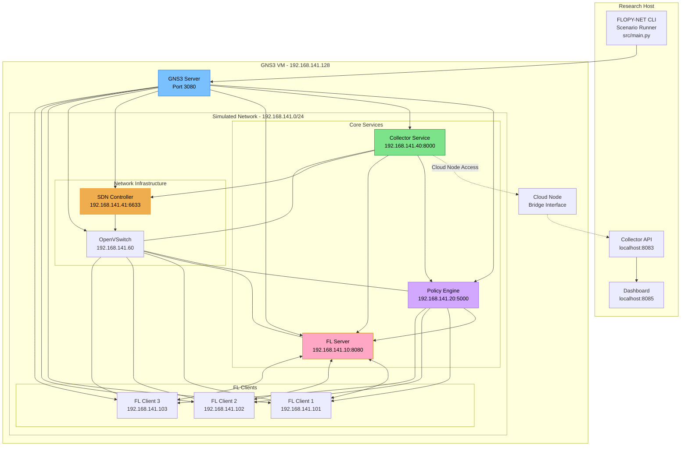
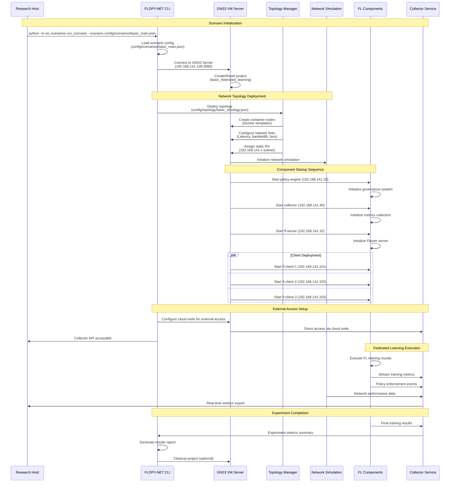

# Welcome to FLOPY-NET

**Federated Learning Observatory Platform - Network Emulation & Testing**

:::warning Development Status
**⚠️ ACTIVE DEVELOPMENT**: FLOPY-NET is currently under development. This documentation may contain incomplete or outdated information. Some features described may not be fully implemented yet. Please refer to the [GitHub repository](https://github.com/abdulmelink/flopy-net) for the latest status and updates.

**Current Status**: 
- Core FL framework: ⚠️ Functional - In development
- GNS3 VM integration: ✅ Functional  
- Policy engine: ⚠️ Functional - In development
- Dashboard: ⚠️ Functional - In development
- Documentation: ⚠️ Functional - Being updated

For questions or issues, please [open an issue](https://github.com/abdulmelink/flopy-net/issues) on GitHub.
:::

FLOPY-NET is a comprehensive research platform for evaluating federated learning algorithms under realistic network conditions. It bridges the gap between theoretical federated learning research and real-world network dynamics by providing an integrated environment that combines custom federated learning implementation, Software-Defined Networking (SDN) with Ryu controllers, network emulation through GNS3 VM, and comprehensive monitoring capabilities.

## What is FLOPY-NET?

FLOPY-NET enables researchers to conduct realistic federated learning experiments that account for complex network interactions. Traditional FL research often assumes perfect network conditions, but real networks exhibit variable latency, packet loss, bandwidth limitations, and complex topologies that significantly impact FL system performance.

Our platform provides:

- **Custom FL Framework** with PyTorch model support for MNIST, CIFAR-10, and custom datasets
- **Policy-Driven Architecture** with centralized governance, security enforcement, and real-time compliance monitoring
- **GNS3 VM Network Simulation** with configurable packet loss, latency, bandwidth constraints, and dynamic topology changes
- **SDN Integration** using Ryu OpenFlow controllers for programmable network behavior and policy enforcement
- **Real-time Observatory** with React-based dashboards, comprehensive metrics collection, and interactive network visualization
- **Container Architecture** with Docker Compose orchestration, static IP assignment (192.168.100.0/24), and service discovery
- **Comprehensive Metrics** stored in SQLite with time-series analysis and research data export capabilities

## Key Features

import FeatureGrid from '@site/src/components/FeatureGrid';

<FeatureGrid />

## System Architecture

FLOPY-NET operates through two distinct deployment models designed to serve different research and development needs. The Docker Compose environment provides rapid prototyping and component testing, while the GNS3 VM environment delivers realistic network emulation for production federated learning research.

### GNS3 Research Environment (Primary Use Case)

The GNS3 VM environment represents FLOPY-NET's primary research platform, where containerized FL components are deployed across a simulated network topology with realistic network conditions including variable latency, packet loss, bandwidth constraints, and complex routing scenarios.



### Scenario-Based Execution Flow

FLOPY-NET operates through scenario-based execution where each experiment is defined by a comprehensive configuration that specifies network topology, component parameters, and experimental conditions. This approach ensures reproducible research and enables systematic study of federated learning under various conditions.



## Quick Start

Get FLOPY-NET running in minutes:

```bash
# Clone the repository
git clone https://github.com/abdulmelink/flopy-net.git
cd flopy-net

# Configure environment (optional)
cp .env.example .env
# Edit .env with your settings

# Start the platform
docker-compose up -d

# Check system status
docker-compose ps

# Run a basic experiment
python -m src.scenarios.run_scenario --scenario config/scenarios/basic_main.json

# Access the dashboard
# http://localhost:8085
```

## Component Interactions & Communication

### Policy Engine (192.168.100.20:5000)
**Core governance system that controls all components:**
- Controls FL Server training parameters and rounds
- Enforces client participation policies  
- Manages SDN controller network policies
- Monitors and logs all system activities
- Provides REST API for configuration and control

### FL Server (192.168.100.10:8080)
**Central training coordinator:**
- Receives training requests from Policy Engine
- Coordinates training rounds with FL Clients
- Performs model aggregation (FedAvg strategy)
- Exposes metrics via port 8081
- Reports training progress to Collector

### FL Clients (192.168.100.101-102:8081)
**Distributed training nodes:**
- Connect to FL Server for training coordination
- Perform local PyTorch model training
- Send model updates back to FL Server
- Report metrics to Collector Service
- Respect Policy Engine constraints

### Collector Service (192.168.100.40:8083)
**Centralized metrics and monitoring:**
- Collects metrics from all components
- Stores data in SQLite database (logs/metrics.db)
- Provides REST API for dashboard queries
- Handles event logging (logs/events.jsonl)
- Exports data for research analysis

### SDN Controller (192.168.100.41:6633)
**Network programmability:**
- Controls OpenVSwitch via OpenFlow protocol
- Implements network policies from Policy Engine
- Manages traffic flows and QoS
- Provides network monitoring data
- Exposes REST API on port 8181

### Dashboard (localhost:8085)
**User interface and visualization:**
- Connects to Dashboard API (port 8001)
- Queries Collector for metrics and status
- Displays real-time FL training progress
- Shows network topology and health
- Provides system configuration interface

## Research Applications

FLOPY-NET enables cutting-edge research in:

### 🔬 Network-Aware Federated Learning
- **Network Impact Studies**: Effect of latency, packet loss, and bandwidth on FL convergence
- **Adaptive Algorithms**: FL algorithms that adjust to network conditions
- **Topology Optimization**: Optimal network configurations for federated learning

### 🛡️ Security & Privacy Research
- **Byzantine Attack Detection**: Identifying and mitigating malicious clients
- **Differential Privacy**: Privacy-preserving FL with configurable privacy budgets
- **Secure Aggregation**: Cryptographic protection of model updates

### 🏭 Edge Computing & IoT
- **Resource-Constrained Scenarios**: FL on heterogeneous edge devices
- **Device Heterogeneity**: Mixed capability client environments
- **Energy Efficiency**: Power-aware FL algorithms and scheduling

### 📊 System Optimization
- **Client Selection**: Optimal participant selection strategies
- **Communication Efficiency**: Minimizing network overhead
- **Scalability Studies**: Large-scale FL deployment analysis

### 📋 Policy & Governance
- **Compliance Monitoring**: Regulatory adherence in distributed ML
- **Trust Management**: Client reputation and behavioral analysis
- **Dynamic Policy Enforcement**: Real-time policy updates and enforcement

## Core Components

### 🎛️ CLI Interface (`src/main.py`)
Unified command-line interface for:
- Starting and stopping system services
- Running experimental scenarios
- Managing configurations and policies
- System health monitoring

### 🛡️ Policy Engine (Port 5000)
The heart of FLOPY-NET's governance system:
- **Policy Management**: JSON-based rule definitions with version control
- **Real-time Enforcement**: Authorization for all system operations
- **Compliance Monitoring**: Continuous adherence checking
- **Trust Scoring**: Client reputation and behavioral analysis

### 📊 Collector Service (Port 8000)
Comprehensive metrics and analytics engine:
- **Multi-Source Collection**: FL, network, and system metrics
- **Time-Series Storage**: Efficient SQLite-based data storage
- **Real-time Analytics**: Performance analysis and trend detection
- **Research Export**: API endpoints for data extraction

### 🌐 FL Framework
Production-ready federated learning implementation:
- **FL Server (Port 8080)**: Training coordination and model aggregation
- **FL Clients (192.168.100.101-255)**: Distributed training nodes
- **Privacy Mechanisms**: Differential privacy and secure aggregation
- **Network Integration**: Adaptive behavior based on network conditions

### 🔧 Network Simulation
Advanced network environment simulation:
- **GNS3 Integration (Port 3080)**: Realistic network topologies
- **SDN Controller (Port 6633/8181)**: Programmable network control
- **OpenVSwitch**: Policy-driven network switching
- **Dynamic Conditions**: Configurable network challenges

### 📱 Dashboard & Monitoring
Comprehensive system observatory:
- **React Frontend (Port 8085)**: Interactive web interface
- **FastAPI Backend (Port 8001)**: Data aggregation and control
- **Real-time Visualization**: Live charts and network topology
- **System Management**: Component health and configuration

## Next Steps

Ready to start experimenting with FLOPY-NET?

1. **[Installation Guide](getting-started/installation)** - Set up your development environment
2. **[Quick Start Tutorial](getting-started/quick-start)** - Run your first experiment
3. **[Basic Experiment](tutorials/basic-experiment)** - Step-by-step FL experiment
4. **[Configuration Guide](user-guide/configuration)** - Customize your setup
5. **[API Reference](api/overview)** - Integrate with your applications

## Getting Help

- 📖 **[Documentation](./getting-started/installation)**: Comprehensive guides and API reference
- 🐛 **[GitHub Issues](https://github.com/abdulmelink/flopy-net/issues)**: Bug reports and feature requests
- 📧 **Contact**: [abdulmeliksaylan@gmail.com](mailto:abdulmeliksaylan@gmail.com)

## Contributing

FLOPY-NET is open source and welcomes contributions! See our [Contributing Guide](/docs/development/contributing) to get started.

## License

FLOPY-NET is released under the [MIT License](https://github.com/abdulmelink/flopy-net/blob/main/LICENSE).

---

*FLOPY-NET is developed by [Abdulmelik Saylan](https://github.com/abdulmelink) as part of ongoing research into federated learning and network systems.*
