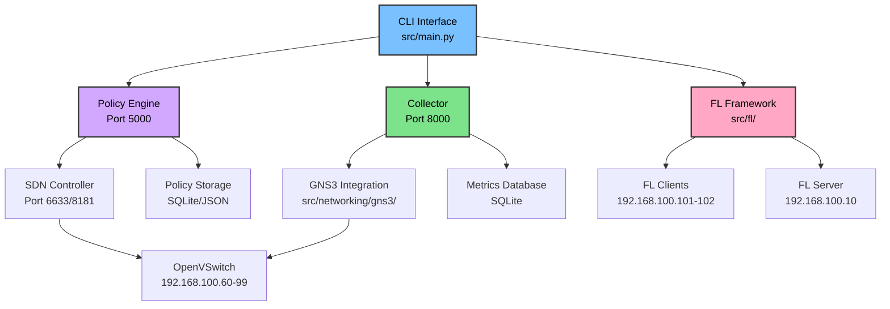

# Welcome to FLOPY-NET

**Observe, Control, and Understand Federated Learning in Realistic Networks**

FLOPY-NET is an open-source observatory platform designed specifically for researchers to study the direct impact of network dynamics—from packet loss to complex topologies—on the performance, security, and behavior of Federated Learning systems.

:::warning Work in Progress

⚠️ **THIS DOCUMENT IS INCOMPLETE. MAY INCLUDE WRONG INFORMATION. DO NOT DEPEND ON.**

This documentation is currently under development and may contain inaccurate or outdated information.

:::

## What is FLOPY-NET?

FLOPY-NET bridges the gap between theoretical federated learning research and real-world network conditions. Traditional FL research often assumes perfect network conditions, but real networks are messy, unreliable, and constantly changing. Our platform lets you:

- **Simulate realistic network conditions** with configurable packet loss, latency, and bandwidth constraints
- **Monitor FL training** in real-time with comprehensive dashboards and metrics
- **Enforce security policies** through our integrated Policy Engine
- **Study network impact** on model convergence, accuracy, and training efficiency
- **Experiment with different topologies** using GNS3 integration and SDN controllers

## Key Features

import FeatureGrid from '@site/src/components/FeatureGrid';

<FeatureGrid />

## Quick Start

Get FLOPY-NET running in minutes:

```powershell
# Clone the repository
git clone https://github.com/abdulmelink/flopy-net.git
cd flopy-net

# Start the platform using PowerShell script
.\docker-run.ps1

# Or manually with docker-compose
docker-compose up -d

# Check system status
docker-compose ps

# Access core services
# Policy Engine: http://localhost:5000
# Collector API: http://localhost:8000
```

## System Architecture



## Research Applications

FLOPY-NET is designed for researchers studying:

- **Network-aware Federated Learning**: How do real network conditions affect FL performance?
- **Security in Distributed ML**: Can malicious nodes be detected and mitigated?
- **Edge Computing Scenarios**: How does FL perform on resource-constrained edge devices?
- **Network Optimization**: What network configurations optimize FL training?
- **Fault Tolerance**: How resilient is FL to network failures and partitions?

## Components Overview

### 🎛️ CLI Interface
Unified command-line interface (`src/main.py`) for starting services, running scenarios, and managing the platform.

### 🛡️ Policy Engine
The heart of FLOPY-NET's security and governance system (Port 5000), enforcing rules and monitoring compliance across all components.

### 📊 Collector
Comprehensive metrics collection system (Port 8000) gathering data from FL training, network performance, and system health.

### 🤖 FL Framework
Docker-based federated learning implementation with server (192.168.100.10) and multiple clients (192.168.100.101-102).

### 🌐 Networking
GNS3 integration (`src/networking/gns3/`) with SDN support (Port 6633/8181) for realistic network simulation and control.

### 🎬 Scenarios
Configurable scenarios (`src/scenarios/`) for testing different network conditions, FL algorithms, and research hypotheses.

## Getting Help

- 📖 **[Documentation](./getting-started/installation)**: Comprehensive guides and API reference
- 🐛 **[GitHub Issues](https://github.com/abdulmelink/flopy-net/issues)**: Bug reports and feature requests
- 💬 **[Discussions](https://github.com/abdulmelink/flopy-net/discussions)**: Community Q&A and general discussion
- 📧 **Contact**: [research@flopy-net.org](mailto:research@flopy-net.org)

## Contributing

FLOPY-NET is open source and welcomes contributions! See our [Contributing Guide](/docs/development/contributing) to get started.

## License

FLOPY-NET is released under the [MIT License](https://github.com/abdulmelink/flopy-net/blob/main/LICENSE).

---

*FLOPY-NET is developed by [Abdulmelik Saylan](https://github.com/abdulmelink) as part of ongoing research into federated learning and network systems.*
