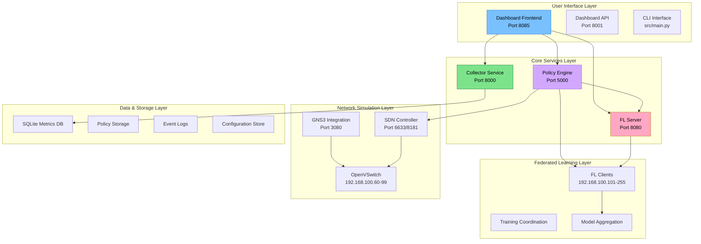

# Welcome to FLOPY-NET

**Federated Learning Observatory Platform - Network Emulation & Testing**

FLOPY-NET is a comprehensive research platform for evaluating federated learning algorithms under realistic network conditions. It bridges the gap between theoretical federated learning research and real-world network dynamics by providing an integrated environment that combines the Flower federated learning framework, Software-Defined Networking (SDN) with Ryu controllers, network emulation through GNS3, and comprehensive monitoring capabilities.

## What is FLOPY-NET?

FLOPY-NET enables researchers to conduct realistic federated learning experiments that account for complex network interactions. Traditional FL research often assumes perfect network conditions, but real networks exhibit variable latency, packet loss, bandwidth limitations, and complex topologies that significantly impact FL system performance.

Our platform provides:

- **Flower-based FL Framework** with PyTorch model support for MNIST, CIFAR-10, and custom datasets
- **Policy-Driven Architecture** with centralized governance, security enforcement, and real-time compliance monitoring
- **GNS3 Network Simulation** with configurable packet loss, latency, bandwidth constraints, and dynamic topology changes
- **SDN Integration** using Ryu OpenFlow controllers for programmable network behavior and policy enforcement
- **Real-time Observatory** with React-based dashboards, comprehensive metrics collection, and interactive network visualization
- **Container Architecture** with Docker Compose orchestration, static IP assignment, and service discovery
- **Comprehensive Metrics** stored in SQLite with time-series analysis and research data export capabilities

## Key Features

import FeatureGrid from '@site/src/components/FeatureGrid';

<FeatureGrid />

## System Architecture

FLOPY-NET follows a layered microservices architecture with five primary layers:



## Quick Start

Get FLOPY-NET running in minutes:

```bash
# Clone the repository
git clone https://github.com/abdulmelink/flopy-net.git
cd flopy-net

# Configure environment (optional)
cp .env.example .env
# Edit .env with your settings

# Start the platform
docker-compose up -d

# Check system status
docker-compose ps

# Run a basic experiment
python src/main.py scenario run basic

# Access the dashboard
# http://localhost:8085
```

## Key Features

### 🎯 Policy-Driven Architecture
Centralized Policy Engine (Port 5000) enforces security, compliance, and governance rules across all components with real-time monitoring and audit trails.

### 🌐 Network-Aware FL Framework
Custom FL implementation with GNS3 integration supporting realistic network conditions, packet loss simulation, and SDN control.

### 📊 Comprehensive Observatory
Real-time dashboard with live monitoring of FL training progress, network topology, system health, and performance metrics.

### 🔧 Research-Focused Design
Modular architecture supporting custom algorithms, experimental scenarios, and extensive configuration options for research studies.

### 🛡️ Security & Privacy
Built-in support for differential privacy, secure aggregation, Byzantine fault tolerance, and policy-based security enforcement.

### � Advanced Analytics
Comprehensive metrics collection, time-series analysis, and research data export capabilities for detailed performance studies.

### 🤖 FL Framework
Docker-based federated learning implementation with server (192.168.100.10) and multiple clients (192.168.100.101-102).

### 🌐 Networking
GNS3 integration (`src/networking/gns3/`) with SDN support (Port 6633/8181) for realistic network simulation and control.

### 🎬 Scenarios
Configurable scenarios (`src/scenarios/`) for testing different network conditions, FL algorithms, and research hypotheses.

## Research Applications

FLOPY-NET enables cutting-edge research in:

### 🔬 Network-Aware Federated Learning
- **Network Impact Studies**: Effect of latency, packet loss, and bandwidth on FL convergence
- **Adaptive Algorithms**: FL algorithms that adjust to network conditions
- **Topology Optimization**: Optimal network configurations for federated learning

### 🛡️ Security & Privacy Research
- **Byzantine Attack Detection**: Identifying and mitigating malicious clients
- **Differential Privacy**: Privacy-preserving FL with configurable privacy budgets
- **Secure Aggregation**: Cryptographic protection of model updates

### 🏭 Edge Computing & IoT
- **Resource-Constrained Scenarios**: FL on heterogeneous edge devices
- **Device Heterogeneity**: Mixed capability client environments
- **Energy Efficiency**: Power-aware FL algorithms and scheduling

### 📊 System Optimization
- **Client Selection**: Optimal participant selection strategies
- **Communication Efficiency**: Minimizing network overhead
- **Scalability Studies**: Large-scale FL deployment analysis

### 📋 Policy & Governance
- **Compliance Monitoring**: Regulatory adherence in distributed ML
- **Trust Management**: Client reputation and behavioral analysis
- **Dynamic Policy Enforcement**: Real-time policy updates and enforcement

## Core Components

### 🎛️ CLI Interface (`src/main.py`)
Unified command-line interface for:
- Starting and stopping system services
- Running experimental scenarios
- Managing configurations and policies
- System health monitoring

### 🛡️ Policy Engine (Port 5000)
The heart of FLOPY-NET's governance system:
- **Policy Management**: JSON-based rule definitions with version control
- **Real-time Enforcement**: Authorization for all system operations
- **Compliance Monitoring**: Continuous adherence checking
- **Trust Scoring**: Client reputation and behavioral analysis

### 📊 Collector Service (Port 8000)
Comprehensive metrics and analytics engine:
- **Multi-Source Collection**: FL, network, and system metrics
- **Time-Series Storage**: Efficient SQLite-based data storage
- **Real-time Analytics**: Performance analysis and trend detection
- **Research Export**: API endpoints for data extraction

### 🌐 FL Framework
Production-ready federated learning implementation:
- **FL Server (Port 8080)**: Training coordination and model aggregation
- **FL Clients (192.168.100.101-255)**: Distributed training nodes
- **Privacy Mechanisms**: Differential privacy and secure aggregation
- **Network Integration**: Adaptive behavior based on network conditions

### 🔧 Network Simulation
Advanced network environment simulation:
- **GNS3 Integration (Port 3080)**: Realistic network topologies
- **SDN Controller (Port 6633/8181)**: Programmable network control
- **OpenVSwitch**: Policy-driven network switching
- **Dynamic Conditions**: Configurable network challenges

### 📱 Dashboard & Monitoring
Comprehensive system observatory:
- **React Frontend (Port 8085)**: Interactive web interface
- **FastAPI Backend (Port 8001)**: Data aggregation and control
- **Real-time Visualization**: Live charts and network topology
- **System Management**: Component health and configuration

## Next Steps

Ready to start experimenting with FLOPY-NET?

1. **[Installation Guide](getting-started/installation)** - Set up your development environment
2. **[Quick Start Tutorial](getting-started/quick-start)** - Run your first experiment
3. **[Basic Experiment](tutorials/basic-experiment)** - Step-by-step FL experiment
4. **[Configuration Guide](user-guide/configuration)** - Customize your setup
5. **[API Reference](api/overview)** - Integrate with your applications

## Getting Help

- 📖 **[Documentation](./getting-started/installation)**: Comprehensive guides and API reference
- 🐛 **[GitHub Issues](https://github.com/abdulmelink/flopy-net/issues)**: Bug reports and feature requests
- 💬 **[Discussions](https://github.com/abdulmelink/flopy-net/discussions)**: Community Q&A and general discussion
- 📧 **Contact**: [research@flopy-net.org](mailto:research@flopy-net.org)

## Contributing

FLOPY-NET is open source and welcomes contributions! See our [Contributing Guide](/docs/development/contributing) to get started.

## License

FLOPY-NET is released under the [MIT License](https://github.com/abdulmelink/flopy-net/blob/main/LICENSE).

---

*FLOPY-NET is developed by [Abdulmelik Saylan](https://github.com/abdulmelink) as part of ongoing research into federated learning and network systems.*
