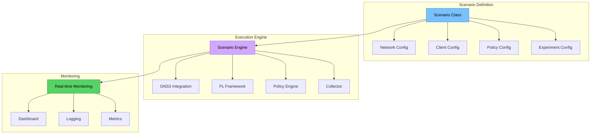

# Custom Scenarios

Learn how to create and configure custom federated learning scenarios to test different network conditions, client behaviors, and system configurations.

## Overview

FLOPY-NET scenarios allow you to simulate realistic federated learning environments with:

- **Custom Network Topologies**: Define complex network structures
- **Realistic Network Conditions**: Simulate latency, bandwidth limitations, packet loss
- **Diverse Client Behaviors**: Configure different client capabilities and data distributions
- **Policy Variations**: Test different governance and security policies
- **Failure Scenarios**: Simulate network failures, client dropouts, and attacks

## Scenario Architecture



## Creating Your First Custom Scenario

### Step 1: Define the Scenario Class

Create a new scenario class that extends the base scenario:

```python
# scenarios/custom_heterogeneous_fl.py
from src.scenarios.base_scenario import BaseScenario
from src.scenarios.network_conditions import NetworkCondition
from src.scenarios.client_profiles import ClientProfile
import json
import time
from typing import Dict, List, Any

class HeterogeneousNetworkFL(BaseScenario):
    """
    Custom scenario simulating federated learning with heterogeneous 
    network conditions and diverse client capabilities.
    """
    
    def __init__(self, scenario_config: Dict[str, Any]):
        super().__init__(scenario_config)
        self.scenario_id = "heterogeneous_network_fl"
        self.name = "Heterogeneous Network FL"
        self.description = "FL with diverse client capabilities and network conditions"
        
        # Scenario-specific parameters
        self.total_clients = scenario_config.get("total_clients", 12)
        self.rounds = scenario_config.get("rounds", 20)
        self.client_types = ["mobile", "edge", "cloud", "iot"]
        
    def setup_network_topology(self) -> Dict[str, Any]:
        """Define the network topology for this scenario."""
        return {
            "topology_type": "hierarchical",
            "regions": [
                {
                    "region_id": "region_1",
                    "name": "Urban Area",
                    "gateway": "gw-urban",
                    "characteristics": {
                        "base_latency_ms": 20,
                        "bandwidth_mbps": 1000,
                        "reliability": 0.99
                    }
                },
                {
                    "region_id": "region_2", 
                    "name": "Suburban Area",
                    "gateway": "gw-suburban",
                    "characteristics": {
                        "base_latency_ms": 45,
                        "bandwidth_mbps": 100,
                        "reliability": 0.95
                    }
                },
                {
                    "region_id": "region_3",
                    "name": "Rural Area", 
                    "gateway": "gw-rural",
                    "characteristics": {
                        "base_latency_ms": 80,
                        "bandwidth_mbps": 25,
                        "reliability": 0.90
                    }
                }
            ],
            "connections": [
                {"from": "fl-server", "to": "gw-urban", "latency_ms": 5, "bandwidth_mbps": 10000},
                {"from": "gw-urban", "to": "gw-suburban", "latency_ms": 15, "bandwidth_mbps": 500},
                {"from": "gw-suburban", "to": "gw-rural", "latency_ms": 25, "bandwidth_mbps": 100}
            ]
        }
    
    def create_client_profiles(self) -> List[ClientProfile]:
        """Create diverse client profiles for the scenario."""
        profiles = []
        
        # High-end cloud clients (2 clients)
        for i in range(2):
            profiles.append(ClientProfile({
                "client_id": f"cloud-client-{i+1}",
                "client_type": "cloud",
                "region": "region_1",
                "capabilities": {
                    "cpu_cores": 16,
                    "memory_gb": 32,
                    "storage_gb": 500,
                    "gpu_available": True
                },
                "network_profile": {
                    "connection_type": "fiber",
                    "bandwidth_mbps": 1000,
                    "latency_variation": 0.1,
                    "reliability": 0.99
                },
                "data_profile": {
                    "dataset_size": 5000,
                    "data_quality": "high",
                    "label_noise": 0.01,
                    "class_distribution": "balanced"
                },
                "participation_profile": {
                    "availability": 0.95,
                    "dropout_probability": 0.05,
                    "response_delay_ms": [10, 50]
                }
            }))
        
        # Edge computing clients (4 clients)
        for i in range(4):
            profiles.append(ClientProfile({
                "client_id": f"edge-client-{i+1}",
                "client_type": "edge",
                "region": "region_2",
                "capabilities": {
                    "cpu_cores": 4,
                    "memory_gb": 8,
                    "storage_gb": 100,
                    "gpu_available": False
                },
                "network_profile": {
                    "connection_type": "broadband",
                    "bandwidth_mbps": 100,
                    "latency_variation": 0.2,
                    "reliability": 0.95
                },
                "data_profile": {
                    "dataset_size": 2000,
                    "data_quality": "medium",
                    "label_noise": 0.05,
                    "class_distribution": "imbalanced"
                },
                "participation_profile": {
                    "availability": 0.80,
                    "dropout_probability": 0.15,
                    "response_delay_ms": [50, 200]
                }
            }))
        
        # Mobile clients (4 clients)
        for i in range(4):
            profiles.append(ClientProfile({
                "client_id": f"mobile-client-{i+1}",
                "client_type": "mobile",
                "region": "region_2",
                "capabilities": {
                    "cpu_cores": 2,
                    "memory_gb": 2,
                    "storage_gb": 32,
                    "gpu_available": False
                },
                "network_profile": {
                    "connection_type": "4g_lte",
                    "bandwidth_mbps": 50,
                    "latency_variation": 0.4,
                    "reliability": 0.85
                },
                "data_profile": {
                    "dataset_size": 800,
                    "data_quality": "medium",
                    "label_noise": 0.08,
                    "class_distribution": "skewed"
                },
                "participation_profile": {
                    "availability": 0.60,
                    "dropout_probability": 0.25,
                    "response_delay_ms": [100, 500]
                }
            }))
        
        # IoT devices (2 clients)
        for i in range(2):
            profiles.append(ClientProfile({
                "client_id": f"iot-client-{i+1}",
                "client_type": "iot",
                "region": "region_3",
                "capabilities": {
                    "cpu_cores": 1,
                    "memory_gb": 0.5,
                    "storage_gb": 8,
                    "gpu_available": False
                },
                "network_profile": {
                    "connection_type": "rural_broadband",
                    "bandwidth_mbps": 10,
                    "latency_variation": 0.6,
                    "reliability": 0.75
                },
                "data_profile": {
                    "dataset_size": 200,
                    "data_quality": "low",
                    "label_noise": 0.15,
                    "class_distribution": "highly_skewed"
                },
                "participation_profile": {
                    "availability": 0.40,
                    "dropout_probability": 0.40,
                    "response_delay_ms": [200, 1000]
                }
            }))
        
        return profiles
    
    def define_network_events(self) -> List[Dict[str, Any]]:
        """Define network events that occur during the scenario."""
        return [
            {
                "event_type": "network_congestion",
                "trigger_round": 5,
                "duration_rounds": 3,
                "affected_regions": ["region_2"],
                "impact": {
                    "bandwidth_reduction": 0.5,
                    "latency_increase": 2.0,
                    "packet_loss_increase": 0.02
                }
            },
            {
                "event_type": "client_failure",
                "trigger_round": 8,
                "duration_rounds": 2,
                "affected_clients": ["mobile-client-3", "iot-client-1"],
                "impact": {
                    "availability": 0.0,
                    "recovery_probability": 0.7
                }
            },
            {
                "event_type": "ddos_attack",
                "trigger_round": 12,
                "duration_rounds": 1,
                "affected_regions": ["region_1"],
                "impact": {
                    "latency_increase": 5.0,
                    "packet_loss_increase": 0.1,
                    "bandwidth_reduction": 0.8
                }
            },
            {
                "event_type": "infrastructure_upgrade",
                "trigger_round": 15,
                "duration_rounds": 5,
                "affected_regions": ["region_3"],
                "impact": {
                    "bandwidth_increase": 2.0,
                    "latency_reduction": 0.7,
                    "reliability_increase": 0.1
                }
            }
        ]
    
    def create_policies(self) -> List[Dict[str, Any]]:
        """Define scenario-specific policies."""
        return [
            {
                "name": "adaptive_participation_policy",
                "description": "Adjust participation requirements based on network conditions",
                "rules": [
                    {
                        "condition": "network_congestion > 0.7",
                        "action": "reduce_min_clients",
                        "parameters": {"min_clients": 6}
                    },
                    {
                        "condition": "average_latency > 200",
                        "action": "extend_round_timeout",
                        "parameters": {"timeout_multiplier": 1.5}
                    }
                ]
            },
            {
                "name": "resource_optimization_policy",
                "description": "Optimize resource usage based on client capabilities",
                "rules": [
                    {
                        "condition": "client_type == 'iot'",
                        "action": "reduce_model_complexity",
                        "parameters": {"compression_ratio": 0.5}
                    },
                    {
                        "condition": "client_type == 'mobile' and battery_level < 0.3",
                        "action": "skip_round",
                        "parameters": {"probability": 0.8}
                    }
                ]
            },
            {
                "name": "security_policy",
                "description": "Enhanced security measures for heterogeneous environments",
                "rules": [
                    {
                        "condition": "client_trust_score < 0.5",
                        "action": "require_additional_validation",
                        "parameters": {"validation_type": "cryptographic_proof"}
                    },
                    {
                        "condition": "anomaly_detected == True",
                        "action": "quarantine_client",
                        "parameters": {"quarantine_duration": 3}
                    }
                ]
            }
        ]
    
    def run_scenario(self) -> Dict[str, Any]:
        """Execute the complete scenario."""
        print(f"Starting scenario: {self.name}")
        
        # Phase 1: Setup
        self.setup_phase()
        
        # Phase 2: Execute FL training with events
        results = self.execute_training_with_events()
        
        # Phase 3: Cleanup and analysis
        self.cleanup_phase()
        
        return results
    
    def setup_phase(self):
        """Setup phase for the scenario."""
        print("Setting up heterogeneous network topology...")
        topology = self.setup_network_topology()
        self.apply_network_topology(topology)
        
        print("Creating client profiles...")
        profiles = self.create_client_profiles()
        self.deploy_clients(profiles)
        
        print("Applying policies...")
        policies = self.create_policies()
        self.apply_policies(policies)
        
        print("Setup complete. Waiting for all clients to connect...")
        self.wait_for_clients(timeout=300)
```

### Step 2: Create the Scenario Configuration

Create a JSON configuration file for your scenario:

```json
{
  "scenario_id": "heterogeneous_network_fl",
  "name": "Heterogeneous Network FL",
  "description": "Federated learning with diverse client capabilities and network conditions",
  "version": "1.0.0",
  "author": "FLOPY-NET Team",
  "created_date": "2025-01-16",
  
  "parameters": {
    "total_clients": 12,
    "rounds": 20,
    "min_clients_per_round": 6,
    "max_round_duration": 600,
    "model_type": "cnn",
    "dataset": "cifar10"
  },
  
  "gns3_integration": {
    "enabled": true,
    "project_name": "HeterogeneousFL",
    "auto_start": true,
    "cleanup_on_finish": false
  },
  
  "monitoring": {
    "metrics_collection_interval": 5,
    "detailed_logging": true,
    "export_results": true,
    "real_time_dashboard": true
  },
  
  "expected_outcomes": {
    "convergence_rounds": 18,
    "target_accuracy": 0.85,
    "client_participation_rate": 0.65,
    "network_efficiency": 0.75
  }
}
```

Save this as `scenarios/configs/heterogeneous_network_fl.json`.

### Step 3: Register the Scenario

Add your scenario to the scenario registry:

```python
# src/scenarios/registry.py
from scenarios.custom_heterogeneous_fl import HeterogeneousNetworkFL

SCENARIO_REGISTRY = {
    # ... existing scenarios ...
    "heterogeneous_network_fl": HeterogeneousNetworkFL,
}

def get_available_scenarios():
    """Get list of all available scenarios."""
    return {
        scenario_id: {
            "class": scenario_class,
            "name": scenario_class.__name__,
            "description": scenario_class.__doc__.strip() if scenario_class.__doc__ else ""
        }
        for scenario_id, scenario_class in SCENARIO_REGISTRY.items()
    }
```

## Advanced Scenario Features

### Dynamic Network Conditions

Implement dynamic network conditions that change during execution:

```python
class DynamicNetworkConditions:
    """Manage dynamic network condition changes during scenario execution."""
    
    def __init__(self, scenario_config):
        self.events = scenario_config.get("network_events", [])
        self.current_round = 0
        
    def update_network_conditions(self, round_number: int):
        """Update network conditions based on current round."""
        self.current_round = round_number
        
        # Check for triggered events
        for event in self.events:
            if self.should_trigger_event(event, round_number):
                self.apply_network_event(event)
    
    def should_trigger_event(self, event: Dict, round_number: int) -> bool:
        """Determine if an event should be triggered."""
        trigger_round = event.get("trigger_round", 0)
        duration = event.get("duration_rounds", 1)
        
        return trigger_round <= round_number < (trigger_round + duration)
    
    def apply_network_event(self, event: Dict):
        """Apply network event effects."""
        event_type = event.get("event_type")
        
        if event_type == "network_congestion":
            self.apply_congestion(event)
        elif event_type == "client_failure":
            self.apply_client_failure(event)
        elif event_type == "ddos_attack":
            self.apply_ddos_attack(event)
        elif event_type == "infrastructure_upgrade":
            self.apply_infrastructure_upgrade(event)
```

### Client Behavior Simulation

Create realistic client behavior patterns:

```python
class ClientBehaviorSimulator:
    """Simulate realistic client behaviors and constraints."""
    
    def __init__(self, client_profile: ClientProfile):
        self.profile = client_profile
        self.current_state = "idle"
        self.battery_level = 1.0  # For mobile clients
        self.resource_usage = 0.0
        
    def should_participate(self, round_number: int) -> bool:
        """Determine if client should participate in current round."""
        base_availability = self.profile.participation_profile["availability"]
        
        # Factor in battery level for mobile clients
        if self.profile.client_type == "mobile":
            battery_factor = max(0, self.battery_level - 0.2) / 0.8
            base_availability *= battery_factor
        
        # Factor in network conditions
        network_factor = self.get_network_quality_factor()
        base_availability *= network_factor
        
        # Factor in current resource usage
        resource_factor = max(0, 1.0 - self.resource_usage)
        base_availability *= resource_factor
        
        return random.random() < base_availability
    
    def simulate_training_delay(self) -> float:
        """Simulate realistic training delays based on client capabilities."""
        base_delay = self.profile.capabilities["cpu_cores"] * 10
        
        # Add network latency
        network_delay = random.uniform(*self.profile.participation_profile["response_delay_ms"])
        
        # Add resource contention delay
        contention_delay = self.resource_usage * 50
        
        return (base_delay + network_delay + contention_delay) / 1000  # Convert to seconds
    
    def update_battery_level(self, training_duration: float):
        """Update battery level for mobile clients."""
        if self.profile.client_type == "mobile":
            battery_drain = training_duration * 0.01  # 1% per 100 seconds of training
            self.battery_level = max(0, self.battery_level - battery_drain)
```

### Custom Metrics and Analysis

Define custom metrics for your scenario:

```python
class ScenarioAnalyzer:
    """Analyze scenario execution and generate insights."""
    
    def __init__(self, scenario_config):
        self.scenario_config = scenario_config
        self.metrics = {}
        
    def analyze_heterogeneity_impact(self, training_results: Dict) -> Dict:
        """Analyze the impact of client heterogeneity on FL performance."""
        analysis = {
            "convergence_analysis": self.analyze_convergence(training_results),
            "fairness_analysis": self.analyze_fairness(training_results),
            "efficiency_analysis": self.analyze_efficiency(training_results),
            "robustness_analysis": self.analyze_robustness(training_results)
        }
        
        return analysis
    
    def analyze_convergence(self, results: Dict) -> Dict:
        """Analyze convergence behavior across different client types."""
        convergence_data = {}
        
        for client_type in ["cloud", "edge", "mobile", "iot"]:
            type_results = [r for r in results["client_results"] 
                          if r["client_type"] == client_type]
            
            if type_results:
                convergence_data[client_type] = {
                    "avg_local_accuracy": np.mean([r["final_accuracy"] for r in type_results]),
                    "convergence_rate": self.calculate_convergence_rate(type_results),
                    "participation_rate": np.mean([r["participation_rate"] for r in type_results])
                }
        
        return convergence_data
    
    def generate_scenario_report(self, results: Dict) -> str:
        """Generate a comprehensive scenario execution report."""
        report = f"""
# Heterogeneous Network FL Scenario Report

## Scenario Overview
- **Scenario ID**: {self.scenario_config["scenario_id"]}
- **Total Rounds**: {results["total_rounds"]}
- **Total Clients**: {results["total_clients"]}
- **Execution Time**: {results["execution_time"]:.2f} seconds

## Performance Metrics
- **Final Global Accuracy**: {results["final_accuracy"]:.4f}
- **Convergence Round**: {results["convergence_round"]}
- **Average Participation Rate**: {results["avg_participation_rate"]:.3f}

## Client Type Analysis
"""
        
        heterogeneity_analysis = self.analyze_heterogeneity_impact(results)
        
        for client_type, metrics in heterogeneity_analysis["convergence_analysis"].items():
            report += f"""
### {client_type.title()} Clients
- **Average Local Accuracy**: {metrics["avg_local_accuracy"]:.4f}
- **Convergence Rate**: {metrics["convergence_rate"]:.4f}
- **Participation Rate**: {metrics["participation_rate"]:.3f}
"""
        
        return report
```

## Running Custom Scenarios

### Using the CLI

```bash
# List available scenarios
python -m src.main scenario --list

# Run your custom scenario
python -m src.main scenario --run heterogeneous_network_fl --config scenarios/configs/heterogeneous_network_fl.json

# Monitor scenario progress
python -m src.main scenario --status heterogeneous_network_fl

# Get scenario results
python -m src.main scenario --results heterogeneous_network_fl
```

### Using the Python API

```python
from src.scenarios.registry import get_scenario_class
import json

# Load scenario configuration
with open('scenarios/configs/heterogeneous_network_fl.json', 'r') as f:
    config = json.load(f)

# Get scenario class and create instance
ScenarioClass = get_scenario_class("heterogeneous_network_fl")
scenario = ScenarioClass(config)

# Run scenario
results = scenario.run_scenario()

# Analyze results
analyzer = ScenarioAnalyzer(config)
analysis = analyzer.analyze_heterogeneity_impact(results)
report = analyzer.generate_scenario_report(results)

print(report)
```

## Best Practices

### 1. Realistic Modeling

- **Use Real-World Data**: Base network conditions on actual measurements
- **Model Constraints**: Include realistic resource limitations
- **Consider Context**: Account for time-of-day, geographic, and usage patterns

### 2. Comprehensive Testing

- **Edge Cases**: Test extreme network conditions and client behaviors
- **Failure Scenarios**: Include various failure modes and recovery mechanisms
- **Scalability**: Test with different numbers of clients and data sizes

### 3. Reproducibility

- **Seed Management**: Use consistent random seeds for reproducible results
- **Version Control**: Track scenario configurations and code changes
- **Documentation**: Document scenario assumptions and expected behaviors

### 4. Performance Optimization

- **Resource Monitoring**: Monitor system resources during execution
- **Parallel Execution**: Utilize parallel processing where possible
- **Efficient Data Handling**: Optimize data loading and processing

## Scenario Templates

FLOPY-NET provides several scenario templates to get you started:

### Urban Edge Computing
```python
class UrbanEdgeFL(BaseScenario):
    """FL scenario for urban edge computing environments."""
    # Focus on high-density, low-latency scenarios
```

### Rural IoT Federation
```python
class RuralIoTFL(BaseScenario):
    """FL scenario for rural IoT device federation."""
    # Focus on bandwidth-constrained, high-latency scenarios
```

### Mobile Federated Learning
```python
class MobileFL(BaseScenario):
    """FL scenario for mobile device federation."""
    # Focus on battery constraints and intermittent connectivity
```

### Cross-Silo Enterprise
```python
class CrossSiloFL(BaseScenario):
    """FL scenario for enterprise cross-silo federation."""
    # Focus on data privacy and regulatory compliance
```

## Next Steps

After mastering custom scenarios:

1. **Explore Advanced Features**: Implement custom aggregation algorithms
2. **Create Scenario Suites**: Build collections of related scenarios
3. **Integrate External Data**: Use real-world datasets and network traces
4. **Contribute Scenarios**: Share your scenarios with the FLOPY-NET community

For more advanced scenario development, see the [Advanced Configuration Tutorial](./advanced-configuration.md) and [Development Setup Guide](../development/setup.md).
