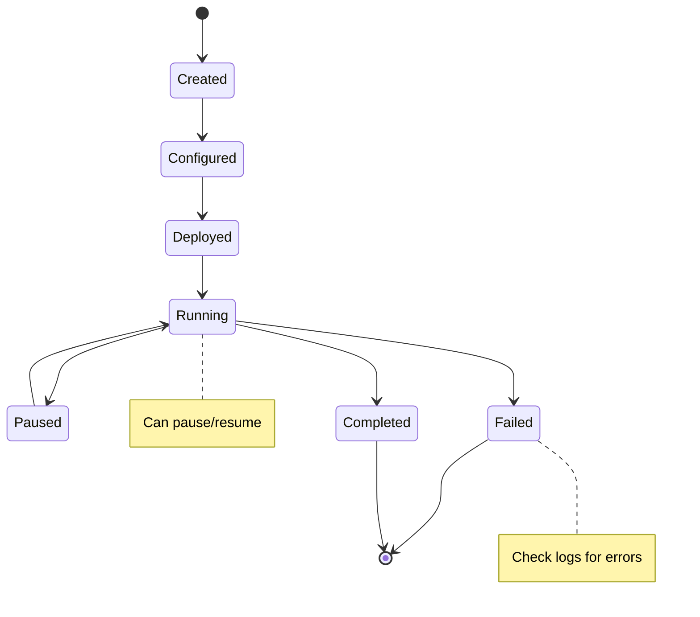

# Running Experiments

Learn how to set up, configure, and execute federated learning experiments in FLOPY-NET. This guide covers everything from basic experiments to advanced research scenarios.

## Experiment Lifecycle


## Creating Experiments

### Using the Dashboard (Recommended)

1. **Navigate to Experiments**
   - Open http://localhost:8085
   - Click "Experiments" in the sidebar
   - Click "New Experiment"

2. **Configure Experiment**
   - **Name**: Descriptive experiment name
   - **Scenario**: Select from predefined scenarios
   - **Dataset**: Choose dataset (MNIST, CIFAR-10, etc.)
   - **Model**: Select ML model architecture
   - **Clients**: Number of FL clients
   - **Rounds**: Training rounds to execute

3. **Advanced Configuration**
   - **Data Distribution**: IID vs Non-IID
   - **Network Conditions**: Latency, packet loss, bandwidth
   - **Security Settings**: Byzantine clients, defenses
   - **Resource Constraints**: CPU, memory limits

### Using the REST API

```bash title="Create Experiment via API"
curl -X POST "http://localhost:8001/api/v1/experiments" \
  -H "Content-Type: application/json" \
  -d '{
    "name": "MNIST_NonIID_Experiment",
    "description": "Testing non-IID data distribution effects",
    "scenario": "non_iid_fl",
    "config": {
      "dataset": "mnist",
      "model": "simple_cnn",
      "num_clients": 10,
      "num_rounds": 20,
      "client_fraction": 0.8,
      "data_distribution": {
        "type": "non_iid",
        "alpha": 0.5
      },
      "network_conditions": {
        "latency": {"mean": 50, "std": 10},
        "packet_loss": 0.02,
        "bandwidth": "10Mbps"
      }
    }
  }'
```

### Using the Command Line

```bash title="CLI Experiment"
# Basic experiment
python -m src.main \
  --scenario basic_fl \
  --dataset mnist \
  --model simple_cnn \
  --clients 5 \
  --rounds 10

# Advanced experiment with custom configuration
python -m src.main \
  --config-file experiments/custom_experiment.json \
  --output-dir results/experiment_1 \
  --seed 42
```

## Experiment Configuration

### Configuration File Structure

```json title="experiments/custom_experiment.json"
{
  "experiment": {
    "name": "Network_Impact_Study",
    "description": "Studying impact of network conditions on FL convergence",
    "seed": 42,
    "output_dir": "results/network_impact"
  },
  "federated_learning": {
    "algorithm": "fedavg",
    "num_clients": 20,
    "clients_per_round": 16,
    "num_rounds": 50,
    "local_epochs": 5,
    "learning_rate": 0.01,
    "batch_size": 32
  },
  "model": {
    "name": "resnet18",
    "num_classes": 10,
    "pretrained": false
  },
  "dataset": {
    "name": "cifar10",
    "data_path": "data/cifar10",
    "split_method": "dirichlet",
    "alpha": 0.3,
    "min_samples_per_client": 100
  },
  "network": {
    "topology": "star",
    "latency": {
      "distribution": "normal",
      "mean": 100,
      "std": 20,
      "unit": "ms"
    },
    "bandwidth": {
      "upload": "5Mbps",
      "download": "25Mbps"
    },
    "packet_loss": 0.01,
    "jitter": {
      "mean": 10,
      "std": 5,
      "unit": "ms"
    }
  },
  "security": {
    "byzantine_clients": 2,
    "attack_type": "label_flipping",
    "defense_mechanism": "krum",
    "trust_threshold": 0.6
  },
  "policies": {
    "model_size_limit": "100MB",
    "round_timeout": "300s",
    "client_dropout_threshold": 0.2
  }
}
```

### Scenario Templates

FLOPY-NET includes predefined scenarios for common research patterns:

#### Basic Federated Learning

```json title="scenarios/basic_fl.json"
{
  "name": "Basic Federated Learning",
  "description": "Standard FL setup with IID data distribution",
  "defaults": {
    "num_clients": 10,
    "clients_per_round": 8,
    "num_rounds": 20,
    "data_distribution": "iid",
    "network_conditions": "ideal"
  }
}
```

#### Non-IID Data Distribution

```json title="scenarios/non_iid.json"
{
  "name": "Non-IID Data Distribution",
  "description": "FL with heterogeneous data distribution",
  "defaults": {
    "data_distribution": {
      "type": "dirichlet",
      "alpha": 0.1
    },
    "num_clients": 20,
    "local_epochs": 10
  }
}
```

#### Byzantine Fault Tolerance

```json title="scenarios/byzantine.json"
{
  "name": "Byzantine Fault Tolerance",
  "description": "FL with malicious clients and defenses",
  "defaults": {
    "byzantine_clients": 3,
    "attack_types": ["label_flipping", "model_poisoning"],
    "defenses": ["krum", "trim_mean", "fedavg_robust"]
  }
}
```

#### Edge Computing Simulation

```json title="scenarios/edge_computing.json"
{
  "name": "Edge Computing",
  "description": "Resource-constrained edge devices",
  "defaults": {
    "client_resources": {
      "cpu_cores": 2,
      "memory_mb": 1024,
      "storage_gb": 16
    },
    "network_conditions": {
      "bandwidth": "1Mbps",
      "latency": 200,
      "intermittent_connectivity": true
    }
  }
}
```

## Monitoring Experiments

### Real-time Monitoring

#### Dashboard Views

1. **Training Progress**
   - Global model accuracy and loss curves
   - Per-round performance metrics
   - Convergence rate analysis

2. **Client Status**
   - Active vs inactive clients
   - Client resource utilization
   - Communication round participation

3. **Network Performance**
   - Latency distribution
   - Bandwidth utilization
   - Packet loss rates
   - Connection stability

4. **Security Metrics**
   - Trust scores
   - Anomaly detection alerts
   - Policy compliance status

#### Key Metrics to Track

| Metric | Description | Good Range |
|--------|-------------|------------|
| **Global Accuracy** | Model performance on test set | Increasing trend |
| **Round Duration** | Time per communication round | Consistent, < 60s |
| **Client Participation** | Active clients per round | > 80% of total |
| **Communication Cost** | Data transferred per round | Minimize while maintaining accuracy |
| **Convergence Rate** | Rounds to reach target accuracy | Depends on problem complexity |

### Programmatic Monitoring

```python title="Monitor Experiment Progress"
import requests
import time
import matplotlib.pyplot as plt

def monitor_experiment(experiment_id: int, duration_minutes: int = 60):
    """Monitor experiment progress and plot real-time metrics."""
    
    start_time = time.time()
    metrics_history = []
    
    while time.time() - start_time < duration_minutes * 60:
        # Get current metrics
        response = requests.get(f"http://localhost:8001/api/v1/experiments/{experiment_id}/metrics")
        if response.status_code == 200:
            metrics = response.json()
            metrics['timestamp'] = time.time()
            metrics_history.append(metrics)
            
            # Plot real-time updates
            plot_metrics(metrics_history)
        
        time.sleep(30)  # Update every 30 seconds
    
    return metrics_history

def plot_metrics(metrics_history):
    """Plot training metrics in real-time."""
    if len(metrics_history) < 2:
        return
    
    rounds = [m['current_round'] for m in metrics_history]
    accuracy = [m['global_accuracy'] for m in metrics_history]
    loss = [m['global_loss'] for m in metrics_history]
    
    fig, (ax1, ax2) = plt.subplots(1, 2, figsize=(12, 5))
    
    ax1.plot(rounds, accuracy, 'b-', linewidth=2)
    ax1.set_title('Global Model Accuracy')
    ax1.set_xlabel('Round')
    ax1.set_ylabel('Accuracy')
    ax1.grid(True, alpha=0.3)
    
    ax2.plot(rounds, loss, 'r-', linewidth=2)
    ax2.set_title('Global Model Loss')
    ax2.set_xlabel('Round')
    ax2.set_ylabel('Loss')
    ax2.grid(True, alpha=0.3)
    
    plt.tight_layout()
    plt.pause(0.1)
```

## Advanced Experiment Features

### Custom Data Distributions

```python title="Custom Data Distribution"
from src.data.distribution import DataDistributor

class CustomDistributor(DataDistributor):
    """Custom data distribution for specific research needs."""
    
    def distribute_data(self, dataset, num_clients):
        """Implement custom data distribution logic."""
        # Example: Temporal data split
        samples_per_client = len(dataset) // num_clients
        client_data = []
        
        for i in range(num_clients):
            start_idx = i * samples_per_client
            end_idx = (i + 1) * samples_per_client
            
            # Add temporal skew
            temporal_offset = i * 100  # Different time periods
            client_subset = dataset[start_idx:end_idx]
            
            client_data.append({
                'data': client_subset,
                'temporal_offset': temporal_offset,
                'client_id': i
            })
        
        return client_data
```

### Network Condition Simulation

```python title="Dynamic Network Conditions"
class DynamicNetworkSimulator:
    """Simulate changing network conditions during training."""
    
    def __init__(self, experiment_config):
        self.base_latency = experiment_config['network']['latency']['mean']
        self.base_bandwidth = experiment_config['network']['bandwidth']
        
    def get_network_conditions(self, round_number, client_id):
        """Get network conditions for specific round and client."""
        # Simulate network degradation over time
        latency_multiplier = 1 + (round_number * 0.05)  # 5% increase per round
        
        # Simulate client-specific conditions
        if client_id in self.get_mobile_clients():
            # Mobile clients have higher variability
            latency_variance = 0.5
            bandwidth_reduction = 0.3
        else:
            latency_variance = 0.1
            bandwidth_reduction = 0.0
        
        return {
            'latency': self.base_latency * latency_multiplier * (1 + random.uniform(-latency_variance, latency_variance)),
            'bandwidth': self.base_bandwidth * (1 - bandwidth_reduction),
            'packet_loss': min(0.1, round_number * 0.002)  # Max 10% loss
        }
```

### Adaptive Algorithms

```python title="Adaptive FL Algorithm"
class AdaptiveFedAvg:
    """FedAvg with adaptive learning rate and client selection."""
    
    def __init__(self, initial_lr=0.01, adaptation_factor=0.95):
        self.learning_rate = initial_lr
        self.adaptation_factor = adaptation_factor
        self.client_performance_history = {}
    
    def aggregate_updates(self, client_updates, round_number):
        """Aggregate client updates with adaptive weighting."""
        # Standard FedAvg aggregation
        aggregated_update = self.fedavg_aggregate(client_updates)
        
        # Adapt learning rate based on convergence
        if self.is_converging_slowly(round_number):
            self.learning_rate *= 1.1  # Increase LR
        elif self.is_converging_quickly(round_number):
            self.learning_rate *= 0.9  # Decrease LR
        
        return aggregated_update
    
    def select_clients(self, available_clients, target_count):
        """Select clients based on performance and network conditions."""
        # Prioritize clients with good network conditions and participation history
        client_scores = []
        
        for client in available_clients:
            network_quality = self.get_network_quality(client)
            participation_rate = self.get_participation_rate(client)
            trust_score = self.get_trust_score(client)
            
            score = (network_quality * 0.4 + 
                    participation_rate * 0.3 + 
                    trust_score * 0.3)
            
            client_scores.append((client, score))
        
        # Select top clients
        client_scores.sort(key=lambda x: x[1], reverse=True)
        return [client for client, score in client_scores[:target_count]]
```

## Experiment Management

### Experiment States



### Experiment Control

```bash title="Experiment Control Commands"
# Start experiment
curl -X POST "http://localhost:8001/api/v1/experiments/1/start"

# Pause experiment
curl -X POST "http://localhost:8001/api/v1/experiments/1/pause"

# Resume experiment
curl -X POST "http://localhost:8001/api/v1/experiments/1/resume"

# Stop experiment
curl -X POST "http://localhost:8001/api/v1/experiments/1/stop"

# Get experiment status
curl "http://localhost:8001/api/v1/experiments/1/status"
```

### Experiment Scheduling

```python title="Experiment Scheduler"
from datetime import datetime, timedelta
import schedule

class ExperimentScheduler:
    """Schedule and manage multiple experiments."""
    
    def __init__(self):
        self.scheduled_experiments = []
        self.running_experiments = {}
    
    def schedule_experiment(self, experiment_config, start_time):
        """Schedule an experiment to run at a specific time."""
        schedule.every().day.at(start_time.strftime("%H:%M")).do(
            self.run_experiment, experiment_config
        )
    
    def schedule_experiment_series(self, base_config, parameter_sweep):
        """Schedule a series of experiments with parameter variations."""
        for i, params in enumerate(parameter_sweep):
            config = {**base_config, **params}
            start_time = datetime.now() + timedelta(hours=i * 2)  # 2 hours apart
            
            self.schedule_experiment(config, start_time)
    
    def run_experiment(self, experiment_config):
        """Execute a scheduled experiment."""
        experiment_id = self.create_experiment(experiment_config)
        self.start_experiment(experiment_id)
        self.running_experiments[experiment_id] = experiment_config

# Example parameter sweep
parameter_sweep = [
    {"num_clients": 10, "alpha": 0.1},
    {"num_clients": 10, "alpha": 0.5},
    {"num_clients": 10, "alpha": 1.0},
    {"num_clients": 20, "alpha": 0.1},
    {"num_clients": 20, "alpha": 0.5},
    {"num_clients": 20, "alpha": 1.0},
]
```

## Best Practices

### Experiment Design

1. **Clear Objectives**: Define specific research questions
2. **Controlled Variables**: Change one parameter at a time
3. **Statistical Significance**: Run multiple seeds for reliability
4. **Baseline Comparison**: Always include baseline scenarios
5. **Documentation**: Document all configuration choices

### Resource Management

1. **Resource Allocation**: Monitor CPU, memory, and network usage
2. **Experiment Queuing**: Avoid running too many experiments simultaneously
3. **Data Management**: Clean up experiment data regularly
4. **Backup Strategy**: Backup important experiment results

### Reproducibility

1. **Deterministic Seeds**: Use fixed random seeds
2. **Environment Consistency**: Use Docker for consistent environments
3. **Configuration Versioning**: Version control experiment configurations
4. **Data Versioning**: Track dataset versions and preprocessing steps

## Troubleshooting

### Common Issues

#### Experiment Won't Start

```bash
# Check experiment configuration
curl "http://localhost:8001/api/v1/experiments/1/config"

# Verify resource availability
curl "http://localhost:8001/api/v1/system/resources"

# Check component health
curl "http://localhost:8001/api/v1/health"
```

#### Slow Convergence

- **Check data distribution**: Highly non-IID data can slow convergence
- **Adjust learning rate**: May need tuning for your specific scenario
- **Increase local epochs**: More local training per round
- **Review network conditions**: High latency affects convergence

#### Client Dropouts

- **Network instability**: Check network simulation parameters
- **Resource constraints**: Verify client resource allocations
- **Policy violations**: Check policy engine logs
- **Timeout settings**: Adjust round timeout limits

### Debugging Tools

```bash title="Debug Commands"
# View experiment logs
docker-compose logs fl-server
docker-compose logs fl-client-1

# Check network connectivity
python scripts/check_gns3_connectivity.py

# Monitor resource usage
docker stats

# Get detailed metrics
curl "http://localhost:8002/api/v1/metrics/detailed"
```

Running successful experiments in FLOPY-NET requires careful planning, monitoring, and analysis. Follow these guidelines to conduct meaningful federated learning research in realistic network environments.
